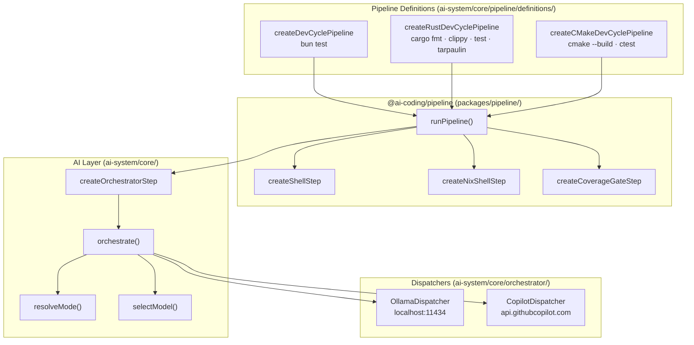
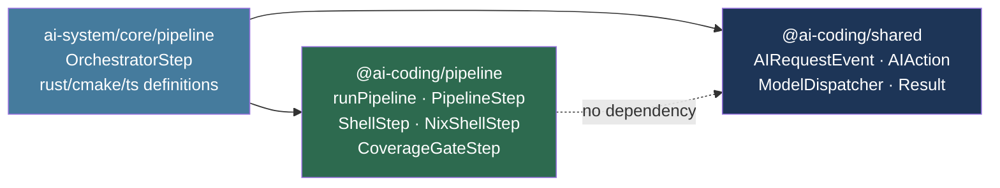
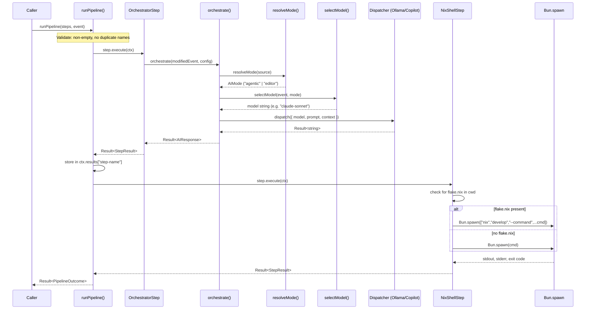

# Architecture

## Overview

The AI Coding OS is a multi-layer system that routes coding requests to the
most appropriate LLM model. At the top is a **pipeline layer** that coordinates
multi-step agent workflows. Below that is the **AI layer** which handles a
single LLM call lifecycle. Both layers delegate to **dispatchers** that talk to
the actual model backends.

---

## Component Layering



---

## Package Dependency Graph

The `@ai-coding/pipeline` package has **zero dependency** on `@ai-coding/shared`
or any AI-specific types. It is a pure TypeScript library for sequencing steps
and threading context. The AI-specific coupling only appears in `ai-system/`,
which imports from both packages.



---

## Full Request Flow

This sequence shows how a pipeline run flows from the caller all the way to a
model backend and back, for a pipeline that contains an `OrchestratorStep`
followed by a `NixShellStep`.



---

## Directory Structure

```
ai-coding/
  packages/
    pipeline/                       Generic pipeline infrastructure
      src/
        pipeline-types.ts            PipelineStep<T>, PipelineContext<T>, Result, StepResult
        run-pipeline.ts              Linear runner with early exit
        steps/
          shell-step.ts              Fixed command execution via Bun.spawn
          nix-shell-step.ts          Auto-detecting nix develop wrapper
          coverage-gate-step.ts      Parses coverage %, fails below threshold
        index.ts                     Barrel export
  ai-system/
    shared/
      event-types.ts                 AIRequestEvent, AIAction, AIMode, Result (re-exported)
    core/
      mode-router/
        resolve-mode.ts              source → AIMode
      model-router/
        select-model.ts              (event, mode) → model string
      orchestrator/
        orchestrate.ts               Single LLM call lifecycle
        ollama-dispatcher.ts         HTTP transport for Ollama
        copilot-dispatcher.ts        HTTP transport for GitHub Copilot
      pipeline/
        steps/
          orchestrator-step.ts       LLM step wrapping orchestrate()
        definitions/
          dev-cycle.ts               TypeScript: plan → implement → bun test
          rust-dev-cycle.ts          Rust: plan → implement → fmt → clippy → test → tarpaulin → gate
          cmake-dev-cycle.ts         C++: plan → implement → cmake build → ctest
  opencode/
    mappings/                        OpenCode provider/model configs
  docs/                              Documentation (you are here)
```

---

## Model Routing Table

Model selection is automatic, driven by the `action` field and resolved `AIMode`:

| Source        | Resolved mode | Action   | Model selected       | Backend       |
|---------------|---------------|----------|----------------------|---------------|
| `nvim`        | `editor`      | any      | `qwen3:8b`   | Ollama        |
| `cli`/`agent` | `agentic`     | `plan`   | `claude-sonnet`      | Copilot API   |
| `cli`/`agent` | `agentic`     | `debug`  | `deepseek-coder-v2`  | Ollama        |
| `cli`/`agent` | `agentic`     | other    | `qwen3:8b`   | Ollama        |

In every pipeline definition, the `plan` step always uses `action: "plan"` and the
`implement` step uses `action: "edit"`, so model selection is consistent and
predictable without any manual configuration.
