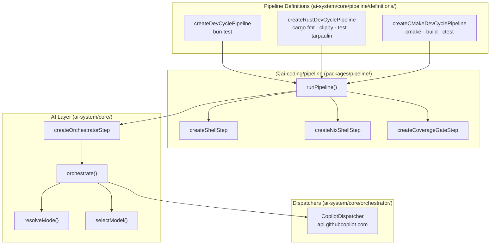
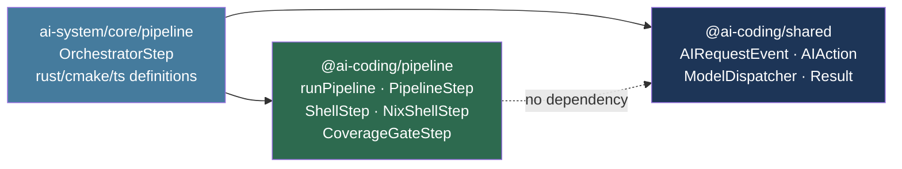

# Architecture

## Overview

The AI Coding OS is a multi-layer system that routes coding requests to the
most appropriate LLM model. At the top is a **pipeline layer** that coordinates
multi-step agent workflows. Below that is the **AI layer** which handles a
single LLM call lifecycle. Both layers delegate to **dispatchers** that talk to
the actual model backends.

---

## Component Layering



---

## Package Dependency Graph

The `@ai-coding/pipeline` package has **zero dependency** on `@ai-coding/shared`
or any AI-specific types. It is a pure TypeScript library for sequencing steps
and threading context. The AI-specific coupling only appears in `ai-system/`,
which imports from both packages.



---

## Full Request Flow

This sequence shows how a pipeline run flows from the caller all the way to a
model backend and back, for a pipeline that contains an `OrchestratorStep`
followed by a `NixShellStep`.


---

## Directory Structure

```
ai-coding/
  packages/
    pipeline/                       Generic pipeline infrastructure
      src/
        pipeline-types.ts            PipelineStep<T>, PipelineContext<T>, Result, StepResult
        run-pipeline.ts              Linear runner with early exit
        steps/
          shell-step.ts              Fixed command execution via Bun.spawn
          nix-shell-step.ts          Auto-detecting nix develop wrapper
          coverage-gate-step.ts      Parses coverage %, fails below threshold
        index.ts                     Barrel export
  ai-system/
    shared/
      event-types.ts                 AIRequestEvent, AIAction, AIMode, Result (re-exported)
    core/
      mode-router/
        resolve-mode.ts              source → AIMode
      model-router/
        select-model.ts              (event, mode) → model string
      orchestrator/
        orchestrate.ts               Single LLM call lifecycle (profile-aware routing)
        copilot-dispatcher.ts        HTTP transport for GitHub Copilot
      pipeline/
        steps/
          orchestrator-step.ts       LLM step wrapping orchestrate()
        definitions/
          dev-cycle.ts               TypeScript: plan → implement → write-files → bun test
          rust-dev-cycle.ts          Rust: plan → implement → write-files → fmt → clippy → test → tarpaulin → gate
          cmake-dev-cycle.ts         C++: plan → implement → write-files → cmake build → ctest
    config/
      model-profiles.ts              ModelRole, ModelProfile, copilot-default profile
      pipeline-registry.ts           Single source of truth for pipeline metadata
  opencode/
    mappings/                        OpenCode provider/model configs
  docs/                              Documentation (you are here)
```

---

## Skill System

OpenCode **skills** provide on-demand, language-specific guidance loaded only
when the agent is working in a relevant context. They complement the always-loaded
`AGENTS.md` files by keeping language rules out of the global config.

### Skill types

| Category | Skills | Loaded when |
|----------|--------|-------------|
| **Role skills** | `programmer`, `tester`, `reviewer`, `analyst`, `architect`, `documenter`, `explorer` | Agent recognises a role-specific task (implement, review, document, etc.) |
| **Language skills** | `rust`, `cpp` | Agent recognises language-specific keywords (cargo, cmake, Cargo.toml, etc.) |

### Where skills live

All skills are deployed globally via Home Manager:

```
~/.config/opencode/skill/
  programmer/SKILL.md   — coding standards (language-agnostic)
  tester/SKILL.md       — testing conventions (language-agnostic)
  reviewer/SKILL.md     — review checklist (language-agnostic)
  rust/SKILL.md         — Rust-specific: cargo, clippy, tarpaulin, safety
  cpp/SKILL.md          — C++-specific: cmake, clang-format, clang-tidy, ctest
  ...
```

### Language skill dispatch

The role skills (programmer, tester, reviewer) delegate language-specific rules
to the language skills rather than duplicating them. Each role skill contains a
`## Language-Specific Rules` section that instructs the agent to load `rust` or
`cpp` when working in those languages.

### Project-local AGENTS.md

Scaffold pipelines (`scaffold-rust`, `scaffold-cpp`) write a lightweight
`AGENTS.md` into each new project containing:

- Project-specific build commands
- An explicit instruction to load the relevant language skill

This ensures the correct language skill is loaded even when trigger keywords
are not prominent in the conversation.

---

## Model Routing

Model selection uses the **role/profile** system. Each pipeline step declares a
semantic `ModelRole`; the active `ModelProfile` maps that role to a concrete model
ID and the dispatcher handles the HTTP transport.

### copilot-default profile (default)

All roles route to `claude-sonnet-4.6` via GitHub Copilot:

| Role          | Model                | Backend       |
|---------------|----------------------|---------------|
| `planner`     | `claude-sonnet-4.6`  | Copilot API   |
| `implementer` | `claude-sonnet-4.6`  | Copilot API   |
| `debugger`    | `claude-sonnet-4.6`  | Copilot API   |
| `reviewer`    | `claude-sonnet-4.6`  | Copilot API   |
| `tester`      | `claude-sonnet-4.6`  | Copilot API   |
| `scaffolder`  | `claude-sonnet-4.6`  | Copilot API   |
| `explorer`    | `claude-sonnet-4.6`  | Copilot API   |
| `default`     | `claude-sonnet-4.6`  | Copilot API   |

### Profile resolution

```
AIAction → actionToRole() → ModelRole → resolveModelForRole(role, profile) → model ID → dispatcher
```

The active profile is set in `OrchestratorConfig.profile`. The CLI resolves it via
`--profile <name>` flag, `AI_CODING_MODEL_PROFILE` env var, or the built-in default.

### Legacy fallback

When no profile is set, the legacy `selectModel(event, mode)` heuristic is used
(preserved for backward compatibility). New code should always pass a profile.
