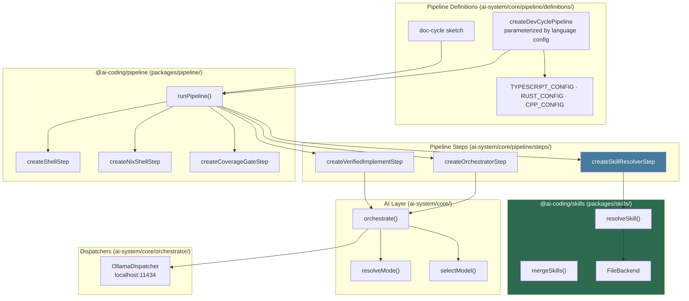
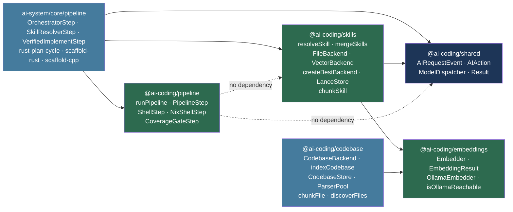
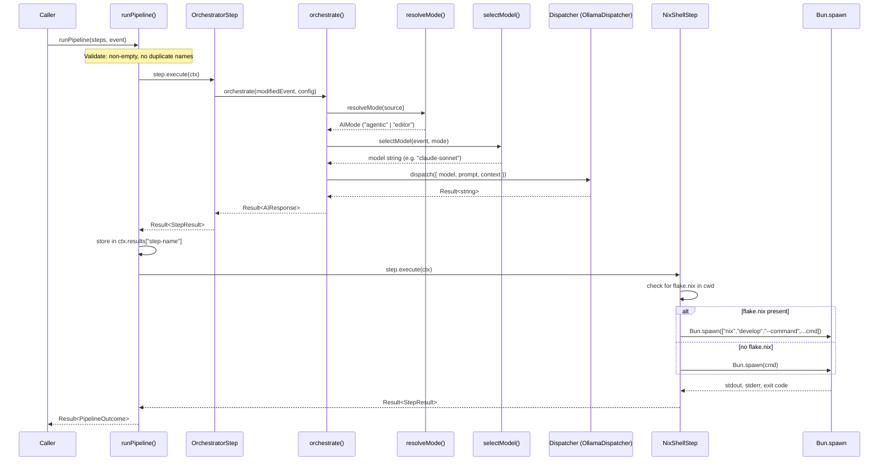

# Architecture

## Overview

The AI Coding OS is a multi-layer system that routes coding requests to the
most appropriate LLM model. At the top is a **pipeline layer** that coordinates
multi-step agent workflows. Below that is the **AI layer** which handles a
single LLM call lifecycle. Both layers delegate to **dispatchers** that talk to
the actual model backends.

---

## Component Layering


```mermaid
graph TD
    subgraph Definitions["Pipeline Definitions (ai-system/core/pipeline/definitions/)"]
        Dev["createDevCyclePipeline\nparameterized by language config"]
        Lang["TYPESCRIPT_CONFIG · RUST_CONFIG · CPP_CONFIG"]
        Doc["doc-cycle sketch"]
    end

    subgraph PipelineSteps["Pipeline Steps (ai-system/core/pipeline/steps/)"]
        OrcStep["createOrchestratorStep"]
        SkillStep["createSkillResolverStep"]
        VerifyStep["createVerifiedImplementStep"]
    end

    subgraph SkillsPkg["@ai-coding/skills (packages/skills/)"]
        ResolveSkill["resolveSkill()"]
        MergeSkills["mergeSkills()"]
        FileBack["FileBackend"]
    end

    subgraph PipelinePkg["@ai-coding/pipeline (packages/pipeline/)"]
        Runner["runPipeline()"]
        ShellStep["createShellStep"]
        NixStep["createNixShellStep"]
        CoverageGate["createCoverageGateStep"]
    end

    subgraph AILayer["AI Layer (ai-system/core/)"]
        Orchestrator["orchestrate()"]
        ModeRouter["resolveMode()"]
        ModelRouter["selectModel()"]
    end

    subgraph Dispatchers["Dispatchers (ai-system/core/orchestrator/)"]
        Ollama["OllamaDispatcher\nlocalhost:11434"]
    end

    Dev --> Lang
    Dev --> Runner
    Doc --> Runner

    Runner --> OrcStep
    Runner --> SkillStep
    Runner --> VerifyStep
    Runner --> ShellStep
    Runner --> NixStep
    Runner --> CoverageGate

    SkillStep --> ResolveSkill
    ResolveSkill --> FileBack

    OrcStep --> Orchestrator
    VerifyStep --> Orchestrator
    Orchestrator --> ModeRouter
    Orchestrator --> ModelRouter
    Orchestrator --> Ollama

    style SkillsPkg fill:#2d6a4f,color:#fff
    style SkillStep fill:#457b9d,color:#fff
```

---

## Package Dependency Graph

The `@ai-coding/pipeline` package has **zero dependency** on `@ai-coding/shared`
or any AI-specific types. It is a pure TypeScript library for sequencing steps
and threading context. The AI-specific coupling only appears in `ai-system/`,
which imports from both packages.


```mermaid
graph LR
    Shared["@ai-coding/shared\nAIRequestEvent · AIAction\nModelDispatcher · Result"]
    Embeddings["@ai-coding/embeddings\nEmbedder · EmbeddingResult\nOllamaEmbedder · isOllamaReachable"]
    Skills["@ai-coding/skills\nresolveSkill · mergeSkills\nFileBackend · VectorBackend\ncreateBestBackend · LanceStore\nchunkSkill"]
    Codebase["@ai-coding/codebase\nCodebaseBackend · indexCodebase\nCodebaseStore · ParserPool\nchunkFile · discoverFiles"]
    Pipeline["@ai-coding/pipeline\nrunPipeline · PipelineStep\nShellStep · NixShellStep\nCoverageGateStep"]
    AISystem["ai-system/core/pipeline\nOrchestratorStep · SkillResolverStep · VerifiedImplementStep\nrust-plan-cycle · scaffold-rust · scaffold-cpp"]

    AISystem --> Pipeline
    AISystem --> Shared
    AISystem --> Skills
    Skills --> Shared
    Skills --> Embeddings
    Codebase --> Embeddings
    Pipeline -.->|"no dependency"| Shared
    Pipeline -.->|"no dependency"| Skills

    style Pipeline fill:#2d6a4f,color:#fff
    style Shared fill:#1d3557,color:#fff
    style Skills fill:#2d6a4f,color:#fff
    style Embeddings fill:#2d6a4f,color:#fff
    style Codebase fill:#457b9d,color:#fff
    style AISystem fill:#457b9d,color:#fff
```

---

## Full Request Flow

This sequence shows how a pipeline run flows from the caller all the way to a
model backend and back, for a pipeline that contains an `OrchestratorStep`
followed by a `NixShellStep`.


```mermaid
sequenceDiagram
    participant Caller
    participant Runner as runPipeline()
    participant OrcStep as OrchestratorStep
    participant Orch as orchestrate()
    participant Mode as resolveMode()
    participant Model as selectModel()
    participant Disp as Dispatcher (OllamaDispatcher)
    participant Nix as NixShellStep
    participant Shell as Bun.spawn

    Caller->>Runner: runPipeline(steps, event)

    Note over Runner: Validate: non-empty, no duplicate names

    Runner->>OrcStep: step.execute(ctx)
    OrcStep->>Orch: orchestrate(modifiedEvent, config)
    Orch->>Mode: resolveMode(source)
    Mode-->>Orch: AIMode ("agentic" | "editor")
    Orch->>Model: selectModel(event, mode)
    Model-->>Orch: model string (e.g. "claude-sonnet")
    Orch->>Disp: dispatch({ model, prompt, context })
    Disp-->>Orch: Result<string>
    Orch-->>OrcStep: Result<AIResponse>
    OrcStep-->>Runner: Result<StepResult>

    Runner->>Runner: store in ctx.results["step-name"]

    Runner->>Nix: step.execute(ctx)
    Nix->>Nix: check for flake.nix in cwd
    alt flake.nix present
        Nix->>Shell: Bun.spawn(["nix","develop","--command",...cmd])
    else no flake.nix
        Nix->>Shell: Bun.spawn(cmd)
    end
    Shell-->>Nix: stdout, stderr, exit code
    Nix-->>Runner: Result<StepResult>

    Runner-->>Caller: Result<PipelineOutcome>
```

---

## Directory Structure

```
ai-coding/
  packages/
    embeddings/                     Shared embedding abstraction (@ai-coding/embeddings)
      src/
        embedder-types.ts            Embedder, EmbeddingResult interfaces
        ollama-embedder.ts           OllamaEmbedder — POST /api/embed (nomic-embed-text)
        index.ts                     Barrel export
    pipeline/                       Generic pipeline infrastructure
      src/
        pipeline-types.ts            PipelineStep<T>, PipelineContext<T>, Result, StepResult
        run-pipeline.ts              Linear runner with early exit
        steps/
          shell-step.ts              Fixed command execution via Bun.spawn
          nix-shell-step.ts          Auto-detecting nix develop wrapper
          coverage-gate-step.ts      Parses coverage %, fails below threshold
        index.ts                     Barrel export
    skills/                         Shared skill retrieval abstraction
      src/
        skill-types.ts               RetrievalContext, ResolvedSkill, SkillBackend, WorkspaceType
        resolve-skill.ts             resolveSkill() — stable public API
        merge-skills.ts              mergeSkills() — concatenate for system prompt injection
        skill-map.ts                 ACTION_SKILLS, WORKSPACE_SKILLS, resolveSkillNames()
        detect-workspace-type.ts     Filesystem probe → WorkspaceType
        backends/
          file-backend.ts            Phase 1: reads SKILL.md files from disk
          vector-backend.ts          Phase 2: semantic ANN search via LanceDB
          create-backend.ts          createBestBackend() — auto-selects best available backend
        chunking/
          markdown-chunker.ts        chunkSkill() — H2-section splitting with paragraph overflow
        store/
          lance-store.ts             LanceStore — LanceDB open/upsert/search/delete wrapper
        indexer/
          index-skills.ts            indexSkills() — hash-based staleness, chunk+embed+upsert
          cli.ts                     bun run skill-index CLI
        cli/
          skill-retrieval-cli.ts     bun run skill-retrieval CLI (used by OpenCode tool)
        index.ts                     Barrel export
    codebase/                       Codebase RAG indexer (@ai-coding/codebase)
      src/
        chunk-types.ts               CodeChunk interface
        discovery/
          detect-language.ts         Extension → tree-sitter grammar name
          discover-files.ts          git ls-files walker; resolveFilePath helper
        chunking/
          parser-pool.ts             ParserPool — lazy WASM init + grammar caching
          node-extractors.ts         CHUNK_NODES map + extractChunks (AST walk)
          code-chunker.ts            chunkFile — tree-sitter or fallback dispatch
          fallback-chunker.ts        Heading-aware paragraph splitter
        store/
          codebase-store.ts          CodebaseStore — LanceDB codebase table wrapper
        indexer/
          index-codebase.ts          indexCodebase — hash-based incremental indexer
          purge.ts                   purgeStale · purgeDeadRepos · runPostIndexPurge
          cli.ts                     bun run index-codebase CLI
        backends/
          codebase-backend.ts        CodebaseBackend — search with query-time refresh
        cli/
          codebase-retrieval-cli.ts  bun run codebase-retrieval CLI
        index.ts                     Barrel export
  ai-system/
    shared/
      event-types.ts                 AIRequestEvent, AIAction, AIMode, Result (re-exported)
    core/
      mode-router/
        resolve-mode.ts              source → AIMode
      model-router/
        select-model.ts              (event, mode) → model string
      orchestrator/
        orchestrate.ts               Single LLM call lifecycle (profile-aware routing)
          ollama-dispatcher.ts         HTTP transport for local Ollama
          copilot-dispatcher.ts        HTTP transport for GitHub Copilot
          anthropic-dispatcher.ts      HTTP transport for native Anthropic Messages API
      pipeline/
        steps/
          orchestrator-step.ts       LLM step wrapping orchestrate()
          skill-resolver-step.ts     Skill resolution step (resolves + merges skills into context)
          verified-implement-step.ts implement → write files → verify → retry/escalate
        definitions/
          dev-cycle.ts               Unified [skills →] implement → write-files factory (Tier B: optional deletion)
          language-configs.ts        TypeScript, Rust, and C++ prompts/toolchains
          doc-cycle.ts               Deferred documentation pipeline sketch
        plan-parser.ts               Structured markdown plan parser
        phase-runner.ts              Per-phase execution and auto-commit
        feature-runner.ts            Parses plan and runs phases sequentially
    config/
      model-profiles.ts              ModelRole, ModelProfile, copilot-default, hybrid, and anthropic-sonnet profiles
      pipeline-registry.ts           Single source of truth for pipeline metadata
  opencode/
    mappings/                        OpenCode provider/model configs
  docs/                              Documentation (you are here)
```

---

## Skill System

OpenCode **skills** provide on-demand, language-specific guidance loaded only
when the agent is working in a relevant context. They complement the always-loaded
`AGENTS.md` files by keeping language rules out of the global config.

### Skill types

| Category | Skills | Loaded when |
|----------|--------|-------------|
| **Role skills** | `programmer`, `tester`, `reviewer`, `debugger`, `analyst`, `architect`, `documenter`, `explorer` | Agent recognises a role-specific task (implement, review, debug, document, etc.) |
| **Language skills** | `rust`, `cpp` | Agent recognises language-specific keywords (cargo, cmake, Cargo.toml, etc.) |

### Where skills live

All skills are deployed globally via Home Manager:

```
~/.config/opencode/skills/
  programmer/SKILL.md   — coding standards (language-agnostic)
  tester/SKILL.md       — testing conventions (language-agnostic)
  reviewer/SKILL.md     — review checklist (language-agnostic)
  debugger/SKILL.md     — debugging workflow (language-agnostic)
  rust/SKILL.md         — Rust-specific: cargo, clippy, tarpaulin, safety
  cpp/SKILL.md          — C++-specific: cmake, clang-format, clang-tidy, ctest
  ...
```

### Language skill dispatch

The role skills (programmer, tester, reviewer) delegate language-specific rules
to the language skills rather than duplicating them. Each role skill contains a
`## Language-Specific Rules` section that instructs the agent to load `rust` or
`cpp` when working in those languages.

### Project-local AGENTS.md

Scaffold pipelines (`scaffold-rust`, `scaffold-cpp`) write a lightweight
`AGENTS.md` into each new project containing:

- Project-specific build commands
- An explicit instruction to load the relevant language skill

This ensures the correct language skill is loaded even when trigger keywords
are not prominent in the conversation.

---

## Model Routing

Model selection uses the **role/profile** system. Each pipeline step declares a
semantic `ModelRole`; the active `ModelProfile` maps that role to a concrete model
ID and the dispatcher handles the HTTP transport.

### local profile (default)

All roles route to `gemma4:26b` via local Ollama:

| Role          | Model                | Backend       |
|---------------|----------------------|---------------|
| `planner`     | `gemma4:26b`         | Ollama        |
| `implementer` | `gemma4:26b`         | Ollama        |
| `debugger`    | `gemma4:26b`         | Ollama        |
| `fixer`       | `gemma4:26b`         | Ollama        |
| `reviewer`    | `gemma4:26b`         | Ollama        |
| `tester`      | `gemma4:26b`         | Ollama        |
| `scaffolder`  | `gemma4:26b`         | Ollama        |
| `explorer`    | `gemma4:26b`         | Ollama        |
| `default`     | `gemma4:26b`         | Ollama        |

### anthropic-sonnet profile

All roles route to `claude-sonnet-5` via the native Anthropic Messages API
(`https://api.anthropic.com/v1/messages`, authenticated with an `x-api-key` +
`anthropic-version` header pair rather than Copilot's `Authorization: Bearer`
scheme). Requires the `ANTHROPIC_API_KEY` environment variable.

| Role          | Model             | Backend                          |
|---------------|-------------------|-----------------------------------|
| `planner`     | `claude-sonnet-5` | Anthropic (native Messages API)  |
| `implementer` | `claude-sonnet-5` | Anthropic (native Messages API)  |
| `debugger`    | `claude-sonnet-5` | Anthropic (native Messages API)  |
| `fixer`       | `claude-sonnet-5` | Anthropic (native Messages API)  |
| `reviewer`    | `claude-sonnet-5` | Anthropic (native Messages API)  |
| `tester`      | `claude-sonnet-5` | Anthropic (native Messages API)  |
| `scaffolder`  | `claude-sonnet-5` | Anthropic (native Messages API)  |
| `explorer`    | `claude-sonnet-5` | Anthropic (native Messages API)  |
| `default`     | `claude-sonnet-5` | Anthropic (native Messages API)  |

The `rust-plan-cycle` pipeline parses its plan from a file rather than
generating it via an LLM, so the `planner` role never fires on that path —
only `implementer` (action `edit`) and `fixer` (action `fix`) roles actually
dispatch to Sonnet during a plan-cycle run.

### Profile resolution

```
AIAction → actionToRole() → ModelRole → resolveModelForRole(role, profile) → model ID → dispatcher
```

The active profile is set in `OrchestratorConfig.profile`. The CLI resolves it via
`--profile <name>` flag, `AI_CODING_MODEL_PROFILE` env var, or the built-in default.

Provider selection is captured entirely in the profile: the `dispatchers` map
built by `load-config.ts` is provider-agnostic, binding each model-ID string to
its dispatcher (`claude-sonnet-5` → Anthropic, `claude-sonnet-4.6` → Copilot,
`gemma4:26b` → Ollama). There is no separate model-override flag; adding a new
provider mix is pure data — define another `ModelProfile` and register it.

### Legacy fallback

When no profile is set, the legacy `selectModel(event, mode)` heuristic is used
(preserved for backward compatibility). New code should always pass a profile.
