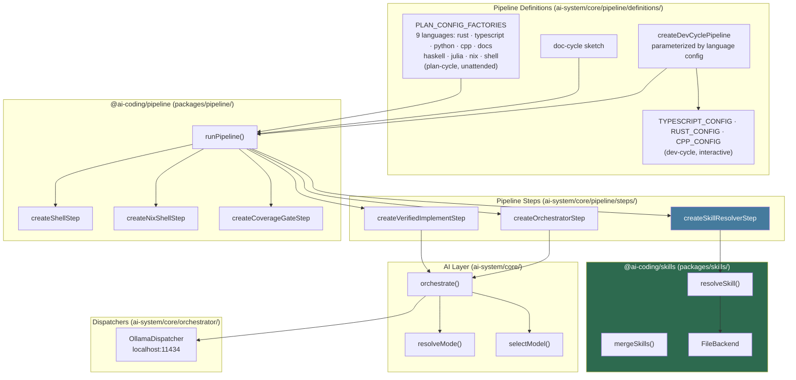
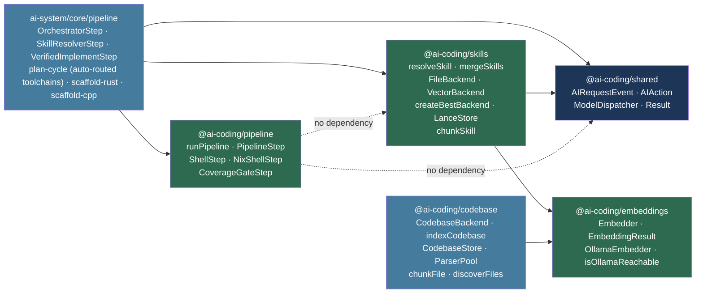
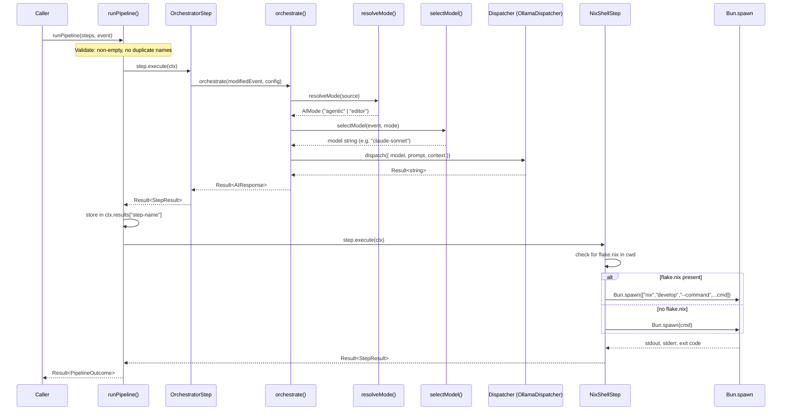
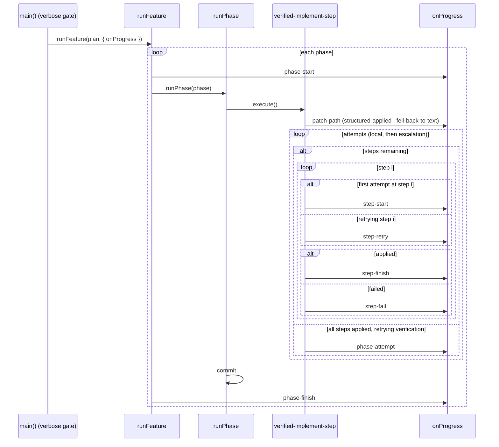
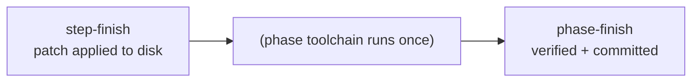

# Architecture

## Overview

The AI Coding OS is a multi-layer system that routes coding requests to the
most appropriate LLM model. At the top is a **pipeline layer** that coordinates
multi-step agent workflows. Below that is the **AI layer** which handles a
single LLM call lifecycle. Both layers delegate to **dispatchers** that talk to
the actual model backends.

---

## Component Layering


```mermaid
graph TD
    subgraph Definitions["Pipeline Definitions (ai-system/core/pipeline/definitions/)"]
        Dev["createDevCyclePipeline\nparameterized by language config"]
        Lang["TYPESCRIPT_CONFIG · RUST_CONFIG · CPP_CONFIG\n(dev-cycle, interactive)"]
        PlanFactories["PLAN_CONFIG_FACTORIES\n9 languages: rust · typescript · python · cpp · docs\nhaskell · julia · nix · shell\n(plan-cycle, unattended)"]
        Doc["doc-cycle sketch"]
    end

    subgraph PipelineSteps["Pipeline Steps (ai-system/core/pipeline/steps/)"]
        OrcStep["createOrchestratorStep"]
        SkillStep["createSkillResolverStep"]
        VerifyStep["createVerifiedImplementStep"]
    end

    subgraph SkillsPkg["@ai-coding/skills (packages/skills/)"]
        ResolveSkill["resolveSkill()"]
        MergeSkills["mergeSkills()"]
        FileBack["FileBackend"]
    end

    subgraph PipelinePkg["@ai-coding/pipeline (packages/pipeline/)"]
        Runner["runPipeline()"]
        ShellStep["createShellStep"]
        NixStep["createNixShellStep"]
        CoverageGate["createCoverageGateStep"]
    end

    subgraph AILayer["AI Layer (ai-system/core/)"]
        Orchestrator["orchestrate()"]
        ModeRouter["resolveMode()"]
        ModelRouter["selectModel()"]
    end

    subgraph Dispatchers["Dispatchers (ai-system/core/orchestrator/)"]
        Ollama["OllamaDispatcher\nlocalhost:11434"]
    end

    Dev --> Lang
    Dev --> Runner
    Doc --> Runner
    PlanFactories --> Runner

    Runner --> OrcStep
    Runner --> SkillStep
    Runner --> VerifyStep
    Runner --> ShellStep
    Runner --> NixStep
    Runner --> CoverageGate

    SkillStep --> ResolveSkill
    ResolveSkill --> FileBack

    OrcStep --> Orchestrator
    VerifyStep --> Orchestrator
    Orchestrator --> ModeRouter
    Orchestrator --> ModelRouter
    Orchestrator --> Ollama

    style SkillsPkg fill:#2d6a4f,color:#fff
    style SkillStep fill:#457b9d,color:#fff
```

---

## Package Dependency Graph

The `@ai-coding/pipeline` package has **zero dependency** on `@ai-coding/shared`
or any AI-specific types. It is a pure TypeScript library for sequencing steps
and threading context. The AI-specific coupling only appears in `ai-system/`,
which imports from both packages.


```mermaid
graph LR
    Shared["@ai-coding/shared\nAIRequestEvent · AIAction\nModelDispatcher · Result"]
    Embeddings["@ai-coding/embeddings\nEmbedder · EmbeddingResult\nOllamaEmbedder · isOllamaReachable"]
    Skills["@ai-coding/skills\nresolveSkill · mergeSkills\nFileBackend · VectorBackend\ncreateBestBackend · LanceStore\nchunkSkill"]
    Codebase["@ai-coding/codebase\nCodebaseBackend · indexCodebase\nCodebaseStore · ParserPool\nchunkFile · discoverFiles"]
    Pipeline["@ai-coding/pipeline\nrunPipeline · PipelineStep\nShellStep · NixShellStep\nCoverageGateStep"]
    AISystem["ai-system/core/pipeline\nOrchestratorStep · SkillResolverStep · VerifiedImplementStep\nplan-cycle (auto-routed toolchains) · scaffold-rust · scaffold-cpp"]

    AISystem --> Pipeline
    AISystem --> Shared
    AISystem --> Skills
    Skills --> Shared
    Skills --> Embeddings
    Codebase --> Embeddings
    Pipeline -.->|"no dependency"| Shared
    Pipeline -.->|"no dependency"| Skills

    style Pipeline fill:#2d6a4f,color:#fff
    style Shared fill:#1d3557,color:#fff
    style Skills fill:#2d6a4f,color:#fff
    style Embeddings fill:#2d6a4f,color:#fff
    style Codebase fill:#457b9d,color:#fff
    style AISystem fill:#457b9d,color:#fff
```

---

## Full Request Flow

This sequence shows how a pipeline run flows from the caller all the way to a
model backend and back, for a pipeline that contains an `OrchestratorStep`
followed by a `NixShellStep`.


```mermaid
sequenceDiagram
    participant Caller
    participant Runner as runPipeline()
    participant OrcStep as OrchestratorStep
    participant Orch as orchestrate()
    participant Mode as resolveMode()
    participant Model as selectModel()
    participant Disp as Dispatcher (OllamaDispatcher)
    participant Nix as NixShellStep
    participant Shell as Bun.spawn

    Caller->>Runner: runPipeline(steps, event)

    Note over Runner: Validate: non-empty, no duplicate names

    Runner->>OrcStep: step.execute(ctx)
    OrcStep->>Orch: orchestrate(modifiedEvent, config)
    Orch->>Mode: resolveMode(source)
    Mode-->>Orch: AIMode ("agentic" | "editor")
    Orch->>Model: selectModel(event, mode)
    Model-->>Orch: model string (e.g. "claude-sonnet")
    Orch->>Disp: dispatch({ model, prompt, context })
    Disp-->>Orch: Result<string>
    Orch-->>OrcStep: Result<AIResponse>
    OrcStep-->>Runner: Result<StepResult>

    Runner->>Runner: store in ctx.results["step-name"]

    Runner->>Nix: step.execute(ctx)
    Nix->>Nix: check for flake.nix in cwd
    alt flake.nix present
        Nix->>Shell: Bun.spawn(["nix","develop","--command",...cmd])
    else no flake.nix
        Nix->>Shell: Bun.spawn(cmd)
    end
    Shell-->>Nix: stdout, stderr, exit code
    Nix-->>Runner: Result<StepResult>

    Runner-->>Caller: Result<PipelineOutcome>
```

---

## Directory Structure

```
ai-coding/
  packages/
    embeddings/                     Shared embedding abstraction (@ai-coding/embeddings)
      src/
        embedder-types.ts            Embedder, EmbeddingResult interfaces
        ollama-embedder.ts           OllamaEmbedder — POST /api/embed (nomic-embed-text)
        index.ts                     Barrel export
    pipeline/                       Generic pipeline infrastructure
      src/
        pipeline-types.ts            PipelineStep<T>, PipelineContext<T>, Result, StepResult
        run-pipeline.ts              Linear runner with early exit
        steps/
          shell-step.ts              Fixed command execution via Bun.spawn
          nix-shell-step.ts          Auto-detecting nix develop wrapper
          coverage-gate-step.ts      Parses coverage %, fails below threshold
        index.ts                     Barrel export
    skills/                         Shared skill retrieval abstraction
      src/
        skill-types.ts               RetrievalContext, ResolvedSkill, SkillBackend, WorkspaceType
        resolve-skill.ts             resolveSkill() — stable public API
        merge-skills.ts              mergeSkills() — concatenate for system prompt injection
        skill-map.ts                 ACTION_SKILLS, WORKSPACE_SKILLS, resolveSkillNames()
        detect-workspace-type.ts     Filesystem probe → WorkspaceType
        backends/
          file-backend.ts            Phase 1: reads SKILL.md files from disk
          vector-backend.ts          Phase 2: semantic ANN search via LanceDB
          create-backend.ts          createBestBackend() — auto-selects best available backend
        chunking/
          markdown-chunker.ts        chunkSkill() — H2-section splitting with paragraph overflow
        store/
          lance-store.ts             LanceStore — LanceDB open/upsert/search/delete wrapper
        indexer/
          index-skills.ts            indexSkills() — hash-based staleness, chunk+embed+upsert
          cli.ts                     bun run skill-index CLI
        cli/
          skill-retrieval-cli.ts     bun run skill-retrieval CLI (used by OpenCode tool)
        index.ts                     Barrel export
    codebase/                       Codebase RAG indexer (@ai-coding/codebase)
      src/
        chunk-types.ts               CodeChunk interface
        discovery/
          detect-language.ts         Extension → tree-sitter grammar name
          discover-files.ts          git ls-files walker; resolveFilePath helper
        chunking/
          parser-pool.ts             ParserPool — lazy WASM init + grammar caching
          node-extractors.ts         CHUNK_NODES map + extractChunks (AST walk)
          code-chunker.ts            chunkFile — tree-sitter or fallback dispatch
          fallback-chunker.ts        Heading-aware paragraph splitter
        store/
          codebase-store.ts          CodebaseStore — LanceDB codebase table wrapper
        indexer/
          index-codebase.ts          indexCodebase — hash-based incremental indexer
          purge.ts                   purgeStale · purgeDeadRepos · runPostIndexPurge
          cli.ts                     bun run index-codebase CLI
        backends/
          codebase-backend.ts        CodebaseBackend — search with query-time refresh
        cli/
          codebase-retrieval-cli.ts  bun run codebase-retrieval CLI
        index.ts                     Barrel export
  ai-system/
    shared/
      event-types.ts                 AIRequestEvent, AIAction, AIMode, Result (re-exported)
    core/
      mode-router/
        resolve-mode.ts              source → AIMode
      model-router/
        select-model.ts              (event, mode) → model string
      orchestrator/
        orchestrate.ts               Single LLM call lifecycle (profile-aware routing)
          ollama-dispatcher.ts         HTTP transport for local Ollama
          copilot-dispatcher.ts        HTTP transport for GitHub Copilot
          anthropic-dispatcher.ts      HTTP transport for native Anthropic Messages API
      pipeline/
        steps/
          orchestrator-step.ts       LLM step wrapping orchestrate()
          skill-resolver-step.ts     Skill resolution step (resolves + merges skills into context)
          verified-implement-step.ts implement → write files → verify → retry/escalate
        definitions/
          dev-cycle.ts               Unified [skills →] implement → write-files factory (Tier B: optional deletion)
          language-configs.ts        DevCycleLanguageConfig + PLAN_CONFIG_FACTORIES (toolchain registry:
                                       rust, typescript, python, cpp, haskell, julia, nix, shell)
          doc-cycle.ts               Deferred documentation pipeline sketch
        plan-parser.ts               Structured markdown plan parser (Feature/Phase/Step + per-phase
                                       Coverage: directive)
        phase-runner.ts              Per-phase toolchain auto-routing (from devShell), baseline check, execution, auto-commit
        feature-runner.ts            Parses plan and runs phases sequentially
        progress.ts                  ProgressEvent model + pure formatProgressEvent (--verbose feed)
    config/
      model-profiles.ts              ModelRole, ModelProfile, copilot-default, hybrid, anthropic-sonnet, bedrock-sonnet, and opencode-free profiles
      pipeline-registry.ts           Single source of truth for pipeline metadata
  opencode/
    mappings/                        OpenCode provider/model configs
  docs/                              Documentation (you are here)
```

---

## Plan-Cycle: Plan File Format and Toolchain Auto-Routing

`plan-cycle` executes structured plan files unattended. Each touched file is auto-routed to a
toolchain based on what's available in the workspace's devShell (`flake.nix`) — there is no
per-phase language directive or CLI flag. A phase may still declare its own coverage directive:

```markdown
# Feature: <name>

## Phase N: <title>

Commit message: <conventional commit>
Coverage: skip | N% | (omitted for default 90%, Rust only)

### Step N: <title>

<instruction>
```

Toolchain resolution per touched file: `route()` maps each file's extension to a toolchain that
is both registered and present in the workspace's devShell palette (via `devShellPalette`). A
file whose toolchain isn't available in the devShell, or which has no matching toolchain at all
(e.g. `.md`/`.json`/`.toml`), falls back to an edit-only "floor" — the patch is still applied and
committed, but no compiler, linter, or coverage gate runs against it.

### `PLAN_CONFIG_FACTORIES` registry

`ai-system/core/pipeline/definitions/language-configs.ts` exports a `PlanConfigFactory` type —
`(coverage, diff) => DevCycleLanguageConfig` — and a registry mapping each toolchain name to its
factory:

| Language | Toolchain | Coverage gate | `baselineCheck` |
|----------|-----------|:---:|:---:|
| `rust` | fmt → check → clippy → test → (if gated) tarpaulin → coverage | ✅ fatal when gated | — |
| `typescript` | typecheck → lint → test | — | — |
| `python` | format → lint → typecheck (warn-only) → test | — | — |
| `cpp` | configure → build → test | — | — |
| `haskell` | build (= typecheck) → lint → test | — | — |
| `julia` | test (weak — no separate format/lint) | — | — |
| `nix` | format → flake check | — | ✅ |
| `shell` | format → guarded shellcheck | — | ✅ |

Any touched file with an extension that doesn't match one of the toolchains above (e.g. a
README edit) — or whose toolchain's tools aren't present in the workspace's devShell — is treated
as edit-only: the phase still applies its patch and commits normally, but no compiler, linter, or
coverage gate runs, since there's nothing available to build or test it with.

`baselineCheck` languages (Nix, Shell) run their toolchain once on the untouched tree before any
implementation attempt, since their whole-repo validators (`nix flake check`, repo-wide
`shellcheck`) can't be scoped to a diff. A pre-existing failure there is a `BaselineCheckError`
(environment error, exit code 3), not a retryable phase failure.

See [`docs/plan-cycle.md`](plan-cycle.md) and
[`docs/plan-cycle-languages.md`](plan-cycle-languages.md) for the full user-facing guide and
per-language prerequisites.

### Commit-guard sequence in `runPhase` (false-green hardening)

After a phase's verified-implement step reports verification success, `runPhase`
(`ai-system/core/pipeline/phase-runner.ts`) runs two guards, in order, before it is
allowed to commit:

1. **Net working-tree change gate** (`hasNetWorkingTreeChange`, via `git status
   --porcelain`, fail-open on git error) — refuses to commit a phase that left the
   working tree provably clean. This closes the false-green failure mode where a
   phase reports `[ok]` even though its declared edits never actually landed (e.g. a
   partial or mis-applied patch), since a clean tree can never legitimately
   represent a completed implementation phase.
2. **`checkAssertions`** (`ai-system/core/pipeline/phase-assertions.ts`) — enforces
   any author-declared `Assert:` directives parsed onto the phase (see the plan file
   format above and the README's Structural Assertions section). A violated
   assertion fails the phase with a clear message naming the assertion; no commit is
   made.

Author-declared `Assert:` directives are the primary mechanism for expressing a
plan's structural intent as a machine-checked invariant; the aider-text fallback and
structured-patch apply paths are otherwise unchanged by this hardening. Plans with
no `Assert:` lines are unaffected (`phase.assertions ?? []` is checked trivially).

The assertion vocabulary includes a `matches <path> :: <regex>` verb alongside
`contains`/`not-contains`/`exists`/`not-exists`: it checks a file's content against
an anchored-capable regular expression (compiled with `new RegExp`), rather than a
plain substring, so a plan author can express exact structural invariants a
substring `contains` cannot (e.g. "this table has exactly this one key") — closing
the false-green loophole where unrelated surrounding content still satisfies a
substring needle. An unreadable file, an invalid regex, or a non-match are each a
FAILURE for `matches`, never a silent pass. `not-contains` likewise now treats a
missing/unreadable file as a FAILURE (previously satisfied trivially) — absence of a
needle cannot be proven for a file that cannot be read.

`runPhase` also restores the working tree to the pre-phase HEAD
(`restoreWorkingTree`: `git reset --hard HEAD` + `git clean -fd`, honoring
`.gitignore`) on every non-commit abort return — the `attributePhaseFailure`
path (including the `BaselineCheckError` case), the net working-tree change
gate, and the structural assertion gate. The successful commit path is never
restored, since a committed phase's HEAD is the new state. `restoreWorkingTree`
never throws; a restore failure (e.g. a non-git workspace) emits a
`restore-failed` progress event rather than masking the original phase
failure, so a dirty tree after abort is observable instead of silent.

A previously-proposed alternative fix — tightening the verified-implement step's
recheck escape hatches in `verified-implement-step.ts` — was evaluated and rejected
as provably inert: in phase mode, `implementation !== ""` already implies
`stepCursor === phaseSteps.length`, so that guard would never change behavior. It is
not part of this change.

---

## Progress Reporting (`--verbose`)

`plan-cycle` is silent by default: it prints only a per-phase summary once the whole feature
completes. Passing `-v` / `--verbose` streams a live progress feed to **stderr** while phases and
steps execute — phase/step start, finish, retry, and failure — without touching the normal
stdout result summary.

### Design principles

- **Opt-in and honest.** The `--verbose` flag decides whether an `onProgress` callback is
  threaded into the runners at all. When absent, no `ProgressEvent`s are constructed — zero
  overhead, zero output. When present, the feed reflects reality, including retries and
  failures, rather than hiding them.
- **Separation of concerns.** Runners (`feature-runner.ts`, `phase-runner.ts`,
  `verified-implement-step.ts`) only emit structured `ProgressEvent`s; `ai-system/core/pipeline/progress.ts`
  owns formatting (glyphs, color); the CLI owns where the formatted lines are written.
- **Convention-correct I/O.** Progress goes to stderr (matching `git`, `cargo`, `curl`,
  `docker build`); the existing stdout result summary is unchanged. Nerd-font glyphs and ANSI
  color are used only when stderr is a TTY and `NO_COLOR` is unset (`FORCE_COLOR=1` overrides);
  otherwise a plain ASCII theme with no escape codes is used.

### Event flow


```mermaid
sequenceDiagram
    participant CLI as main() (verbose gate)
    participant FR as runFeature
    participant PR as runPhase
    participant VIS as verified-implement-step
    participant OP as onProgress

    CLI->>FR: runFeature(plan, { onProgress })
    loop each phase
        FR->>OP: phase-start
        FR->>PR: runPhase(phase)
        PR->>VIS: execute()
        VIS->>OP: patch-path (structured-applied | fell-back-to-text)
        loop attempts (local, then escalation)
            alt steps remaining
                loop step i
                    alt first attempt at step i
                        VIS->>OP: step-start
                    else retrying step i
                        VIS->>OP: step-retry
                    end
                    alt applied
                        VIS->>OP: step-finish
                    else failed
                        VIS->>OP: step-fail
                    end
                end
            else all steps applied, retrying verification
                VIS->>OP: phase-attempt
            end
        end
        PR->>PR: commit
        FR->>OP: phase-finish
    end
```

The `patch-path` event fires once per phase attempt, before the step loop, reporting whether
the whole-phase structured `emit_patch` attempt applied (with verification green) or the run
fell back to the incremental step loop (with a machine-readable reason) — see "Observable
structured-patch fallback" below.

### Certainty ladder


```mermaid
flowchart LR
    S["step-finish\npatch applied to disk"] --> V["(phase toolchain runs once)"] --> P["phase-finish\nverified + committed"]
```

`step-finish` means a step's patch was written to disk — not that it was verified. Verification
runs once per phase (after all steps), so only `phase-finish` implies the toolchain passed and
the commit landed. A phase that never succeeds ends in `phase-fail` instead, reporting the local
and escalation attempt counts exhausted.

---

## Skill System

OpenCode **skills** provide on-demand, language-specific guidance loaded only
when the agent is working in a relevant context. They complement the always-loaded
`AGENTS.md` files by keeping language rules out of the global config.

### Skill types

| Category | Skills | Loaded when |
|----------|--------|-------------|
| **Role skills** | `programmer`, `tester`, `reviewer`, `debugger`, `analyst`, `architect`, `documenter`, `explorer` | Agent recognises a role-specific task (implement, review, debug, document, etc.) |
| **Language skills** | `rust`, `cpp` | Agent recognises language-specific keywords (cargo, cmake, Cargo.toml, etc.) |

### Where skills live

All skills are deployed globally via Home Manager:

```
~/.config/opencode/skills/
  programmer/SKILL.md   — coding standards (language-agnostic)
  tester/SKILL.md       — testing conventions (language-agnostic)
  reviewer/SKILL.md     — review checklist (language-agnostic)
  debugger/SKILL.md     — debugging workflow (language-agnostic)
  rust/SKILL.md         — Rust-specific: cargo, clippy, tarpaulin, safety
  cpp/SKILL.md          — C++-specific: cmake, clang-format, clang-tidy, ctest
  ...
```

### Language skill dispatch

The role skills (programmer, tester, reviewer) delegate language-specific rules
to the language skills rather than duplicating them. Each role skill contains a
`## Language-Specific Rules` section that instructs the agent to load `rust` or
`cpp` when working in those languages.

### Project-local AGENTS.md

Scaffold pipelines (`scaffold-rust`, `scaffold-cpp`) write a lightweight
`AGENTS.md` into each new project containing:

- Project-specific build commands
- An explicit instruction to load the relevant language skill

This ensures the correct language skill is loaded even when trigger keywords
are not prominent in the conversation.

---

## Model Routing

Model selection uses the **role/profile** system. Each pipeline step declares a
semantic `ModelRole`; the active `ModelProfile` maps that role to a concrete model
ID and the dispatcher handles the HTTP transport.

### local profile (default)

All roles route to `gemma4:26b` via local Ollama:

| Role          | Model                | Backend       |
|---------------|----------------------|---------------|
| `planner`     | `gemma4:26b`         | Ollama        |
| `implementer` | `gemma4:26b`         | Ollama        |
| `debugger`    | `gemma4:26b`         | Ollama        |
| `fixer`       | `gemma4:26b`         | Ollama        |
| `reviewer`    | `gemma4:26b`         | Ollama        |
| `tester`      | `gemma4:26b`         | Ollama        |
| `scaffolder`  | `gemma4:26b`         | Ollama        |
| `explorer`    | `gemma4:26b`         | Ollama        |
| `default`     | `gemma4:26b`         | Ollama        |

### anthropic-sonnet profile

All roles route to `claude-sonnet-5` via the native Anthropic Messages API
(`https://api.anthropic.com/v1/messages`, authenticated with an `x-api-key` +
`anthropic-version` header pair rather than Copilot's `Authorization: Bearer`
scheme). Requires the `ANTHROPIC_API_KEY` environment variable.

| Role          | Model             | Backend                          |
|---------------|-------------------|-----------------------------------|
| `planner`     | `claude-sonnet-5` | Anthropic (native Messages API)  |
| `implementer` | `claude-sonnet-5` | Anthropic (native Messages API)  |
| `debugger`    | `claude-sonnet-5` | Anthropic (native Messages API)  |
| `fixer`       | `claude-sonnet-5` | Anthropic (native Messages API)  |
| `reviewer`    | `claude-sonnet-5` | Anthropic (native Messages API)  |
| `tester`      | `claude-sonnet-5` | Anthropic (native Messages API)  |
| `scaffolder`  | `claude-sonnet-5` | Anthropic (native Messages API)  |
| `explorer`    | `claude-sonnet-5` | Anthropic (native Messages API)  |
| `default`     | `claude-sonnet-5` | Anthropic (native Messages API)  |

The `plan-cycle` pipeline parses its plan from a file rather
than generating it via an LLM, so the `planner` role never fires on that path —
only `implementer` (action `edit`) and `fixer` (action `fix`) roles actually
dispatch to Sonnet during a plan-cycle run.

### bedrock-sonnet profile

All roles route to a Claude Sonnet model hosted on **Amazon Bedrock** via the
`InvokeModel` API. Unlike the other three profiles, the model key
(`bedrock-sonnet`) is a stable *logical* token, not a real model ID: the
actual invoke target is a Bedrock **application inference profile ARN**,
resolved from the `AWS_BEDROCK_INFERENCE_PROFILE_ARN` environment variable at
`load-config.ts` time and injected into the `BedrockDispatcher` constructor.
This keeps the profile portable across AWS accounts — the ARN embeds an
account ID and must never be committed to source.

Authentication uses the AWS SDK's default credential provider chain (e.g. an
`aws sso login` session selected via `AWS_PROFILE`), not an API key. The
target region is parsed from the ARN itself, so `AWS_REGION` is optional.
The Bedrock client is configured with the SDK's standard retry strategy
(`maxAttempts`), which automatically retries `ThrottlingException` and
`ModelNotReadyException` with exponential backoff — important because a
shared, quota-limited inference profile can throttle mid-run, and
`plan-cycle`'s retry loop only retries *verification* failures, not
transport errors.

| Role          | Model             | Backend                                 |
|---------------|-------------------|-------------------------------------------|
| `planner`     | `bedrock-sonnet`  | Amazon Bedrock (InvokeModel API)        |
| `implementer` | `bedrock-sonnet`  | Amazon Bedrock (InvokeModel API)        |
| `debugger`    | `bedrock-sonnet`  | Amazon Bedrock (InvokeModel API)        |
| `fixer`       | `bedrock-sonnet`  | Amazon Bedrock (InvokeModel API)        |
| `reviewer`    | `bedrock-sonnet`  | Amazon Bedrock (InvokeModel API)        |
| `tester`      | `bedrock-sonnet`  | Amazon Bedrock (InvokeModel API)        |
| `scaffolder`  | `bedrock-sonnet`  | Amazon Bedrock (InvokeModel API)        |
| `explorer`    | `bedrock-sonnet`  | Amazon Bedrock (InvokeModel API)        |
| `default`     | `bedrock-sonnet`  | Amazon Bedrock (InvokeModel API)        |

Requires `AWS_BEDROCK_INFERENCE_PROFILE_ARN` plus valid AWS credentials
(`aws sso login` + `AWS_PROFILE`, or any other AWS SDK credential source).
SSO session credentials are time-bounded (commonly 1–8 hours); a long
unattended `plan-cycle` run should start right after a fresh login, since
expiry mid-run surfaces as a dispatch error (not retried by the backoff
above — it is not transient).

### opencode-free profile

All roles route to a free model on **OpenCode Zen** via an OpenAI-compatible
`chat/completions` endpoint (`https://opencode.ai/zen/v1/chat/completions`).
As with `bedrock-sonnet`, the model key (`opencode-free`) is a stable
*logical* token, not a real model ID: the concrete model (e.g.
`deepseek-v4-flash-free`) is resolved from the `OPENCODE_ZEN_MODEL`
environment variable at `load-config.ts` time and injected into the
`OpenCodeZenDispatcher` constructor — mirroring how Bedrock's ARN is
resolved from `AWS_BEDROCK_INFERENCE_PROFILE_ARN`. This makes swapping the
free model when it rotates out a one-line env change, never a source edit.

Authentication is a Bearer API key from the `OPENCODE_ZEN_API_KEY`
environment variable. Unlike Anthropic's top-level `system` field, the
system prompt is sent as a `system`-role message, and the response is read
from `choices[0].message.content` (standard OpenAI chat shape).

| Role          | Model             | Backend                                    |
|---------------|-------------------|---------------------------------------------|
| `planner`     | `opencode-free`   | OpenCode Zen (OpenAI-compatible endpoint)  |
| `implementer` | `opencode-free`   | OpenCode Zen (OpenAI-compatible endpoint)  |
| `debugger`    | `opencode-free`   | OpenCode Zen (OpenAI-compatible endpoint)  |
| `fixer`       | `opencode-free`   | OpenCode Zen (OpenAI-compatible endpoint)  |
| `reviewer`    | `opencode-free`   | OpenCode Zen (OpenAI-compatible endpoint)  |
| `tester`      | `opencode-free`   | OpenCode Zen (OpenAI-compatible endpoint)  |
| `scaffolder`  | `opencode-free`   | OpenCode Zen (OpenAI-compatible endpoint)  |
| `explorer`    | `opencode-free`   | OpenCode Zen (OpenAI-compatible endpoint)  |
| `default`     | `opencode-free`   | OpenCode Zen (OpenAI-compatible endpoint)  |

Requires `OPENCODE_ZEN_API_KEY` and `OPENCODE_ZEN_MODEL`. Sign in at
https://opencode.ai/auth to obtain a Zen API key.

### Profile resolution

```
AIAction → actionToRole() → ModelRole → resolveModelForRole(role, profile) → model ID → dispatcher
```

The active profile is set in `OrchestratorConfig.profile`. The CLI resolves it via
`--profile <name>` flag, `AI_CODING_MODEL_PROFILE` env var, or the built-in default.

Provider selection is captured entirely in the profile: the `dispatchers` map
built by `load-config.ts` is provider-agnostic, binding each model-ID string to
its dispatcher (`claude-sonnet-5` → Anthropic native, `copilot/claude-sonnet-5`
→ Copilot-served Sonnet 5 (namespaced to stay distinct from the Anthropic-native
bare id; the CopilotDispatcher strips the `copilot/` prefix on the wire),
`claude-sonnet-4.6` → Copilot, `gemma4:26b` → Ollama). The CopilotDispatcher
sends the durable GitHub OAuth token from `GITHUB_COPILOT_TOKEN` DIRECTLY to
`https://api.githubcopilot.com/chat/completions` as the `Authorization: Bearer`
credential — there is NO `copilot_internal/v2/token` exchange, because that
exchange was observed to be blocked by GitHub's anti-scraping WAF (403) for
opencode-minted OAuth tokens as of the last verification, whereas the durable
token authenticates directly (HTTP 200); re-verify before assuming this still
holds. Requests carry ai-coding's own honest `User-Agent`
(`ai-coding-os/1.0.0`) plus `X-GitHub-Api-Version: 2026-06-01`, modeled on
opencode's own observed behaviour at the time of writing; `Copilot-Integration-Id`
and `Editor-Version` are deliberately NOT sent (those belong to the VS Code editor profile). There is no separate
model-override flag; adding a new
provider mix is pure data — define another `ModelProfile` and register it.

### Legacy fallback

When no profile is set, the legacy `selectModel(event, mode)` heuristic is used
(preserved for backward compatibility). New code should always pass a profile.

---

## Structured Patch Output Contract

The `plan-cycle`/`dev-cycle` implement step traditionally asks the model for
raw **aider-style SEARCH/REPLACE/MOVE patch text** (parsed by
`parse-patch.ts`'s `parsePatch`), which breaks when a chatty model interleaves
prose or code fences into the patch body. A **provider-agnostic structured
patch output contract** was added as a parallel, preferred path for backends
that can *guarantee* valid structured output — with the aider-text path
**always retained as the fallback**, so no backend is ever hard-excluded.

### The contract

`ai-system/shared/event-types.ts` (the `@ai-coding/shared` alias target, which
imports nothing — see the hard rule at the top of that file) defines:

- **`PatchOp`** — a discriminated union on `kind`: `create` (`filePath`,
  `contents`), `move` (`filePath`, `toPath`), `edit` (`filePath`, `search`,
  `replace`). This is the WIRE shape a structured-capable model emits.
- **`PATCH_TOOL_NAME`** (`"emit_patch"`) — the name of the forced
  tool/function every structured-capable dispatcher exposes.
- **`PATCH_OPS_JSON_SCHEMA`** — one provider-neutral JSON Schema describing
  `{ ops: PatchOp[] }`, reused verbatim as Anthropic's `input_schema`,
  Copilot/OpenAI's `function.parameters`, and (planned) Ollama's `format`.
- **`ModelDispatcher.dispatchPatch?`** — an OPTIONAL sibling to `dispatch()`,
  additive so every existing dispatcher stays valid unchanged. Present only on
  backends that can guarantee structured output; called ONLY by
  `orchestratePatch()`, never directly by pipeline steps.

`ai-system/core/orchestrator/patch-contract.ts` converts between the wire
shape and the applier's internal shape:

- `parsePatchOps(raw: unknown)` — structurally validates an already-parsed
  JSON value against `{ ops: PatchOp[] }` (the guard for backends whose
  "structured" output is actually a JSON string, e.g. Copilot's tool_calls
  `arguments`).
- `patchOpsToEdits(ops)` — converts `PatchOp[]` into the exact `PatchEdit[]`
  flags-on-one-struct shape `applyPatch` already consumes (`isCreate`,
  `isMove`, `toPath`) — the applier's verbs are never changed by this work.

### Per-model capability registry

`ai-system/core/orchestrator/patch-capability.ts` keys structured-patch
capability by the bare **model-ID string** (never per-profile, never
per-role), because `HYBRID_PROFILE` mixes providers per-role and the same
profile's `implementer`/`fixer` roles can resolve to different models with
different capabilities:

```ts
type PatchMode = "text" | "anthropic-tool-use" | "openai-tool-calls";
```

| Model-ID                    | PatchMode             | Status                        |
|------------------------------|-----------------------|-------------------------------|
| `claude-sonnet-5`             | `anthropic-tool-use`  | Confirmed (dry-run, plumbing) |
| `copilot/claude-sonnet-5`     | `openai-tool-calls`   | **Confirmed live** (real Copilot call, see `docs/adr/0001-copilot-structured-patch.md`) |
| `claude-sonnet-4.6`           | `openai-tool-calls`   | **Confirmed live** |
| everything else (default)    | `text`                | Unchanged aider-text path     |

The default is always `"text"`, so every model not explicitly registered
keeps using the existing aider-text + `parsePatch` path, byte-for-byte
unchanged.

### `orchestratePatch()` facade

`ai-system/core/orchestrator/orchestrate.ts` adds `orchestratePatch()`
alongside the existing `orchestrate()`, sharing model/dispatcher resolution
(`resolveDispatcher`) and the memory side-effect (`writeMemory`) so neither is
ever forked between the string and structured paths. It:

1. Resolves the model-ID from the action + profile identically to
   `orchestrate()`.
2. Checks `patchModeForModel(model)` and feature-detects `dispatcher.dispatchPatch`
   — **recomputed fresh on every call**, never cached, so a profile whose
   per-role model mix flips backends mid-run (e.g. `HYBRID_PROFILE`'s
   `implementer` vs. `fixer`) is handled correctly with no extra plumbing.
3. Returns `{ kind: "not-capable" }` (not an error) when the model/attempt
   isn't structured-capable — the sentinel telling the caller to fall back to
   the string `orchestrate()` path.
4. Otherwise calls `dispatchPatch`, and on success writes the same memory
   record `orchestrate()` writes.

This is the **only** seam that reaches `config.dispatchers` for the structured
path; pipeline steps must go through this facade, never index
`config.dispatchers` directly.

### Whole-phase structured attempt in the implement step

`ai-system/core/pipeline/steps/structured-implement.ts` (`tryStructuredPhase`)
is tried **once per phase, ahead of** the existing incremental aider-text
retry/escalation loop in `createVerifiedImplementStep`:

1. Calls `orchestratePatch()` for the whole phase at once — a single forced
   tool call returning **all** ops for the phase, not one call per step.
2. Converts ops via `patchOpsToEdits`.
3. Applies them via `applyEditsTransactionally`, which branches on whether any
   touched path (source or destination for moves) resolves to an EXISTING
   DIRECTORY:
   - **File-only edits** (no touched path is a directory): applies the
     original IN-PROCESS content-snapshot path — snapshots every touched path
     before calling `applyPatch`, and on any failure (including a partial
     apply, e.g. op 3 of 5) **rolls back every touched path** to its
     pre-attempt state — restoring edited/moved files, deleting newly-created
     ones, reversing partial moves — before returning an error. This works
     without a git repository and is deliberately different from the
     applier's idempotent no-op semantics (byte-identical create /
     already-satisfied move), which exist to make the *text* loop's re-issued
     edits safe to retry.
   - **Directory-touching edits** (e.g. a whole-directory move): applies via a
     GIT-TRANSACTIONAL path instead, since the file-content snapshot model
     cannot represent or restore a directory. If `workspace` is not a git
     repository, declines gracefully with `directory-declined` (no mutation).
     Otherwise calls `applyPatch` (whose `renameSync`-based move verb natively
     supports directories) and, on failure, restores the tree via
     `git reset --hard HEAD` + `git clean -fd` (omitting `-x`, so
     `.gitignore`d build artifacts survive) before returning an `apply-failed`
     error. This relies on a verified invariant: `tryStructuredPhase` runs
     exactly once per phase, before any step edits are applied and before the
     text loop starts, and `runPhase` commits at each phase boundary — so the
     working tree is provably a clean committed HEAD at structured-apply
     time, meaning `git reset --hard HEAD` can never destroy earlier-step
     uncommitted work. `assertInsideWorkspace` still gates every op on both
     paths, including move destinations. The git-restore helper deliberately
     duplicates `phase-runner.ts`'s `restoreWorkingTree` locally rather than
     importing it, to avoid an import cycle
     (`phase-runner` → `verified-implement-step` → `structured-implement` →
     `phase-runner`).
4. Directory-touching edits in a non-git workspace decline cleanly without
   mutating rather than crashing: the original file-content
   `snapshotTouchedPaths` guard remains as a defensive backstop on the
   file-only path (it should never see a directory path in practice, since
   `applyEditsTransactionally` routes those to the git-transactional branch
   above), preventing any future caller from reintroducing an `EISDIR` crash.
   The decline returns an error `Result` that triggers the aider-text
   fallback, never a crash.
5. Never throws. Any thrown error — including a rejected `dispatchPatch`
   propagating up through `orchestratePatch` (which does not itself guard
   against a rejecting dispatcher) — is converted into an error `Result`, so
   the caller's fallback-to-text-loop contract always holds.

On success + green verification, the phase is done and the text loop is never
entered. On success + red verification, the attempt is treated as if the text
loop's first iteration already ran and failed on verification — state
(`implementation`, `lastError`, `stepCursor`, `prompt`) is pre-populated
exactly as that failure path would leave it, and the loop resumes from its
second iteration, so every existing retry/escalation branch runs completely
unchanged. On ANY structured failure (not-capable, dispatch error, conversion
error, or apply failure), nothing is touched and the loop runs exactly as it
does today.

### Deterministic create→edit coercion and structured-patch prompt guidance

Two defense-in-depth mitigations close a run-to-run instability observed when
the structured path's whole-phase attempt touches a file that ALREADY EXISTS
on disk (e.g. relocated there by an earlier `move` op in the same phase): the
model sometimes emitted a `create` op for that path (declined by the applier
with `"already exists; cannot create"`, forcing a fallback to the flaky
aider-text loop), and sometimes emitted an `edit` op whose `search` anchor was
too narrow (an additive edit that left stale content dangling alongside new
content — a malformed-but-cargo-tolerated result in the observed case).

1. **`coerceCreatesToEdits`** (`ai-system/core/pipeline/steps/coerce-create-to-edit.ts`)
   is a new, deliberately filesystem-aware normalization pass that runs
   between `patchOpsToEdits` (which is filesystem-blind by design) and
   `applyEditsTransactionally` inside `tryStructuredPhase`. For each edit: a
   `create` op whose target already exists on disk with NON-empty, DIFFERENT
   contents is coerced into a whole-file-replace `edit` (`search` = the
   entire current file contents, `replace` = the create's contents) — a
   string cannot contain two non-overlapping copies of its own entirety, so
   this `search` is guaranteed to match exactly once and the applier's edit
   branch applies it cleanly instead of declining. A `create` targeting an
   EXISTING EMPTY (0-byte) file is left unchanged and instead relies on a
   companion relaxation in the applier (`apply-patch-step.ts`): the CREATE
   branch now overwrites an empty existing target instead of declining,
   since an empty file has no content to conflict with. A `create` whose
   target is byte-identical to its contents, or whose path resolves outside
   the workspace, is passed through unchanged in both cases —
   `assertInsideWorkspace` (inside `applyPatch`) remains the SOLE
   path-safety gate; `coerceCreatesToEdits` never performs path-safety
   checks itself, and skips reading the filesystem entirely for any path
   that resolves outside the workspace. The coercion runs BEFORE
   `applyEditsTransactionally`, so the existing transactional apply/rollback
   semantics still fully cover the coerced edits.

2. **`STRUCTURED_PATCH_SYSTEM`** (`ai-system/core/orchestrator/patch-guidance.ts`)
   is a provider-agnostic system prompt now forwarded from
   `tryStructuredPhase` to `orchestratePatch` via `LLMOptions.system` — the
   structured path previously sent NO system prompt at all (unlike the
   aider-text path, which passes `implementSystem`/`buildPatchSystem`). It
   instructs the model to use `edit` for existing files, `create` only for
   genuinely new files, and to make an `edit`'s `search` cover the entire
   region being replaced. This applies to ALL structured-capable providers
   (Anthropic, Copilot).

**Scope note:** only mitigation (2) addresses the additive/malformed-edit
failure mode, and it is non-deterministic (a prompt nudge, not an applier
guard) — a generic deterministic guard here would false-positive on
legitimate edits that intentionally retain part of their `search` text
inside `replace`. Manifest/structural output validity (e.g. a malformed
Cargo `[lints]` table that cargo silently tolerates) is explicitly OUT OF
SCOPE for this normalization layer and is owned by the separate
structural-assertion-vocabulary plan (`plan:false-green-gate-assert-v1`).
See `docs/adr/0002-structured-create-over-existing-coercion.md` for the full
decision record, including the residual risk and the
**live-reverification** gate: because the runner's green unit tests prove
wiring only (not live tool adherence), this change must be treated as
PROVISIONAL until a human/coordinator re-runs the live Copilot forced-tool
structured path (parlang plan-cycle, profile `copilot-default`) and confirms
`emit_patch` still fires and applies correctly WITH the new system prompt
present.

### Observable structured-patch fallback (`patch-path` progress event)

Every non-error outcome of `tryStructuredPhase` (declined or applied) is now
attributed with a machine-readable reason rather than an opaque `Error`, and
surfaced through the `--verbose` progress feed, so the choice between the
structured `emit_patch` path and the incremental aider-text loop is never
silent:

- `StructuredDeclineReason` and `StructuredPatchReason` live in
  `ai-system/shared/event-types.ts` (the zero-import graph root) as bare
  string-literal unions — `not-capable-text-mode`, `not-capable-no-dispatch-patch`,
  `dispatch-error`, `conversion-failed`, `apply-failed`, `directory-declined`,
  `threw`, and `verification-red-after-structured` (a decline), plus
  `structured-applied` (the honest phase-succeeded-via-structured marker).
  `tryStructuredPhase` returns `Result<"applied", StructuredDecline>`, where
  `StructuredDecline` pairs a `StructuredDeclineReason` with a human-readable
  `message`.
- `orchestratePatch()`'s `not-capable` outcome carries its own two-value
  `reason: "text-mode" | "no-dispatch-patch"`, discriminating a text-mode
  model-ID from a structured-capable model whose resolved dispatcher lacks a
  `dispatchPatch` channel — previously collapsed into a single
  undifferentiated `{ kind: "not-capable" }`.
- `ai-system/core/pipeline/progress.ts` defines a `patch-path` `ProgressEvent`
  variant (`{ kind: "patch-path"; phase; step?; path: "structured-applied" |
  "fell-back-to-text"; reason: StructuredPatchReason }`), rendered by
  `formatProgressEvent` alongside the other event kinds.
- `createVerifiedImplementStep` (`verified-implement-step.ts`) emits exactly
  three honest `patch-path` events at the structured/text decision point:
  1. `path: "structured-applied"`, `reason: "structured-applied"` — ONLY after
     the structured patch applies AND verification goes green (the phase is
     done; the text loop is never entered).
  2. `path: "fell-back-to-text"`, `reason: "verification-red-after-structured"`
     — the structured patch applied but verification failed, so the text loop
     resumes from its second iteration (the ambiguous case this feature exists
     to disambiguate: the model DID emit valid structured ops, but the result
     didn't verify).
  3. `path: "fell-back-to-text"`, `reason: structuredResult.error.reason` — the
     structured attempt declined outright (any `StructuredDeclineReason`), and
     the text loop runs from the start.

When the fell-back-to-text reason is `dispatch-error`, the rendered progress
line appends the underlying transport failure as a `: <detail>` suffix — for
example `(dispatch-error): ECONNREFUSED`. The `detail` field on the event is
optional and present only for that reason (carried from the dispatch error's
cause), and every other patch-path line — including `structured-applied` —
renders exactly as before, with no trailing detail.

This is **observability only** — none of these three emission points change
which branch executes; they report a decision that was already being made
silently.

### Per-backend implementations

- **Anthropic** (`anthropic-dispatcher.ts`) — forces a single `tool_choice`
  naming `emit_patch`, with `input_schema: PATCH_OPS_JSON_SCHEMA`. The
  response's `content` array is a `text | tool_use` discriminated union;
  `dispatchPatch` selects the `tool_use` block by name (never assumes
  position — a response may contain both a text and a tool_use block), treats
  `stop_reason === "max_tokens"` as an unrecoverable truncation (never
  attempts to parse partial JSON), and passes the tool_use block's `input`
  (already a parsed object) through `parsePatchOps`.
- **Copilot** (`copilot-dispatcher.ts`) — forces the same `emit_patch` call via
  OpenAI-shaped `tools`/`tool_choice` (`function.parameters:
  PATCH_OPS_JSON_SCHEMA`), reusing the exact auth path `dispatch()` uses
  (direct `GITHUB_COPILOT_TOKEN` Bearer, honest `User-Agent`,
  `X-GitHub-Api-Version` header). Unlike Anthropic's pre-parsed `input`,
  Copilot's `tool_calls[0].function.arguments` is a JSON-encoded **string**
  that must be `JSON.parse`d (never throws; a malformed string is a Result
  err) before `parsePatchOps` validates it. **Empirically confirmed against
  live Copilot** — see `docs/adr/0001-copilot-structured-patch.md` and
  `scripts/probe-copilot-toolcalls.ts` — the proxy reliably honors forced
  `tool_calls` and returns schema-valid arguments.
- **Ollama, OpenCode Zen, Bedrock** — not yet wired to a `dispatchPatch`
  implementation; all three remain on the `"text"` default (unchanged
  aider-text path). Ollama's constrained-decoding `format` field and Zen's
  best-effort JSON mode are planned; Bedrock shares Anthropic's `tool_use`
  seam and can be folded in later as a one-file mirror of the Anthropic
  implementation.

### Verification status

The dual path has been verified two ways so far:

1. **Plumbing verification** (real filesystem, real
   `createVerifiedImplementStep`/`applyPatch`/`orchestratePatch` chain, fake
   dispatcher standing in only for the network call) — covers
   structured-green, structured-red-then-fallback, partial-apply rollback,
   and not-capable-model-unaffected scenarios. All passed.
2. **Live end-to-end verification against Copilot** — a real network call
   through the real `CopilotDispatcher.dispatchPatch`, driving the real
   `createVerifiedImplementStep`, successfully created and verified a file via
   the structured whole-phase path (confirmed by the step's own output
   string: `"Verified implementation via structured whole-phase patch"`).

Live end-to-end verification against **Anthropic** is still outstanding
(requires `ANTHROPIC_API_KEY` in a session that has it) — the code path is the
same shape already proven live for Copilot, but Anthropic's forced
`tool_choice` behavior has only been confirmed via the plumbing-level dry run,
not a live call.


