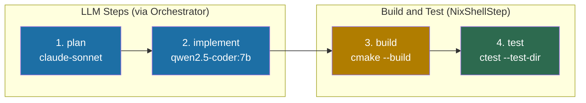
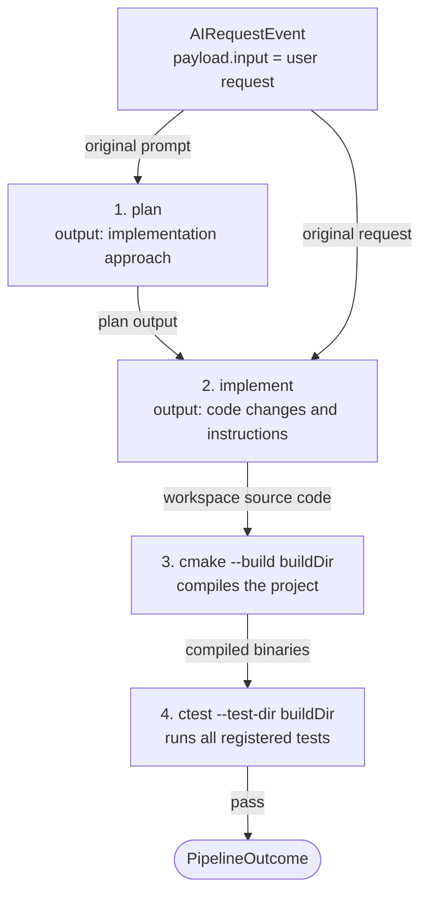

# CMake Pipeline

## Overview

The CMake dev-cycle pipeline runs a planning and implementation workflow on a
C++ project, then builds it and runs the CTest suite. It is designed to work
with projects that use CMake as their build system.

All shell steps are nix-aware -- if a `flake.nix` is detected in the workspace,
every command is automatically wrapped in `nix develop --command`.

---

## Pipeline Flow



---

## Data Flow Between Steps



---

## Step-by-Step Explanation

### Step 1: plan (OrchestratorStep, action: "plan")

Sends the user's original request to `claude-sonnet`. Produces a high-level
implementation plan for the C++ change.

**Model:** `claude-sonnet` (via Copilot API)
**Input:** `event.payload.input`
**Output:** Implementation plan stored in `ctx.results.get("plan")`

### Step 2: implement (OrchestratorStep, action: "edit")

Combines the plan with the original request into a structured prompt for
`qwen2.5-coder:7b`:

```typescript
(ctx) => {
  const plan = ctx.results.get("plan")?.output ?? "";
  const original = ctx.event.payload.input ?? "";
  return `Implement the following plan in C++:\n\n${plan}\n\nOriginal request: ${original}`;
}
```

**Model:** `qwen2.5-coder:7b` (local, via Ollama)

### Step 3: build (NixShellStep)

Runs `cmake --build <buildDir>`. Compiles the project using the pre-configured
CMake build directory. Fails the pipeline on any compilation error.

**Command:** `cmake --build <buildDir>`
**Prerequisite:** The build directory must already be configured (see below)
**Failure:** Compilation errors or missing build directory

### Step 4: test (NixShellStep)

Runs `ctest --test-dir <buildDir> --output-on-failure`. Executes all tests
registered with CTest. The `--output-on-failure` flag shows test output only
for failing tests, keeping successful output clean.

**Command:** `ctest --test-dir <buildDir> --output-on-failure`
**Failure:** Any test failure

---

## Prerequisites

### Build system setup

The pipeline does **not** run CMake configuration. You must configure the build
directory before invoking the pipeline:

```bash
# Configure (run once, or when CMakeLists.txt changes)
cmake -S /path/to/project -B /path/to/project/build -DCMAKE_BUILD_TYPE=Debug

# Optionally enable coverage flags if you plan to add coverage steps later
cmake -S . -B build -DCMAKE_BUILD_TYPE=Debug \
  -DCMAKE_CXX_FLAGS="--coverage" -DCMAKE_EXE_LINKER_FLAGS="--coverage"
```

### Registering tests with CTest

Tests must be registered in `CMakeLists.txt` using `add_test()`:

```cmake
enable_testing()

add_executable(my_tests tests/main.cpp)
target_link_libraries(my_tests my_lib)

add_test(NAME MyTests COMMAND my_tests)
```

With GoogleTest, use `gtest_discover_tests`:

```cmake
include(GoogleTest)
gtest_discover_tests(my_tests)
```

---

## Invocation Example

```typescript
import { runPipeline } from "@ai-coding/pipeline";
import { CopilotDispatcher } from "ai-system/core/orchestrator/copilot-dispatcher";
import { OllamaDispatcher } from "ai-system/core/orchestrator/ollama-dispatcher";
import type { OrchestratorConfig } from "ai-system/core/orchestrator/orchestrate";
import { createCMakeDevCyclePipeline } from
  "ai-system/core/pipeline/definitions/cmake-dev-cycle";
import type { AIRequestEvent } from "@ai-coding/shared";

const config: OrchestratorConfig = {
  dispatchers: {
    "claude-sonnet":     new CopilotDispatcher(process.env.COPILOT_TOKEN ?? ""),
    "deepseek-coder-v2": new OllamaDispatcher(),
    "qwen2.5-coder:7b":  new OllamaDispatcher(),
  },
};

const workspace = "/home/user/my-cpp-project";

const event: AIRequestEvent = {
  id: crypto.randomUUID(),
  timestamp: Date.now(),
  source: "cli",
  action: "plan",
  payload: {
    input: "Add a thread-safe cache to the network layer",
  },
};

// Uses "build" as the build dir by default (relative to workspace)
const steps = createCMakeDevCyclePipeline(config, workspace);

// Custom build directory:
// const steps = createCMakeDevCyclePipeline(config, workspace, "cmake-build-debug");

const result = await runPipeline(steps, event);

if (!result.ok) {
  console.error("Pipeline failed:", result.error.message);
  process.exit(1);
}

console.log(`Completed in ${result.value.totalDurationMs}ms`);
for (const step of result.value.steps) {
  console.log(`[${step.stepName}] ${step.durationMs}ms`);
}
```

---

## Customization

### Change the build directory

```typescript
const steps = createCMakeDevCyclePipeline(config, workspace, "cmake-build-release");
```

### Pass additional CMake build flags

Extend the pipeline definition to use custom build commands:

```typescript
import { createNixShellStep } from "@ai-coding/pipeline";

// Replace the build step with a parallel build
createNixShellStep<AIRequestEvent>("build", ["cmake", "--build", "build", "--parallel", "4"], {
  cwd: workspace,
});
```

### Add a clang-tidy lint step

Insert a lint step between `implement` and `build`:

```typescript
createNixShellStep<AIRequestEvent>(
  "lint",
  ["run-clang-tidy", "-p", "build"],
  { cwd: workspace },
),
```

---

## Interpreting Failures

| Failing step | Likely cause | Action |
|---|---|---|
| `build` | Compilation error | Run `cmake --build build` locally; fix errors |
| `build` | Missing build dir | Run `cmake -S . -B build` to configure first |
| `test` | Test failure | Run `ctest --test-dir build --output-on-failure` locally |
| `test` | No tests registered | Add `add_test()` or `gtest_discover_tests()` to CMakeLists.txt |
