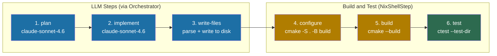
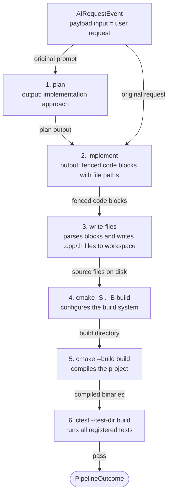

# CMake Pipeline

## Overview

The CMake dev-cycle pipeline runs a planning and implementation workflow on a
C++ project, writes the generated code to disk, then configures, builds, and
runs the CTest suite. It is designed to work with projects that use CMake as
their build system.

All shell steps are nix-aware -- if a `flake.nix` is detected in the workspace,
every command is automatically wrapped in `nix develop --command`.

---

## Pipeline Flow



---

## Data Flow Between Steps



---

## Step-by-Step Explanation

### Step 1: plan (OrchestratorStep, action: "plan")

Sends the user's original request to `claude-sonnet-4.6` via the Copilot API.
Produces a high-level implementation plan for the C++ change.

**Model:** `claude-sonnet-4.6` (GitHub Copilot, `copilot-default` profile, `planner` role)
**Input:** `event.payload.input`
**Output:** Implementation plan stored in `ctx.results.get("plan")`

### Step 2: implement (OrchestratorStep, action: "edit")

Combines the plan with the original request into a structured prompt. The model
must respond with fenced code blocks that include file paths:

```typescript
(ctx) => {
  const plan = ctx.results.get("plan")?.output ?? "";
  const original = ctx.event.payload.input ?? "";
  return `Implement the following plan in C++. Output ONLY fenced code blocks with file paths.\n\nPlan:\n${plan}\n\nOriginal request: ${original}`;
}
```

**Model:** `claude-sonnet-4.6` (GitHub Copilot, `copilot-default` profile, `implementer` role)
**Input:** plan + original request (composed by buildPrompt)
**Output:** Fenced code blocks with format ` ```cpp <relative-path> `

### Step 3: write-files (FileWriterStep)

Parses the fenced code blocks from the `implement` output and writes each block
to the corresponding file path relative to the workspace directory. This is what
actually applies the generated code to disk before the build runs.

**Reads from:** `ctx.results.get("implement")`
**Writes to:** `<workspace>/<relative-path>` for each code block

### Step 4: configure (NixShellStep)

Runs `cmake -S . -B <buildDir>`. Configures the CMake build system in the
specified build directory.

**Command:** `cmake -S . -B <buildDir>`
**Failure:** Missing `CMakeLists.txt`, bad CMake syntax, or missing dependencies

### Step 5: build (NixShellStep)

Runs `cmake --build <buildDir>`. Compiles the project using the configured
build directory. Fails the pipeline on any compilation error.

**Command:** `cmake --build <buildDir>`
**Failure:** Compilation errors

### Step 6: test (NixShellStep)

Runs `ctest --test-dir <buildDir> --output-on-failure`. Executes all tests
registered with CTest. The `--output-on-failure` flag shows test output only
for failing tests, keeping successful output clean.

**Command:** `ctest --test-dir <buildDir> --output-on-failure`
**Failure:** Any test failure

---

## Prerequisites

- `cmake` on PATH (or in a nix dev shell)
- `ctest` on PATH (ships with CMake)
- A `CMakeLists.txt` in the workspace root
- GitHub Copilot token available (via `opencode auth login` or `COPILOT_TOKEN` env)

### Registering tests with CTest

Tests must be registered in `CMakeLists.txt` using `add_test()`:

```cmake
enable_testing()

add_executable(my_tests tests/main.cpp)
target_link_libraries(my_tests my_lib)

add_test(NAME MyTests COMMAND my_tests)
```

With GoogleTest, use `gtest_discover_tests`:

```cmake
include(GoogleTest)
gtest_discover_tests(my_tests)
```

---

## Invocation Example

```typescript
import { runPipeline } from "@ai-coding/pipeline";
import { CopilotDispatcher } from "ai-system/core/orchestrator/copilot-dispatcher";
import { COPILOT_DEFAULT_PROFILE } from "ai-system/config/model-profiles";
import type { OrchestratorConfig } from "ai-system/core/orchestrator/orchestrate";
import { createCMakeDevCyclePipeline } from
  "ai-system/core/pipeline/definitions/cmake-dev-cycle";
import type { AIRequestEvent } from "@ai-coding/shared";

const config: OrchestratorConfig = {
  profile: COPILOT_DEFAULT_PROFILE,
  dispatchers: {
    "claude-sonnet-4.6": new CopilotDispatcher(process.env.COPILOT_TOKEN ?? ""),
  },
};

const workspace = "/home/user/my-cpp-project";

const event: AIRequestEvent = {
  id: crypto.randomUUID(),
  timestamp: Date.now(),
  source: "cli",
  action: "plan",
  payload: {
    input: "Add a thread-safe cache to the network layer",
  },
};

// Uses "build" as the build dir by default (relative to workspace)
const steps = createCMakeDevCyclePipeline(config, workspace);

// Custom build directory:
// const steps = createCMakeDevCyclePipeline(config, workspace, "cmake-build-debug");

const result = await runPipeline(steps, event);

if (!result.ok) {
  console.error("Pipeline failed:", result.error.message);
  process.exit(1);
}

console.log(`Completed in ${result.value.totalDurationMs}ms`);
for (const step of result.value.steps) {
  console.log(`[${step.stepName}] ${step.durationMs}ms`);
}
```

Or use the CLI directly:

```bash
bun run pipeline cmake-dev-cycle /home/user/my-cpp-project \
  --input "Add a thread-safe cache to the network layer"
```

---

## Customization

### Change the build directory

```typescript
const steps = createCMakeDevCyclePipeline(config, workspace, "cmake-build-release");
```

### Pass additional CMake build flags

Extend the pipeline definition to use custom build commands:

```typescript
import { createNixShellStep } from "@ai-coding/pipeline";

// Replace the build step with a parallel build
createNixShellStep<AIRequestEvent>("build", ["cmake", "--build", "build", "--parallel", "4"], {
  cwd: workspace,
});
```

### Add a clang-tidy lint step

Insert a lint step between `write-files` and `configure`:

```typescript
createNixShellStep<AIRequestEvent>(
  "lint",
  ["run-clang-tidy", "-p", "build"],
  { cwd: workspace },
),
```

---

## Interpreting Failures

| Failing step | Likely cause | Action |
|---|---|---|
| `write-files` | No fenced code blocks in implement output | Check implement prompt / LLM response |
| `configure` | Missing or broken `CMakeLists.txt` | Fix CMake configuration manually |
| `build` | Compilation error | Run `cmake --build build` locally; fix errors |
| `test` | Test failure | Run `ctest --test-dir build --output-on-failure` locally |
| `test` | No tests registered | Add `add_test()` or `gtest_discover_tests()` to CMakeLists.txt |
