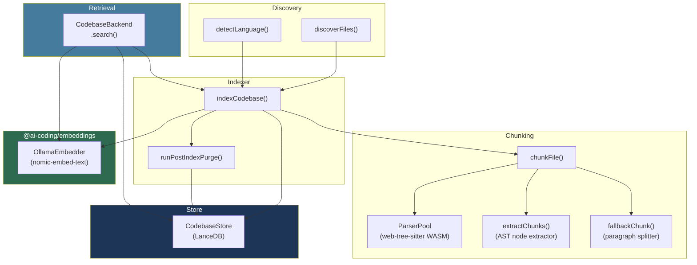
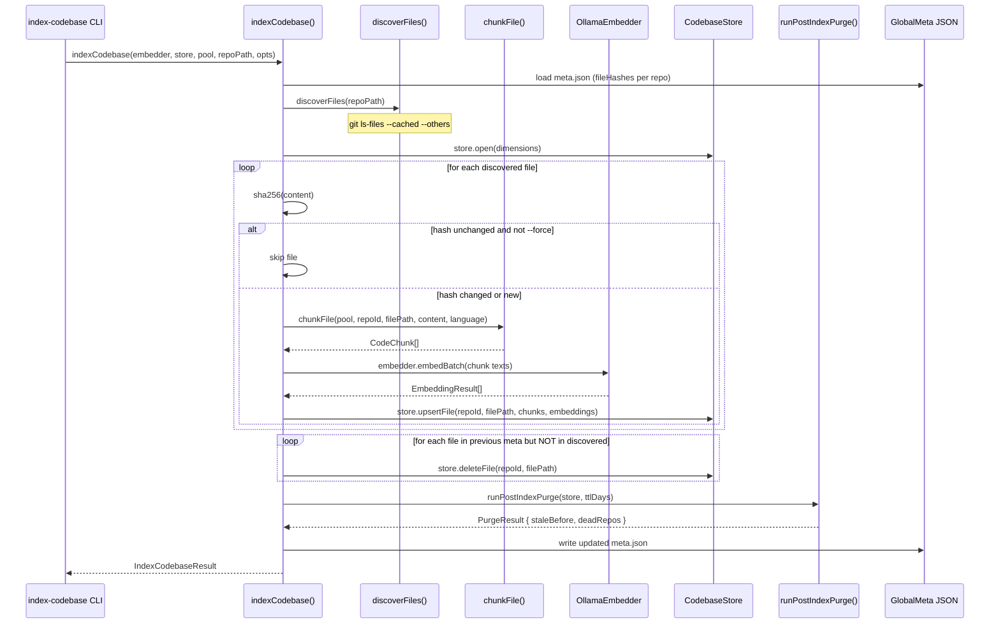
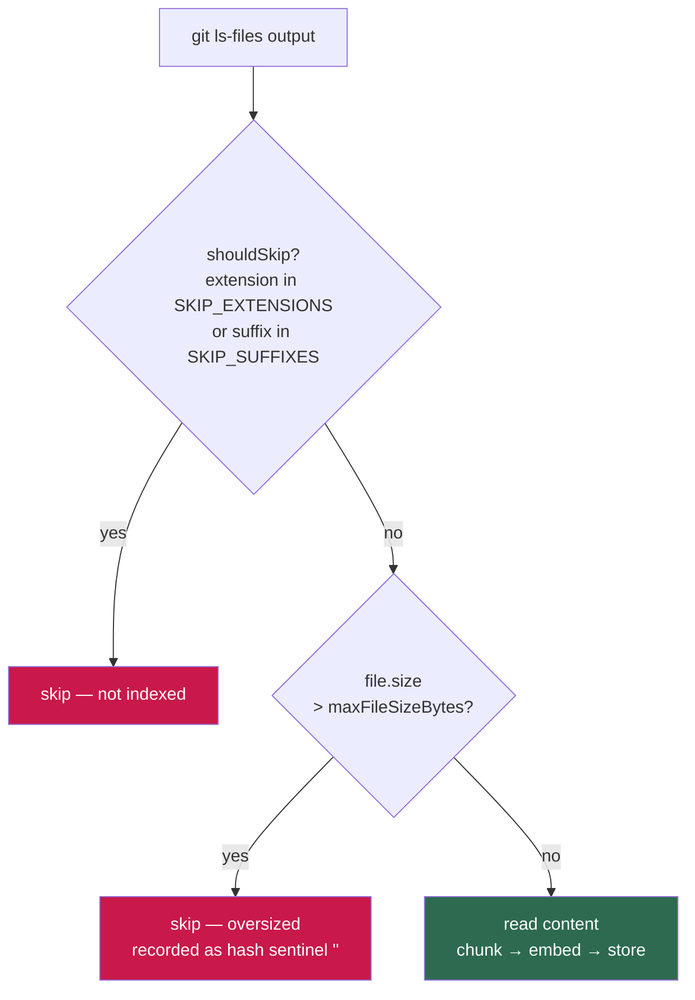
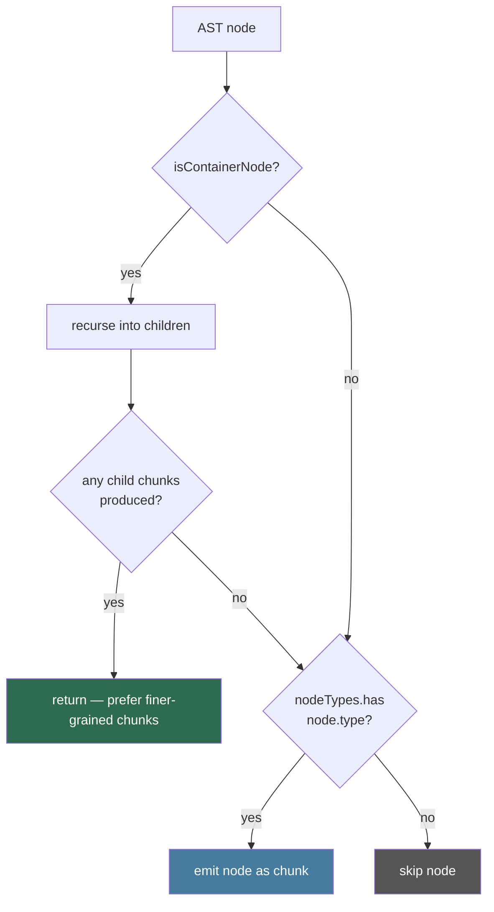
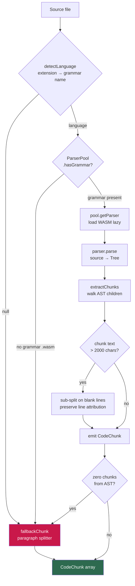
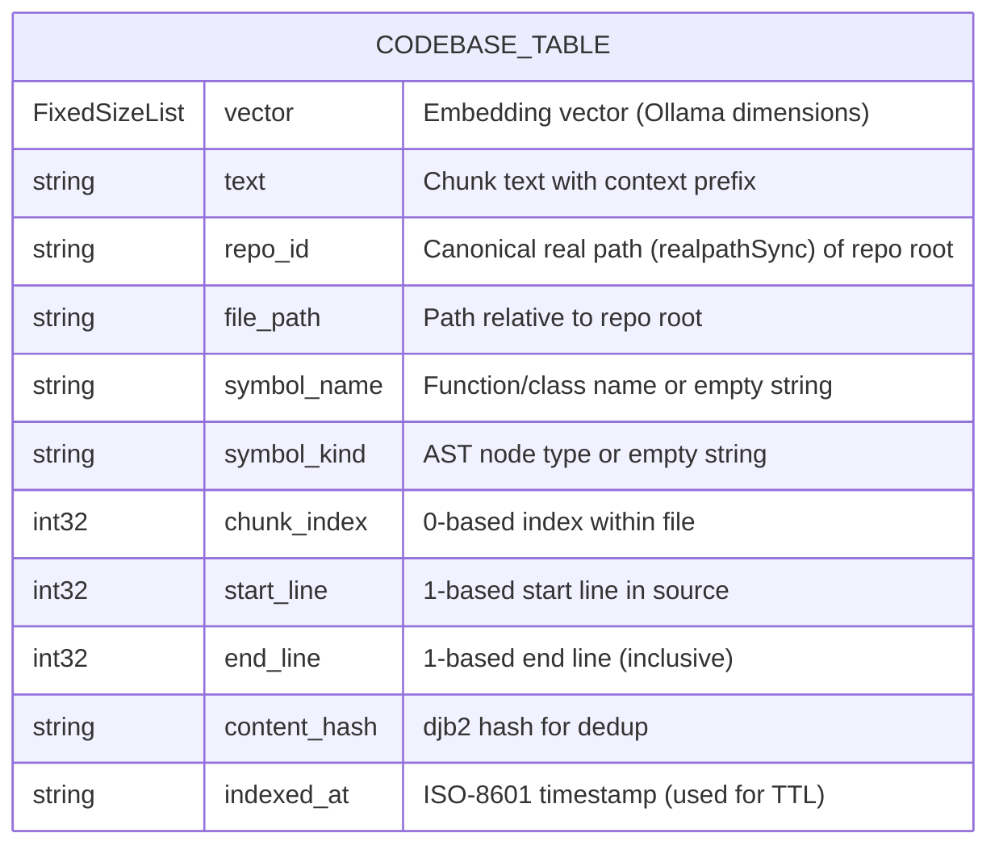
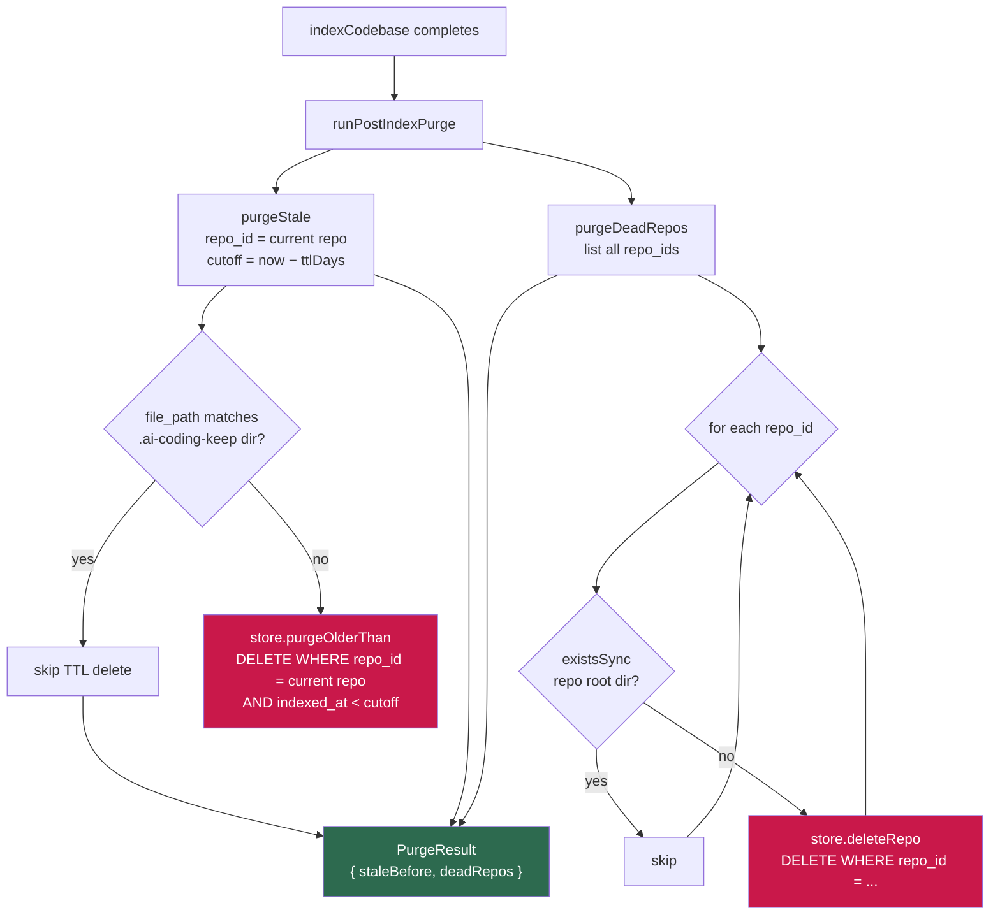

# Codebase RAG Indexer

## Goal

Index one or more git repositories into a local LanceDB vector store so that
OpenCode sessions can retrieve semantically relevant code chunks without
re-reading the entire codebase on every request. This reduces per-session token
costs and enables cross-repo search.

---

## Architecture Overview

The codebase indexer lives in `packages/codebase/` (`@ai-coding/codebase`) and
is composed of four cooperating layers:



**Key design choices:**

- **WASM-only tree-sitter** (`web-tree-sitter`) — avoids Bun crash issues with
  native NAPI bindings (#17503, #30286, #23770).
- **Incremental re-indexing** — only files whose SHA-256 hash changed are
  re-embedded; unchanged files are skipped in < 1 ms.
- **Fallback chunker** — files with no installed grammar use a heading-aware
  paragraph splitter, so markdown, TOML, YAML, and other text files are still
  indexed.
- **Single LanceDB table** — all repos share the `codebase` table, keyed by
  `repo_id` (= canonical repo root path, resolved via `realpathSync()`). Multi-repo
  global search is a single vector query.
- **Symlink canonicalization** — all repo paths are resolved to their real path
  via `realpathSync()` at every entry point (CLI, library, and retrieval). This
  means `/via/symlink` and `/real/path` always resolve to the same `repo_id`.

---

## Indexing Flow



---

## File Filtering Pipeline

Before a file reaches the chunker, it passes through two independent guards in
`discoverFiles()` and `indexCodebase()`.



**Skipped extensions** (`SKIP_EXTENSIONS` in `discover-files.ts`):

Binary and generated file types that produce no useful text chunks:
`.png`, `.jpg`, `.gif`, `.svg`, `.ico`, `.woff`, `.woff2`, `.ttf`, `.eot`,
`.mp4`, `.mp3`, `.wav`, `.pdf`, `.zip`, `.tar`, `.gz`, `.bz2`, `.xz`,
`.7z`, `.rar`, `.exe`, `.dll`, `.so`, `.dylib`, `.a`, `.lib`, `.o`, `.obj`,
`.wasm`, `.bin`, `.dat`, `.db`, `.sqlite`, `.lock`, `.min.js`, `.min.css`,
`.map`, `.snap`, `.pb`, `.onnx`, `.pt`, `.pth`, `.safetensors`.

**Skipped suffixes** (`SKIP_SUFFIXES` in `discover-files.ts`):

Compound suffixes that are not caught by extension alone:
`.vcxproj.filters`.

**Oversized file handling:**

Files whose `file.size` (bytes) exceeds `maxFileSizeBytes` (default `100_000`)
are skipped without reading their content into memory. The file's hash is
recorded as the sentinel value `""` so that:

- On re-run, the file is still skipped (sentinel ≠ real hash, but size guard
  fires first).
- If the file later shrinks below the limit, the sentinel `""` differs from the
  real hash, triggering a re-index.
- `--force` does **not** override the size cap — oversized files are always
  skipped regardless of `--force`.

---

## Container Node Recursion (C++ AST)

Large C++ template headers (e.g. GeometricTools / GTE) define hundreds of
member functions inside a single `template_declaration` wrapping a
`class_specifier`. Without container recursion, the entire class would be
emitted as one oversized chunk, causing Ollama to reject it with a
`400 {"error":"the input length exceeds the context length"}` error.

`collectChunks()` uses a **container-first** strategy:



**Container node types:**

| Node type | Language | Purpose |
|-----------|----------|---------|
| `namespace_definition` | C++ | Recurse into namespace body |
| `class_specifier` | C++ | Recurse into class body (member functions) |
| `struct_specifier` | C++ | Recurse into struct body |
| `template_declaration` | C++ | Recurse into template body |
| `mod_item` | Rust | Recurse into module body |
| `module_definition` | Julia | Recurse into module body |
| `program` | various | Root node alias |
| `source_file` | various | Root node alias |
| `translation_unit` | C/C++ | Root node alias |

**Empty container fallback:** If a `class_specifier` or `struct_specifier` has
no member functions (e.g. a forward declaration or a struct with only field
declarations), recursion produces zero child chunks and the container is emitted
as a single chunk instead.

---

## Chunking Decision Tree

Each source file passes through `chunkFile()`, which routes to tree-sitter or
the fallback chunker depending on whether a grammar `.wasm` is installed.



**Chunk context prefix** — every chunk is prefixed with a self-contained header
so retrieval results are useful without extra context:

```
# file: src/store/lance-store.ts | class: LanceStore

export class LanceStore { ... }
```

---

## LanceDB Store Schema

The `codebase` table has a fixed Arrow schema. It is created once and shared
across all indexed repos.



**Default path:** `~/.local/share/ai-coding/codebase.lance`

Override with `AI_CODING_CODEBASE_DB` environment variable.

**Upsert strategy:** `upsertFile()` deletes all existing rows for
`(repo_id, file_path)` and then bulk-inserts the new chunks. This is simpler
than `mergeInsert` and sufficient for per-file granularity.

---

## Query-Time Freshness

`CodebaseBackend.search()` supports two freshness modes, selectable per-call via
the `refresh` option.

```mermaid
sequenceDiagram
    participant Caller
    participant CB as CodebaseBackend
    participant IC as indexCodebase()
    participant OE as OllamaEmbedder
    participant CS as CodebaseStore

    Caller->>CB: search(query, repoPath, { refresh: true })

    Note over CB: refresh=true (default)
    CB->>IC: indexCodebase(embedder, store, pool, repoPath, { ttlDays: 3650 })
    Note over IC: Incremental — only changed files re-embedded
    IC-->>CB: IndexCodebaseResult

    CB->>OE: embedder.embed(query)
    OE-->>CB: EmbeddingResult { vector }

    CB->>CS: store.searchInRepo(vector, repoPath, limit)
    CS-->>CB: CodebaseSearchResult[]

    CB-->>Caller: CodebaseResult[] (score = 1 − distance)

    ---

    Caller->>CB: search(query, repoPath, { refresh: false })

    Note over CB: refresh=false — skip re-index
    CB->>CS: store.open() — throws if table missing
    CB->>OE: embedder.embed(query)
    OE-->>CB: EmbeddingResult { vector }
    CB->>CS: store.searchInRepo(vector, repoPath, limit)
    CS-->>CB: CodebaseSearchResult[]
    CB-->>Caller: CodebaseResult[]
```

**When to use `refresh: false`:**

- Large repos (poky-scale) where the nightly `index-codebase` run is the
  primary indexing mechanism.
- Performance-sensitive paths where < 1 ms freshness check overhead matters.
- From the `codebase-retrieval` CLI via the `--no-refresh` flag.

**Score:** `score = 1 − L2_distance`. Higher is more similar. Range is
`(−∞, 1]`; well-matched chunks score close to 1.

---

## Purge Pipeline

The post-index purge runs automatically after every `indexCodebase()` call.
It has two stages that together prevent unbounded store growth.



**Default TTL:** 30 days (`DEFAULT_TTL_DAYS`). Override per-call via
`IndexCodebaseOptions.ttlDays`.

TTL sweeps are scoped to the repository currently being indexed, so indexing one
repository cannot evict stale rows for another repository. After indexing and
deleted-file cleanup, `indexCodebase()` bulk-refreshes `indexed_at` for every
surviving row in the current repo, including files skipped by the hash check.

**Directory TTL exemption:** place an empty `.ai-coding-keep` file inside a
directory to prevent rows under that relative prefix from being TTL-evicted. For
example, `GeometricTools/.ai-coding-keep` exempts `GeometricTools/`. A root-level
marker is ignored because it would disable TTL for the entire repo.

**Note:** Query-time refresh uses `ttlDays: 3650` (≈10 years) so that freshly
indexed rows are never swept away immediately after indexing.

**Manual purge commands:**

```bash
# Via bun run (from ai-coding monorepo)
bun run index-codebase --purge-only                 # dead-repo sweep only
bun run index-codebase /path/to/repo --purge-repo /path/to/repo  # remove one specific repo

# Via shell wrapper (from any directory)
index-codebase --purge-only                 # dead-repo sweep only (no Ollama needed)
index-codebase --purge-repo /path/to/repo  # remove one specific repo (no Ollama needed)

# Adjust TTL
index-codebase --ttl 7
```

> **Offline use:** `--purge-only` and `--purge-repo` do not require Ollama to be
> running — they exit before the Ollama reachability check.

---

## CLI Usage

### Index a repository

```bash
bun run index-codebase <repo-path> [options]
```

| Flag | Default | Description |
|------|---------|-------------|
| `--force` | off | Re-index all files, bypassing the hash check |
| `--max-file-bytes <n>` | `100000` | Skip files larger than this many bytes (size check uses `file.size`, not char count) |
| `--purge-only` | off | Run dead-repo purge only; no indexing or TTL sweep. Does not require Ollama |
| `--purge-repo <path>` | — | Remove all indexed chunks for a specific repo. Does not require Ollama |
| `--ttl <days>` | `30` | TTL for the post-index purge sweep |
| `--db-path <path>` | `~/.local/share/ai-coding/codebase.lance` | LanceDB path |
| `--model <name>` | `nomic-embed-text` | Ollama embedding model |
| `--grammars <dir>` | `~/.local/share/ai-coding/grammars` | Grammar `.wasm` directory |

```bash
# Index the current repo
bun run index-codebase .

# Force full re-index with a custom model
bun run index-codebase /path/to/my-project --force --model mxbai-embed-large

# Nightly cron (large repo, skip TTL purge of freshly indexed rows)
bun run index-codebase /path/to/poky --ttl 90

# Remove one specific repo from the index (no Ollama needed)
bun run index-codebase --purge-repo /path/to/old-project
```

### Search the index

```bash
bun run codebase-retrieval <query> [options]
```

| Flag | Default | Description |
|------|---------|-------------|
| `--workspace <path>` | — | Restrict results to this repo (also triggers refresh) |
| `--limit <n>` | `10` | Maximum number of results |
| `--no-refresh` | off | Skip incremental re-index before search |
| `--db-path <path>` | `~/.local/share/ai-coding/codebase.lance` | LanceDB path |
| `--model <name>` | `nomic-embed-text` | Ollama embedding model |
| `--grammars <dir>` | `~/.local/share/ai-coding/grammars` | Grammar `.wasm` directory |

```bash
# Search the current repo (auto-refresh)
bun run codebase-retrieval "hash-based staleness check" --workspace .

# Global search across all indexed repos
bun run codebase-retrieval "how does the purge step work"

# Fast query without re-index
bun run codebase-retrieval "LanceDB schema" --workspace . --no-refresh
```

---

## Shell Wrappers (run from any directory)

Home Manager deploys two bash wrapper scripts to `~/.local/bin/` so the
indexer and retrieval CLIs can be invoked from any repository directory
without `cd`-ing to the ai-coding monorepo first. Both wrappers use
`$AI_CODING_MONOREPO` (set globally by Home Manager) to locate the monorepo
and delegate to `bun run --cwd`.

### `index-codebase`

```bash
# Index the current directory (repo path defaults to $PWD)
index-codebase

# Index a specific repo
index-codebase /path/to/repo

# Force full re-index of current directory
index-codebase --force

# Custom TTL
index-codebase --ttl 7

# Dead-repo purge only (no Ollama needed)
index-codebase --purge-only

# Remove a specific repo from the index (no Ollama needed)
index-codebase --purge-repo /path/to/old-project
```

All flags (`--force`, `--max-file-bytes`, `--ttl`, `--purge-only`, `--purge-repo`, `--db-path`, `--model`, `--grammars`) are
forwarded verbatim to the underlying CLI.

### `codebase-retrieval`

```bash
# Search the current repo (--workspace $PWD is injected automatically)
codebase-retrieval "hash-based staleness check"

# Search a specific repo
codebase-retrieval "purge pipeline" --workspace /path/to/repo

# Limit results
codebase-retrieval "LanceDB schema" --limit 5

# Fast query without incremental re-index
codebase-retrieval "LanceDB schema" --no-refresh
```

When `--workspace` is not provided, `$PWD` is injected automatically so
results are scoped to the repository you are currently working in. Pass
`--workspace` explicitly to search a different repo or to search globally
(omit `--workspace` entirely only when you want cross-repo results — but
note that the wrapper always injects `$PWD` unless you override it).

### Prerequisites

Scripts are deployed by running `home-manager switch` on any machine. After
the switch, open a new shell (so `~/.local/bin` is on `$PATH`) and verify:

```bash
which index-codebase       # → ~/.local/bin/index-codebase
which codebase-retrieval   # → ~/.local/bin/codebase-retrieval
```

---

## Environment Variables

| Variable | Default | Description |
|----------|---------|-------------|
| `AI_CODING_CODEBASE_DB` | `~/.local/share/ai-coding/codebase.lance` | LanceDB store path |
| `AI_CODING_GRAMMARS_DIR` | `~/.local/share/ai-coding/grammars` | Tree-sitter `.wasm` grammar directory |

---

## Programmatic API

```typescript
import { CodebaseBackend, CodebaseStore, ParserPool } from "@ai-coding/codebase";
import { OllamaEmbedder } from "@ai-coding/embeddings";

const embedder = new OllamaEmbedder("nomic-embed-text");
const store    = new CodebaseStore();
const pool     = new ParserPool();
const backend  = new CodebaseBackend(embedder, store, pool);

// Search with automatic incremental refresh
const results = await backend.search("hash-based staleness", "/path/to/repo");
for (const r of results) {
  console.log(`${r.filePath}:${r.startLine}-${r.endLine} (score ${r.score.toFixed(3)})`);
  console.log(r.text.slice(0, 200));
}
```

---

## Language Support

| Language | Extensions | Status |
|----------|-----------|--------|
| TypeScript | `.ts`, `.tsx`, `.mts`, `.cts` | Deployed |
| JavaScript | `.js`, `.mjs`, `.cjs`, `.jsx` | Deployed |
| Rust | `.rs` | Deployed |
| C | `.c` | Deployed |
| C++ | `.cpp`, `.cc`, `.cxx`, `.h`, `.hpp`, `.hxx` | Deployed |
| Python | `.py` | Deployed |
| Haskell | `.hs`, `.lhs` | Grammar not yet deployed |
| Lua | `.lua` | Grammar not yet deployed |
| Julia | `.jl` | Grammar not yet deployed |
| *Everything else* | — | Fallback paragraph chunker |

> **Note on `.h` files:** Header files use the C++ grammar (a strict superset
> of C) so that `template_declaration`, `class_specifier`, and
> `namespace_definition` nodes are recognised. Pure C headers with no C++
> constructs are handled correctly by the C++ grammar.

Grammar files are deployed by Home Manager to `~/.local/share/ai-coding/grammars/`
as `tree-sitter-<language>.wasm`. Run `home-manager switch` to deploy new grammars.

---

## Adding a New Language

1. **Extension mapping** — add to `EXT_TO_LANG` in
   `packages/codebase/src/discovery/detect-language.ts`:
   ```typescript
   ".go": "go",
   ```

2. **AST node types** — add to `CHUNK_NODES` in
   `packages/codebase/src/chunking/node-extractors.ts`:
   ```typescript
   go: [
     "function_declaration",
     "method_declaration",
     "type_declaration",
     "import_declaration",
   ],
   ```

3. **Grammar deployment** — add a `pkgs.fetchurl` entry in the home-manager
   Nix configuration (see `modules/grammars.nix` in the home-manager repo),
   pinned to a known SHA-256:
   ```nix
   "tree-sitter-go.wasm" = pkgs.fetchurl {
     url  = "https://github.com/nicolo-ribaudo/tree-sitter-go-wasm/releases/download/v0.1.0/tree-sitter-go.wasm";
     sha256 = "sha256-<hash>";
   };
   ```

4. **Deploy** — run `home-manager switch` to copy the `.wasm` file to
   `~/.local/share/ai-coding/grammars/tree-sitter-go.wasm`.

5. **Test** — write a test in `packages/codebase/src/chunking/node-extractors.test.ts`
   that parses a short Go snippet and asserts the expected chunks.

---

## Troubleshooting

### `400 {"error":"the input length exceeds the context length"}`

Ollama rejected a chunk because it was too large for the embedding model's
context window. This can happen with very large source files or C++ template
headers that were not split correctly.

**Fix 1 — Reduce the file size limit** (skip files that are too large to chunk
usefully):

```bash
index-codebase /path/to/repo --max-file-bytes 50000
```

**Fix 2 — Force a full re-index** after upgrading to a version with container
node recursion (which splits large C++ template classes per-member-function):

```bash
index-codebase /path/to/repo --force
```

**Fix 3 — Check which file is causing the error** by temporarily reducing
`--max-file-bytes` until the error disappears, then identifying the culprit:

```bash
index-codebase /path/to/repo --max-file-bytes 10000
```

### `Grammar not found for language "typescript": ...`

The `.wasm` grammar file is missing from `AI_CODING_GRAMMARS_DIR`.

```bash
# Check what grammars are deployed
ls ~/.local/share/ai-coding/grammars/

# Re-deploy via Home Manager
home-manager switch --flake ~/Projects/home-manager#<machine>
```

### `CodebaseStore not opened`

`refresh: false` was passed but no previous `index-codebase` run has created the
LanceDB table. Either run `bun run index-codebase <repo>` first, or drop the
`--no-refresh` flag.

### Ollama not running

```bash
# Start Ollama
ollama serve

# Pull the embedding model
ollama pull nomic-embed-text
```

### Index is stale after code changes

By default the `CodebaseBackend` runs an incremental re-index on every search
(`refresh: true`). If you are using `--no-refresh`, re-run:

```bash
bun run index-codebase <repo-path>
```

### Symlink migration — search returns no results after upgrading

All repo paths are now canonicalized with `realpathSync()`. If you previously
indexed a repo via a symlink path (e.g. `/via/link/my-repo` instead of
`/real/path/my-repo`), the old rows are keyed under the symlink path and won't
match queries that resolve to the canonical path.

Fix: re-index the repo to write canonical-path rows:

```bash
index-codebase /path/to/repo --force
```

The old symlink-keyed rows are treated as a separate repo ID. To remove them
immediately, purge the old symlink path explicitly:

```bash
index-codebase --purge-repo /via/link/my-repo
```

---

## References

- [`packages/codebase/README.md`](../packages/codebase/README.md) — package-level quick-start
- [`packages/embeddings/README.md`](../packages/embeddings/README.md) — embedder API reference
- [`docs/architecture.md`](./architecture.md) — full system component diagram
- [`docs/skills.md`](./skills.md) — skill retrieval system (parallel use-case)
