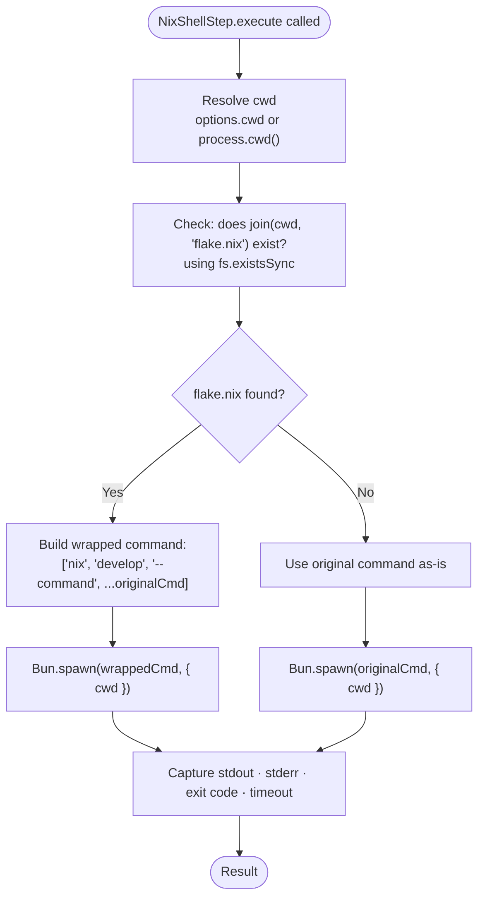

# Nix Integration

## Overview

All pipeline shell steps come in two variants:

| Step factory | Nix-aware? |
|---|---|
| `createShellStep` | No -- runs command directly |
| `createNixShellStep` | Yes -- auto-detects `flake.nix` and wraps in `nix develop` |

The `createNixShellStep` factory is the default choice in all built-in pipeline
definitions (Rust, C++, TypeScript). It makes the same pipeline definition work
in both nix-managed environments (where tools live inside the dev shell) and
standard environments (where tools are on the system PATH).

---

## How Auto-Detection Works

Detection happens at **step execution time**, not at pipeline creation time. This
means the flake check is performed immediately before each shell command runs.



The check uses Node's synchronous `fs.existsSync` -- a single filesystem stat
per step invocation. There is no caching; if you add or remove `flake.nix`
between steps, subsequent steps will re-detect.

---

## What Gets Wrapped

When `flake.nix` is present, the original command array is prefixed:

```
Original:  ["cargo", "test"]
Wrapped:   ["nix", "develop", "--command", "cargo", "test"]
```

```
Original:  ["bun", "test"]
Wrapped:   ["nix", "develop", "--command", "bun", "test"]
```

```
Original:  ["cmake", "--build", "build"]
Wrapped:   ["nix", "develop", "--command", "cmake", "--build", "build"]
```

The `--command` flag tells nix to enter the dev shell and run the specified
command, then exit. It is not an interactive shell session.

---

## Requirements

### When nix is available and flake.nix exists

- `nix` must be on the system PATH (typically `/nix/bin/nix` or via the nix
  installer's PATH additions)
- The `flake.nix` must expose a `devShell` that provides the required tools
- Nix flakes must be enabled: add `experimental-features = nix-command flakes`
  to `/etc/nix/nix.conf` or `~/.config/nix/nix.conf`

### When nix is not available

If no `flake.nix` is present in the cwd, the step runs the command directly --
`nix` does not need to be installed. This is the normal case for standard
Linux/macOS environments.

If `flake.nix` **is** present but `nix` is not installed, the step will fail
with a spawn error (command not found). The error propagates as a pipeline
failure. To avoid this, either install nix or remove `flake.nix` from the
project root.

---

## Nix Shell Integration Per Language

### Rust (flake.nix with rust-overlay)

A typical Rust `flake.nix` that exposes `cargo`, `rustfmt`, `clippy`, and
`cargo-tarpaulin` in the dev shell:

```nix
{
  inputs = {
    nixpkgs.url = "github:NixOS/nixpkgs/nixpkgs-unstable";
    rust-overlay.url = "github:oxalica/rust-overlay";
    flake-utils.url = "github:numtide/flake-utils";
  };

  outputs = { self, nixpkgs, rust-overlay, flake-utils }:
    flake-utils.lib.eachDefaultSystem (system:
      let
        pkgs = import nixpkgs {
          inherit system;
          overlays = [ rust-overlay.overlays.default ];
        };
        rust = pkgs.rust-bin.stable.latest.default.override {
          extensions = [ "rust-src" "clippy" "rustfmt" ];
        };
      in {
        devShells.default = pkgs.mkShell {
          buildInputs = [ rust pkgs.cargo-tarpaulin ];
        };
      }
    );
}
```

With this in place, `createRustDevCyclePipeline` auto-detects the flake and
wraps all `cargo` commands in `nix develop --command`.

### C++ (flake.nix with CMake)

```nix
{
  inputs.nixpkgs.url = "github:NixOS/nixpkgs/nixpkgs-unstable";
  inputs.flake-utils.url = "github:numtide/flake-utils";

  outputs = { self, nixpkgs, flake-utils }:
    flake-utils.lib.eachDefaultSystem (system:
      let pkgs = nixpkgs.legacyPackages.${system};
      in {
        devShells.default = pkgs.mkShell {
          buildInputs = with pkgs; [ cmake ninja gcc gtest ];
        };
      }
    );
}
```

### TypeScript (flake.nix with Bun)

```nix
{
  inputs.nixpkgs.url = "github:NixOS/nixpkgs/nixpkgs-unstable";
  inputs.flake-utils.url = "github:numtide/flake-utils";

  outputs = { self, nixpkgs, flake-utils }:
    flake-utils.lib.eachDefaultSystem (system:
      let pkgs = nixpkgs.legacyPackages.${system};
      in {
        devShells.default = pkgs.mkShell {
          buildInputs = [ pkgs.bun pkgs.nodejs ];
        };
      }
    );
}
```

---

## Opting Out

If you want a step that never uses nix, use `createShellStep` instead of
`createNixShellStep`:

```typescript
import { createShellStep } from "@ai-coding/pipeline";

// Always runs directly, even if flake.nix is present
createShellStep<AIRequestEvent>("test", ["cargo", "test"], { cwd: workspace });
```

You can mix nix-aware and non-nix steps in the same pipeline.

---

## Home Manager Integration

This project's nix configuration is managed by Home Manager. Ollama runs as a
systemd service and OpenCode is installed globally. The `flake.nix` in each
project directory controls the dev environment for that project's build tools.

The pipeline infrastructure makes no assumptions about how nix is configured --
it only checks for `flake.nix` and invokes `nix develop --command`. Any valid
nix flake dev shell works.
