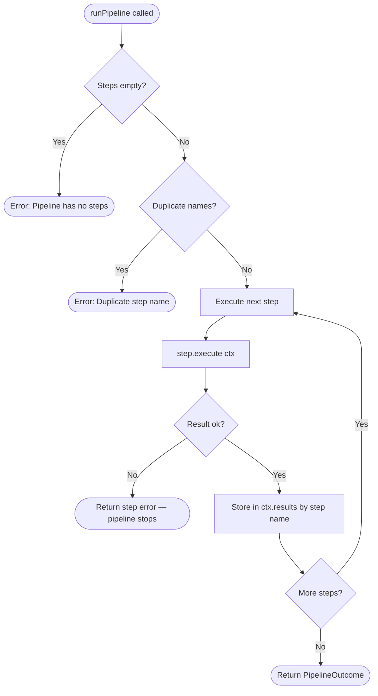
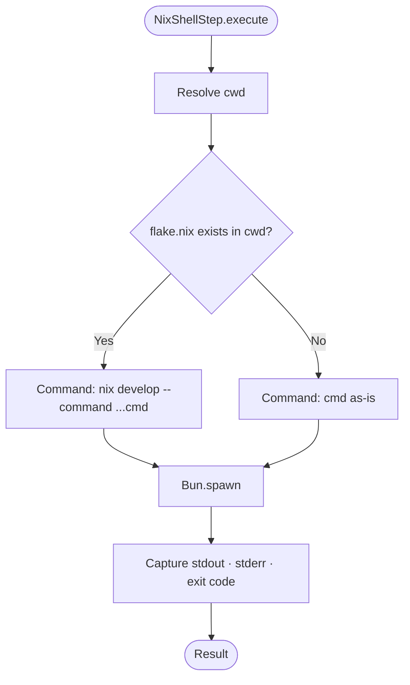
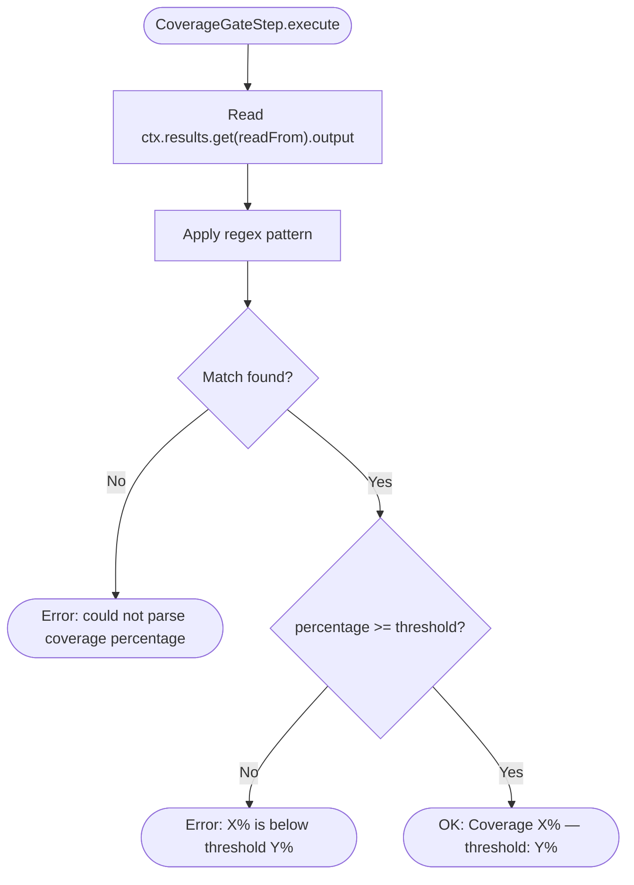

# Pipelines

## Overview

A pipeline coordinates a multi-step agent workflow where the output of one step
feeds the input of the next. Each step is an independent unit of work -- an LLM
call, a shell command, or any custom logic -- and all steps share a mutable
context so they can read each other's outputs.

The generic pipeline infrastructure lives in `@ai-coding/pipeline` with no
dependency on AI-specific types. Language-specific step implementations
(`OrchestratorStep`) and pipeline definitions (Rust, C++, TypeScript) live in
`ai-system/core/pipeline/`, which imports from both `@ai-coding/pipeline` and
`@ai-coding/shared`.

See [docs/architecture.md](./architecture.md) for the full system architecture.

---

## Pipeline Runner Flow



---

## Core Concepts

### PipelineStep

The unit of work. Every step implements this interface (generic over `TEvent`):

```typescript
interface PipelineStep<TEvent = unknown> {
  readonly name: string;
  execute(ctx: PipelineContext<TEvent>): Promise<Result<StepResult>>;
}
```

- The `name` must be unique within a pipeline run -- it is the key under which
  the step's result is stored in `ctx.results`.
- `execute` returns `Result<StepResult>`: either `{ ok: true, value }` on success
  or `{ ok: false, error }` on failure. Never throw -- wrap exceptions in a `Result`.

### PipelineContext

Shared state threaded through every step. `TEvent` matches whatever event type
the caller provides:

```typescript
interface PipelineContext<TEvent = unknown> {
  readonly event: TEvent;                    // original request, unchanged
  readonly results: Map<string, StepResult>; // each prior step's output
}
```

Steps read prior outputs via `ctx.results.get("step-name")?.output`. A step can
only read results from steps that ran before it.

### StepResult

What a step produces on success:

```typescript
interface StepResult {
  readonly stepName: string;
  readonly output: string;   // stdout for shell steps, LLM response for AI steps
  readonly durationMs: number;
}
```

### PipelineOutcome

What `runPipeline` returns on full success:

```typescript
interface PipelineOutcome {
  readonly steps: readonly StepResult[];
  readonly totalDurationMs: number;
}
```

### Early exit

When any step returns `{ ok: false, error }`, the pipeline stops immediately and
returns that error. Steps after the failing one are never executed.

---

## Built-in Step Types

### ShellStep

Runs a fixed shell command. Commands are passed as an array -- no shell
interpolation -- eliminating injection risk.

```typescript
import { createShellStep } from "@ai-coding/pipeline";

createShellStep(
  name: string,
  command: readonly string[],
  options?: {
    cwd?: string;            // working directory (default: process.cwd())
    timeoutMs?: number;      // kill after N ms (default: 60000)
    failOnNonZero?: boolean; // fail on non-zero exit (default: true)
  }
)
```

On success: stdout becomes `StepResult.output`.
On non-zero exit (default): returns an error with exit code and stderr.
On timeout: kills the process, returns an error.

### NixShellStep

Identical to `ShellStep` but auto-detects `flake.nix` in the working directory.
If found, the command is wrapped in `nix develop --command`. If not, it runs
directly. This lets the same pipeline definition work in both nix-managed
and standard environments.



```typescript
import { createNixShellStep } from "@ai-coding/pipeline";

createNixShellStep(
  name: string,
  command: readonly string[],
  options?: ShellStepOptions  // same as ShellStep
)
```

See [docs/nix-integration.md](./nix-integration.md) for full details.

### CoverageGateStep

Reads a prior step's output, extracts a coverage percentage using a regex, and
fails the pipeline if it falls below the configured threshold.



```typescript
import { createCoverageGateStep } from "@ai-coding/pipeline";

createCoverageGateStep(
  name: string,
  readFrom: string,    // name of the step whose output contains the coverage report
  threshold: number,   // minimum acceptable percentage (0-100)
  pattern?: RegExp     // default: /(\d+\.?\d*)% coverage/i (tarpaulin format)
)
```

The default pattern matches `cargo tarpaulin` text output:
`87.50% coverage, 35/40 lines covered`. Supply a custom pattern for other tools.

### OrchestratorStep

_(AI-specific -- lives in `ai-system/`, not in `@ai-coding/pipeline`)_

Wraps the existing `orchestrate()` function. Each invocation goes through the
full routing chain: `resolveMode → selectModel → dispatcher.dispatch`.

```typescript
import { createOrchestratorStep } from
  "ai-system/core/pipeline/steps/orchestrator-step";

createOrchestratorStep(
  name: string,
  action: AIAction,
  config: OrchestratorConfig,
  buildPrompt?: (ctx: PipelineContext<AIRequestEvent>) => string,
)
```

The `buildPrompt` callback is how steps wire context together. It receives the
full context so it can read prior step outputs:

```typescript
createOrchestratorStep("implement", "edit", config, (ctx) => {
  const plan = ctx.results.get("plan")?.output ?? "";
  return `Implement this plan:\n\n${plan}`;
});
```

When omitted, the original `event.payload.input` is used unchanged.

---

## How to Invoke a Pipeline

### 1. Build the dispatcher config

```typescript
import { CopilotDispatcher } from
  "ai-system/core/orchestrator/copilot-dispatcher";
import { OllamaDispatcher } from
  "ai-system/core/orchestrator/ollama-dispatcher";
import type { OrchestratorConfig } from
  "ai-system/core/orchestrator/orchestrate";

const config: OrchestratorConfig = {
  dispatchers: {
    "claude-sonnet":     new CopilotDispatcher(process.env.COPILOT_TOKEN ?? ""),
    "deepseek-coder-v2": new OllamaDispatcher(),
    "qwen3:8b":  new OllamaDispatcher(),
  },
};
```

### 2. Choose and create a pipeline

```typescript
import { createRustDevCyclePipeline } from
  "ai-system/core/pipeline/definitions/rust-dev-cycle";

const steps = createRustDevCyclePipeline(config, "/path/to/my-rust-project");
```

### 3. Create the event

```typescript
import type { AIRequestEvent } from "@ai-coding/shared";

const event: AIRequestEvent = {
  id: crypto.randomUUID(),
  timestamp: Date.now(),
  source: "cli",       // determines agentic mode, which drives model selection
  action: "plan",      // pipeline definitions override this per step internally
  payload: {
    input: "Add retry logic to the HTTP client with exponential backoff",
  },
};
```

### 4. Run and handle the result

```typescript
import { runPipeline } from "@ai-coding/pipeline";

const result = await runPipeline(steps, event);

if (!result.ok) {
  console.error("Pipeline failed:", result.error.message);
  process.exit(1);
}

console.log(`Completed in ${result.value.totalDurationMs}ms`);
for (const step of result.value.steps) {
  console.log(`\n[${step.stepName}] (${step.durationMs}ms)\n${step.output}`);
}
```

---

## How to Create a New Pipeline

### Step 1 -- Identify steps and their types

| Need to do | Use |
|-----------|-----|
| LLM call (plan, implement, debug) | `createOrchestratorStep` |
| Shell command, build tool, test runner | `createNixShellStep` (preferred) or `createShellStep` |
| Validate prior output | `createCoverageGateStep` or a custom step |

### Step 2 -- Create the factory in `definitions/`

Name files `<language>-<workflow>.ts`, e.g. `rust-debug-fix.ts`.

```typescript
// ai-system/core/pipeline/definitions/rust-debug-fix.ts

import { createNixShellStep } from "@ai-coding/pipeline";
import type { PipelineStep } from "@ai-coding/pipeline";
import type { AIRequestEvent } from "@ai-coding/shared";

import type { OrchestratorConfig } from "../../orchestrator/orchestrate";
import { createOrchestratorStep } from "../steps/orchestrator-step";

export function createRustDebugFixPipeline(
  config: OrchestratorConfig,
  workspace: string,
): readonly PipelineStep<AIRequestEvent>[] {
  return [
    createOrchestratorStep("debug", "debug", config),

    createOrchestratorStep("fix", "edit", config, (ctx) => {
      const diagnosis = ctx.results.get("debug")?.output ?? "";
      const original  = ctx.event.payload.input ?? "";
      return (
        `A debugging agent diagnosed:\n\n${diagnosis}\n\n` +
        `Apply a fix. Original report: ${original}`
      );
    }),

    createNixShellStep<AIRequestEvent>("verify", ["cargo", "test"], { cwd: workspace }),
  ];
}
```

### Step 3 -- Wire context between steps

Use `buildPrompt` on `OrchestratorStep` to read prior results:

```typescript
(ctx) => {
  const prev = ctx.results.get("prior-step-name")?.output ?? "";
  return `Based on:\n\n${prev}\n\nNow do...`;
}
```

---

## Creating Custom Step Types

Implement `PipelineStep<TEvent>` directly for anything that does not fit the
built-in factories.

```typescript
import type { Result } from "@ai-coding/pipeline";
import type { PipelineContext, PipelineStep, StepResult } from "@ai-coding/pipeline";

export function createValidatorStep<TEvent>(
  name: string,
  validate: (ctx: PipelineContext<TEvent>) => boolean,
  errorMessage: string,
): PipelineStep<TEvent> {
  return {
    name,
    execute: async (ctx: PipelineContext<TEvent>): Promise<Result<StepResult>> => {
      const startedAt = Date.now();
      if (!validate(ctx)) {
        return { ok: false, error: new Error(errorMessage) };
      }
      return {
        ok: true,
        value: { stepName: name, output: "validation passed", durationMs: Date.now() - startedAt },
      };
    },
  };
}
```

Rules for custom steps:
- Return `{ ok: false, error }` to stop the pipeline.
- Return `{ ok: true, value: StepResult }` to continue.
- `StepResult.stepName` must equal the step's `name` property.
- Never throw -- always return a `Result`.
- Keep steps stateless -- avoid mutable shared state between step instances.
