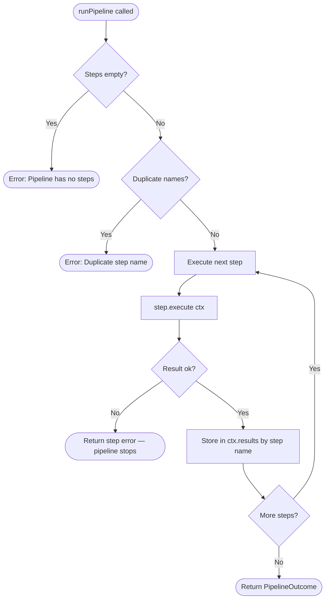
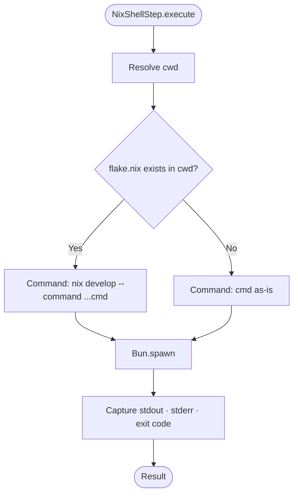
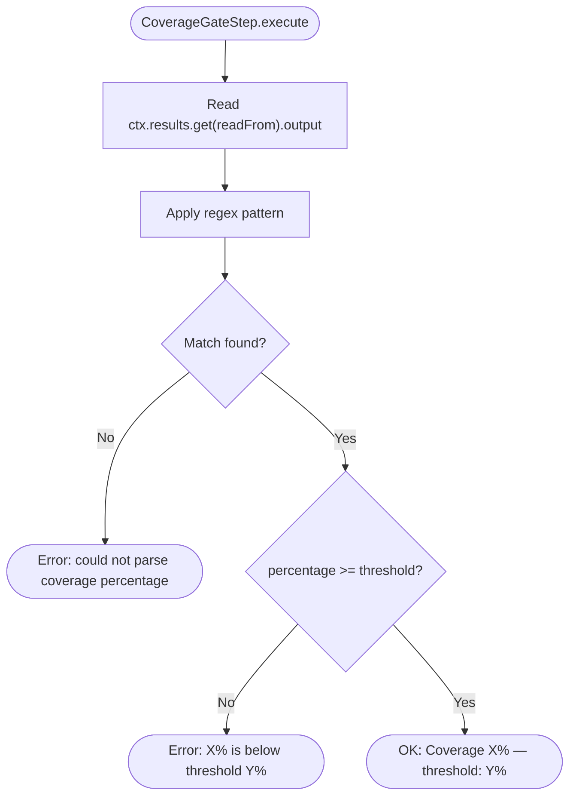
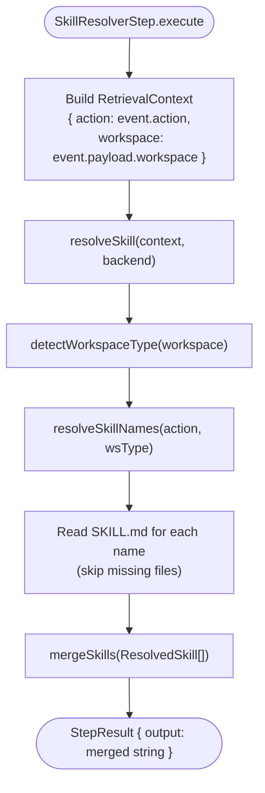

# Pipelines

## Overview

A pipeline coordinates a multi-step agent workflow where the output of one step
feeds the input of the next. Each step is an independent unit of work -- an LLM
call, a shell command, or any custom logic -- and all steps share a mutable
context so they can read each other's outputs.

The generic pipeline infrastructure lives in `@ai-coding/pipeline` with no
dependency on AI-specific types. Language-specific step implementations
(`OrchestratorStep`) and pipeline definitions (9 languages via `plan-cycle`:
Rust, TypeScript, Python, C++, Docs, Haskell, Julia, Nix, Shell) live in
`ai-system/core/pipeline/`, which imports from both `@ai-coding/pipeline` and
`@ai-coding/shared`.

See [docs/architecture.md](./architecture.md) for the full system architecture.

---

## Pipeline Runner Flow


```mermaid
flowchart TD
    Start([runPipeline called]) --> Empty{Steps empty?}
    Empty -->|Yes| ErrEmpty([Error: Pipeline has no steps])
    Empty -->|No| Dups{Duplicate names?}
    Dups -->|Yes| ErrDup([Error: Duplicate step name])
    Dups -->|No| Loop[Execute next step]
    Loop --> Exec[step.execute ctx]
    Exec --> Ok{Result ok?}
    Ok -->|No| ErrStep([Return step error — pipeline stops])
    Ok -->|Yes| Store[Store in ctx.results by step name]
    Store --> More{More steps?}
    More -->|Yes| Loop
    More -->|No| Done([Return PipelineOutcome])
```

---

## Core Concepts

### PipelineStep

The unit of work. Every step implements this interface (generic over `TEvent`):

```typescript
interface PipelineStep<TEvent = unknown> {
  readonly name: string;
  execute(ctx: PipelineContext<TEvent>): Promise<Result<StepResult>>;
}
```

- The `name` must be unique within a pipeline run -- it is the key under which
  the step's result is stored in `ctx.results`.
- `execute` returns `Result<StepResult>`: either `{ ok: true, value }` on success
  or `{ ok: false, error }` on failure. Never throw -- wrap exceptions in a `Result`.

### PipelineContext

Shared state threaded through every step. `TEvent` matches whatever event type
the caller provides:

```typescript
interface PipelineContext<TEvent = unknown> {
  readonly event: TEvent;                    // original request, unchanged
  readonly results: Map<string, StepResult>; // each prior step's output
}
```

Steps read prior outputs via `ctx.results.get("step-name")?.output`. A step can
only read results from steps that ran before it.

### StepResult

What a step produces on success:

```typescript
interface StepResult {
  readonly stepName: string;
  readonly output: string;   // stdout for shell steps, LLM response for AI steps
  readonly durationMs: number;
}
```

### PipelineOutcome

What `runPipeline` returns on full success:

```typescript
interface PipelineOutcome {
  readonly steps: readonly StepResult[];
  readonly totalDurationMs: number;
}
```

### Early exit

When any step returns `{ ok: false, error }`, the pipeline stops immediately and
returns that error. Steps after the failing one are never executed.

---

## Built-in Step Types

### ShellStep

Runs a fixed shell command. Commands are passed as an array -- no shell
interpolation -- eliminating injection risk.

```typescript
import { createShellStep } from "@ai-coding/pipeline";

createShellStep(
  name: string,
  command: readonly string[],
  options?: {
    cwd?: string;            // working directory (default: process.cwd())
    timeoutMs?: number;      // kill after N ms (default: 60000)
    failOnNonZero?: boolean; // fail on non-zero exit (default: true)
  }
)
```

On success: stdout becomes `StepResult.output`.
On non-zero exit (default): returns an error with exit code and stderr.
On timeout: kills the process, returns an error.

### NixShellStep

Identical to `ShellStep` but auto-detects `flake.nix` in the working directory.
If found, the command is wrapped in `nix develop --command`. If not, it runs
directly. This lets the same pipeline definition work in both nix-managed
and standard environments.


```mermaid
flowchart TD
    Start([NixShellStep.execute]) --> Cwd[Resolve cwd]
    Cwd --> Check{"flake.nix exists in cwd?"}
    Check -->|Yes| Wrap["Command: nix develop --command ...cmd"]
    Check -->|No| Direct["Command: cmd as-is"]
    Wrap --> Spawn[Bun.spawn]
    Direct --> Spawn
    Spawn --> Capture[Capture stdout · stderr · exit code]
    Capture --> Result([Result])
```

```typescript
import { createNixShellStep } from "@ai-coding/pipeline";

createNixShellStep(
  name: string,
  command: readonly string[],
  options?: ShellStepOptions  // same as ShellStep
)
```

See [docs/nix-integration.md](./nix-integration.md) for full details.

### CoverageGateStep

Reads a prior step's output, extracts a coverage percentage using a regex, and
fails the pipeline if it falls below the configured threshold.


```mermaid
flowchart TD
    Start([CoverageGateStep.execute]) --> Read["Read ctx.results.get(readFrom).output"]
    Read --> Parse[Apply regex pattern]
    Parse --> Match{Match found?}
    Match -->|No| ErrParse([Error: could not parse coverage percentage])
    Match -->|Yes| Compare{"percentage >= threshold?"}
    Compare -->|No| ErrLow(["Error: X% is below threshold Y%"])
    Compare -->|Yes| Pass(["OK: Coverage X% — threshold: Y%"])
```

```typescript
import { createCoverageGateStep } from "@ai-coding/pipeline";

createCoverageGateStep(
  name: string,
  readFrom: string,    // name of the step whose output contains the coverage report
  threshold: number,   // minimum acceptable percentage (0-100)
  pattern?: RegExp     // default: /(\d+\.?\d*)% coverage/i (tarpaulin format)
)
```

The default pattern matches `cargo tarpaulin` text output:
`87.50% coverage, 35/40 lines covered`. Supply a custom pattern for other tools.

### OrchestratorStep

_(AI-specific -- lives in `ai-system/`, not in `@ai-coding/pipeline`)_

Wraps the existing `orchestrate()` function. Each invocation goes through the
full routing chain: `resolveMode → selectModel → dispatcher.dispatch`.

```typescript
import { createOrchestratorStep } from
  "ai-system/core/pipeline/steps/orchestrator-step";

createOrchestratorStep(
  name: string,
  action: AIAction,
  config: OrchestratorConfig,
  buildPrompt?: (ctx: PipelineContext<AIRequestEvent>) => string,
  llmOptions?: LLMOptions,
  buildLlmOptions?: (ctx: PipelineContext<AIRequestEvent>) => LLMOptions,
)
```

The `buildPrompt` callback is how steps wire context together. It receives the
full context so it can read prior step outputs:

```typescript
createOrchestratorStep("implement", "edit", config, (ctx) => {
  const plan = ctx.results.get("plan")?.output ?? "";
  return `Implement this plan:\n\n${plan}`;
});
```

The `buildLlmOptions` callback allows the system prompt to be built dynamically
from context — used when skill content (resolved by a prior `SkillResolverStep`)
must be prepended to the system prompt at execution time:

```typescript
createOrchestratorStep(
  "implement", "edit", config,
  (ctx) => buildUserPrompt(ctx),
  undefined,
  (ctx) => ({
    system: ctx.results.get("resolve-skills")?.output
      ? `${ctx.results.get("resolve-skills")!.output}\n\n---\n\nYou are a coding assistant...`
      : "You are a coding assistant...",
    temperature: 0.4,
  }),
);
```

When omitted, the original `event.payload.input` is used unchanged.

### SkillResolverStep

_(AI-specific -- lives in `ai-system/`, not in `@ai-coding/pipeline`)_

Resolves relevant skills for the current request and stores the merged skill
content in the pipeline context. Downstream `OrchestratorStep`s read the output
and inject it into their system prompts.


```mermaid
flowchart TD
    Start([SkillResolverStep.execute]) --> Build["Build RetrievalContext\n{ action: event.action,\n  workspace: event.payload.workspace }"]
    Build --> Resolve["resolveSkill(context, backend)"]
    Resolve --> Detect["detectWorkspaceType(workspace)"]
    Detect --> Map["resolveSkillNames(action, wsType)"]
    Map --> Read["Read SKILL.md for each name\n(skip missing files)"]
    Read --> Merge["mergeSkills(ResolvedSkill[])"]
    Merge --> Result(["StepResult { output: merged string }"])
```

```typescript
import { createSkillResolverStep } from
  "ai-system/core/pipeline/steps/skill-resolver-step";
import { FileBackend } from "@ai-coding/skills";

createSkillResolverStep(
  name: string,       // typically "resolve-skills"
  backend: SkillBackend,
)
```

Insert it as the **first step** in a pipeline definition. Downstream steps read
the merged skill content via `ctx.results.get("resolve-skills")?.output`.

See [docs/skills.md](./skills.md) for the full skills package documentation.

---

## How to Invoke a Pipeline

### 1. Build the dispatcher config

```typescript
import { CopilotDispatcher } from
  "ai-system/core/orchestrator/copilot-dispatcher";
import { COPILOT_DEFAULT_PROFILE } from
  "ai-system/config/model-profiles";
import type { OrchestratorConfig } from
  "ai-system/core/orchestrator/orchestrate";

const config: OrchestratorConfig = {
  profile: COPILOT_DEFAULT_PROFILE,
  dispatchers: {
    "claude-sonnet-4.6": new CopilotDispatcher(process.env.COPILOT_TOKEN ?? ""),
  },
};
```

To route through the native Anthropic Messages API instead, use the
`anthropic-sonnet` profile and `AnthropicDispatcher`:

```typescript
import { AnthropicDispatcher } from
  "ai-system/core/orchestrator/anthropic-dispatcher";
import { ANTHROPIC_SONNET_PROFILE } from
  "ai-system/config/model-profiles";
import type { OrchestratorConfig } from
  "ai-system/core/orchestrator/orchestrate";

const config: OrchestratorConfig = {
  profile: ANTHROPIC_SONNET_PROFILE,
  dispatchers: {
    "claude-sonnet-5": new AnthropicDispatcher(process.env.ANTHROPIC_API_KEY ?? ""),
  },
};
```

To route through Claude Sonnet hosted on Amazon Bedrock instead, use the
`bedrock-sonnet` profile and `BedrockDispatcher`. The dispatcher takes the
Bedrock application inference profile ARN as a constructor argument (read
from `AWS_BEDROCK_INFERENCE_PROFILE_ARN`, never hardcoded, since it embeds an
AWS account ID) and authenticates via the AWS SDK's default credential
provider chain rather than an API key:

```typescript
import { BedrockDispatcher } from
  "ai-system/core/orchestrator/bedrock-dispatcher";
import { BEDROCK_SONNET_PROFILE } from
  "ai-system/config/model-profiles";
import type { OrchestratorConfig } from
  "ai-system/core/orchestrator/orchestrate";

const arn = process.env.AWS_BEDROCK_INFERENCE_PROFILE_ARN ?? "";
const config: OrchestratorConfig = {
  profile: BEDROCK_SONNET_PROFILE,
  dispatchers: {
    "bedrock-sonnet": new BedrockDispatcher(arn, "eu-west-1"),
  },
};
```

### 2. Choose and create a pipeline

**Note:** The `createDevCyclePipeline` API is deprecated. Use `runFeature()` with the
`PLAN_CONFIG_FACTORIES` registry for plan-based execution instead.

```typescript
import { runFeature } from
  "ai-system/core/pipeline/feature-runner";

const planContent = `# Feature: Add retry logic
## Phase 1: Implement
Commit message: feat: add retry logic
### Step 1: Implement
Add exponential backoff to HTTP client`;

const outcome = await runFeature(planContent, {
  config,
  workspace: "/path/to/my-project",
  // Toolchain per touched file is auto-routed from the workspace's devShell
  // palette (devShellPalette) -- no defaultLanguage/factories pair needed.
  retryConfig: { maxLocalRetries: 2 },
});
```

### 3. Handle the result

```typescript
if (!outcome.ok) {
  console.error("Feature failed:", outcome.error.message);
  process.exit(1);
}

console.log(`Running feature: ${outcome.value.feature}`);
for (const phase of outcome.value.phases) {
  console.log(`[ok] Phase ${phase.phaseNumber}: ${phase.commitMessage}`);
}
```
```

---

## How to Create a New Pipeline

### Step 1 -- Identify steps and their types

| Need to do | Use |
|-----------|-----|
| Resolve relevant skills for the request | `createSkillResolverStep` (first step) |
| LLM call (implement, debug, fix) | `createOrchestratorStep` |
| Implement/write/verify/retry as one unit | `createVerifiedImplementStep` |
| Shell command, build tool, test runner | `createNixShellStep` (preferred) or `createShellStep` |
| Validate prior output | `createCoverageGateStep` or a custom step |

### Step 2 -- Add a new language to plan-cycle

`plan-cycle` supports 8 toolchains today (Rust, TypeScript, Python, C++, Haskell, Julia, Nix,
Shell) via `PLAN_CONFIG_FACTORIES` in `language-configs.ts`, auto-routed per touched file from
the workspace's devShell. To add another, add a `create<Lang>PlanConfig` factory and register it:

```typescript
// ai-system/core/pipeline/definitions/language-configs.ts

import { createNixShellStep } from "@ai-coding/pipeline";

const GO_PLAN_IDIOMS =
  "Use idiomatic Go patterns, explicit error returns (not panics), and doc comments on all " +
  "exported items. Ensure all necessary imports are present.";

export function createGoPlanConfig(
  _coverage: CoverageDirective,
  _diff: string,
): DevCycleLanguageConfig {
  return {
    name: "go", // register "go" in the toolchain routing table (routing/route.ts) first
    languageHint: "Go",
    sourceExtensions: [".go"],
    sourceRoots: ["."],
    implementSystem: buildPatchSystem("Go", GO_PLAN_IDIOMS),
    toolchainSteps: (workspace: string) => [
      createNixShellStep<AIRequestEvent>("fmt", ["gofmt", "-l", "."], {
        cwd: workspace,
        timeoutMs: 60_000, // always set an explicit timeout — the 60s default is too low for most build tools
      }),
      createNixShellStep<AIRequestEvent>("vet", ["go", "vet", "./..."], {
        cwd: workspace,
        timeoutMs: 120_000,
      }),
      createNixShellStep<AIRequestEvent>("test", ["go", "test", "./..."], {
        cwd: workspace,
        timeoutMs: 300_000,
      }),
    ],
  };
}
```

Then register it in `PLAN_CONFIG_FACTORIES`:

```typescript
export const PLAN_CONFIG_FACTORIES: Readonly<Partial<Record<LanguageName, PlanConfigFactory>>> = {
  // ...existing entries...
  go: createGoPlanConfig,
};
```

See [`docs/plan-cycle-languages.md`](plan-cycle-languages.md#adding-a-new-language) for the full
checklist, including `baselineCheck` guidance for whole-repo validators.

### Step 3 -- Create a genuinely new workflow

For pipelines that are not language dev-cycles (e.g. debug-fix, documentation),
create a new definition file:

```typescript
// ai-system/core/pipeline/definitions/debug-fix.ts

import { createNixShellStep } from "@ai-coding/pipeline";
import type { PipelineStep } from "@ai-coding/pipeline";
import type { AIRequestEvent } from "@ai-coding/shared";

import type { OrchestratorConfig } from "../../orchestrator/orchestrate";
import { createOrchestratorStep } from "../steps/orchestrator-step";

export function createDebugFixPipeline(
  config: OrchestratorConfig,
  workspace: string,
): readonly PipelineStep<AIRequestEvent>[] {
  return [
    createOrchestratorStep("debug", "debug", config),

    createOrchestratorStep("fix", "fix", config, (ctx) => {
      const diagnosis = ctx.results.get("debug")?.output ?? "";
      const original = ctx.event.payload.input ?? "";
      return `Fix this issue:\n\n${diagnosis}\n\nOriginal report: ${original}`;
    }),

    createNixShellStep<AIRequestEvent>("verify", ["cargo", "test"], { cwd: workspace }),
  ];
}
```

### Step 4 -- Wire context between steps

Use `buildPrompt` on `OrchestratorStep` to read prior results:

```typescript
(ctx) => {
  const prev = ctx.results.get("prior-step-name")?.output ?? "";
  return `Based on:\n\n${prev}\n\nNow do...`;
}
```

---

## Creating Custom Step Types

Implement `PipelineStep<TEvent>` directly for anything that does not fit the
built-in factories.

```typescript
import type { Result } from "@ai-coding/pipeline";
import type { PipelineContext, PipelineStep, StepResult } from "@ai-coding/pipeline";

export function createValidatorStep<TEvent>(
  name: string,
  validate: (ctx: PipelineContext<TEvent>) => boolean,
  errorMessage: string,
): PipelineStep<TEvent> {
  return {
    name,
    execute: async (ctx: PipelineContext<TEvent>): Promise<Result<StepResult>> => {
      const startedAt = Date.now();
      if (!validate(ctx)) {
        return { ok: false, error: new Error(errorMessage) };
      }
      return {
        ok: true,
        value: { stepName: name, output: "validation passed", durationMs: Date.now() - startedAt },
      };
    },
  };
}
```

Rules for custom steps:
- Return `{ ok: false, error }` to stop the pipeline.
- Return `{ ok: true, value: StepResult }` to continue.
- `StepResult.stepName` must equal the step's `name` property.
- Never throw -- always return a `Result`.
- Keep steps stateless -- avoid mutable shared state between step instances.
