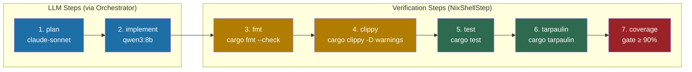
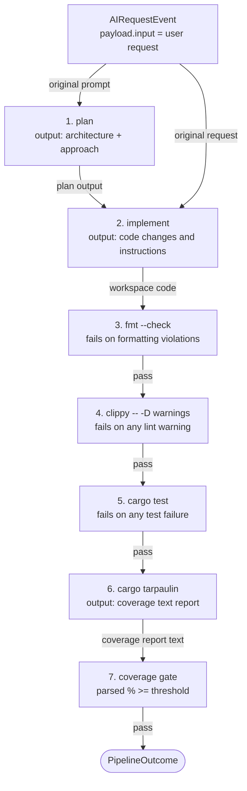

# Rust Pipeline

## Overview

The Rust dev-cycle pipeline runs a complete development workflow on a Rust
project: planning with a cloud model, implementation with a local model, then
a full verification chain ending with a coverage gate.

All shell steps are nix-aware -- if a `flake.nix` is detected in the workspace,
every `cargo` command is automatically wrapped in `nix develop --command`.

---

## Pipeline Flow



---

## Data Flow Between Steps



---

## Step-by-Step Explanation

### Step 1: plan (OrchestratorStep, action: "plan")

Sends the user's original request to `claude-sonnet` via the Copilot API.
Produces a high-level implementation plan that step 2 will use.

**Model:** `claude-sonnet` (via `selectModel`: action "plan" + agentic mode)
**Input:** `event.payload.input` (user's original request)
**Output:** Implementation plan text stored in `ctx.results.get("plan")`

### Step 2: implement (OrchestratorStep, action: "edit")

Combines the plan from step 1 with the original request into a structured
prompt for `qwen3:8b`. This is where `buildPrompt` wires the context:

```typescript
(ctx) => {
  const plan = ctx.results.get("plan")?.output ?? "";
  const original = ctx.event.payload.input ?? "";
  return `Implement the following plan in Rust:\n\n${plan}\n\nOriginal request: ${original}`;
}
```

**Model:** `qwen3:8b` (local, via Ollama)
**Input:** plan + original request (composed by buildPrompt)
**Output:** Code changes / implementation instructions

### Step 3: fmt (NixShellStep)

Runs `cargo fmt --check`. Fails the pipeline if any file would be reformatted.
This catches formatting issues before the slower test steps run.

**Command:** `cargo fmt --check`
**Failure:** Any file has formatting violations

### Step 4: clippy (NixShellStep)

Runs `cargo clippy -- -D warnings`. The `-D warnings` flag treats every
clippy warning as a hard error. Fails before tests if there are any lint issues.

**Command:** `cargo clippy -- -D warnings`
**Failure:** Any clippy warning or error

### Step 5: test (NixShellStep)

Runs the full test suite. Fails if any test fails.

**Command:** `cargo test`
**Failure:** Any test failure or compilation error

### Step 6: tarpaulin (NixShellStep, failOnNonZero: false)

Runs `cargo tarpaulin` to generate a coverage report. `failOnNonZero` is
set to `false` because tarpaulin can exit non-zero even when tests pass (e.g.
on some compiler warnings or partial environments). The actual pass/fail
decision is delegated to the coverage gate step.

**Command:** `cargo tarpaulin`
**Output:** Coverage text: `87.50% coverage, 35/40 lines covered`

### Step 7: coverage (CoverageGateStep)

Reads the tarpaulin output, extracts the percentage using the default regex
(`/(\d+\.?\d*)% coverage/i`), and fails if below the threshold.

**Reads from:** `ctx.results.get("tarpaulin")`
**Default threshold:** 90%
**Failure message:** `Coverage gate "coverage": 87.50% is below threshold 90%`

---

## Prerequisites

- `cargo` on PATH (or in a nix dev shell)
- `cargo-tarpaulin` installed: `cargo install cargo-tarpaulin`
- `cargo-clippy` (ships with rustup toolchains by default)
- The project must compile successfully before running the pipeline

---

## Invocation Example

```typescript
import { runPipeline } from "@ai-coding/pipeline";
import { CopilotDispatcher } from "ai-system/core/orchestrator/copilot-dispatcher";
import { OllamaDispatcher } from "ai-system/core/orchestrator/ollama-dispatcher";
import type { OrchestratorConfig } from "ai-system/core/orchestrator/orchestrate";
import { createRustDevCyclePipeline } from
  "ai-system/core/pipeline/definitions/rust-dev-cycle";
import type { AIRequestEvent } from "@ai-coding/shared";

const config: OrchestratorConfig = {
  dispatchers: {
    "claude-sonnet":     new CopilotDispatcher(process.env.COPILOT_TOKEN ?? ""),
    "deepseek-coder-v2": new OllamaDispatcher(),
    "qwen3:8b":  new OllamaDispatcher(),
  },
};

const event: AIRequestEvent = {
  id: crypto.randomUUID(),
  timestamp: Date.now(),
  source: "cli",
  action: "plan",
  payload: {
    input: "Add retry logic with exponential backoff to the HTTP client",
    workspace: "/home/user/my-rust-project",
  },
};

// Default coverage threshold: 90%
const steps = createRustDevCyclePipeline(config, "/home/user/my-rust-project");

// Custom coverage threshold:
// const steps = createRustDevCyclePipeline(config, "/home/user/my-rust-project", 85);

const result = await runPipeline(steps, event);

if (!result.ok) {
  console.error("Pipeline failed:", result.error.message);
  process.exit(1);
}

console.log(`All ${result.value.steps.length} steps passed in ${result.value.totalDurationMs}ms`);
```

---

## Customization

### Change the coverage threshold

```typescript
const steps = createRustDevCyclePipeline(config, workspace, 85); // allow 85%
```

### Skip fmt or clippy

Create a custom pipeline definition that omits those steps. Copy
`rust-dev-cycle.ts` and remove the steps you don't need.

### Add additional steps

Insert steps between existing ones, e.g. a doc generation step between
`implement` and `fmt`:

```typescript
createNixShellStep<AIRequestEvent>("doc", ["cargo", "doc", "--no-deps"], { cwd: workspace }),
```

---

## Interpreting Failures

| Failing step | Likely cause | Action |
|---|---|---|
| `fmt` | Code not formatted | Run `cargo fmt` in the workspace |
| `clippy` | Lint warnings present | Run `cargo clippy -- -D warnings` locally, fix warnings |
| `test` | Test failures | Run `cargo test` locally to see which tests fail |
| `tarpaulin` | Compilation error in tarpaulin | Check tarpaulin output; may need `cargo clean` |
| `coverage` | Coverage below threshold | Add tests; check which lines are uncovered with `cargo tarpaulin --out Html` |
