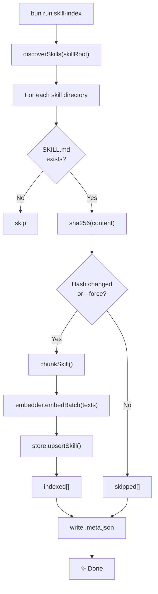

# Skill Indexer

## Overview

The skill indexer builds a **vector database** of all installed skill files so
that pipelines and OpenCode agents can retrieve semantically relevant skill
content for any task — not just the skills statically mapped to an action label.

It reads every `SKILL.md` file under `~/.config/opencode/skill/`, splits each
file into chunks, embeds the chunks using a local Ollama model, and stores the
vectors in a LanceDB database on disk. Once indexed, the vector backend can
answer queries like "which skills are relevant to refactoring a Rust parser?"
with sub-millisecond latency.

---

## Prerequisites

| Requirement | Version | Purpose |
|-------------|---------|---------|
| [Ollama](https://ollama.com) | any | Local embedding model server |
| `nomic-embed-text` model | — | Default embedding model (768 dims) |
| Bun | ≥ 1.3 | Runtime for the indexer CLI |

### Install and start Ollama

```bash
# Pull the embedding model (one-time)
ollama pull nomic-embed-text

# Start the server (keep running in background)
ollama serve
```

Ollama must be running on `http://localhost:11434` when you index or when
pipelines/agents use the vector backend. If it is not running, the system
silently falls back to the file backend — no errors, no configuration needed.

---

## Running the Indexer

### First-time index

```bash
bun run skill-index
```

Output:

```
🔍  Checking Ollama availability…
📚  Indexing skills from: /home/<user>/.config/opencode/skill
💾  LanceDB path:         /home/<user>/.local/share/ai-coding/skills.lance
🤖  Embedding model:      nomic-embed-text

✅  Indexed (10):
    • reviewer
    • explorer
    • debugger
    • programmer
    • documenter
    • rust
    • analyst
    • cpp
    • tester
    • architect

✨  Done.
```

### Incremental re-index (after updating a skill)

Run the same command again. Skills whose content has not changed are skipped:

```bash
bun run skill-index
```

```
✅  Indexed (1):
    • rust

⏭️   Skipped unchanged (9):
    • reviewer
    • explorer
    • ...
```

### Force full re-index

```bash
bun run skill-index --force
```

Ignores all stored hashes and re-embeds every skill from scratch.

### CLI options

```
bun run skill-index [options]

Options:
  --force           Re-index all skills, ignoring staleness hashes
  --skill-root <p>  Override skill root (default: ~/.config/opencode/skill)
  --db-path <p>     Override LanceDB path (default: ~/.local/share/ai-coding/skills.lance)
  --model <name>    Ollama embedding model (default: nomic-embed-text)
```

---

## How It Works

### 1. Discovery

The indexer scans `skillRoot` for subdirectories. Each subdirectory is treated
as a skill. Only directories that contain a `SKILL.md` file are processed.

```
~/.config/opencode/skill/
  programmer/SKILL.md   ← indexed
  debugger/SKILL.md     ← indexed
  rust/SKILL.md         ← indexed
  cpp/SKILL.md          ← indexed
  ...
```

### 2. Staleness detection

A `.meta.json` file is written alongside the LanceDB directory after each
successful index run:

```json
{
  "lastIndexedAt": "2026-05-05T14:30:00.000Z",
  "skillHashes": {
    "programmer": "a3f1c2d4...",
    "debugger":   "b8e2f9a1...",
    "rust":       "c7d3e5b2..."
  }
}
```

On each run, the SHA-256 of each `SKILL.md` is compared to the stored hash.
Skills whose hash matches are skipped — no re-embedding, no re-insert. Only
changed or new skills are processed.

### 3. Chunking

Each `SKILL.md` is split into semantically meaningful chunks by
`chunkSkill()` in `packages/skills/src/chunking/markdown-chunker.ts`:

- **Split on H2 headings** (`##`) — each section becomes a chunk
- **H1 title prepended** to every H2 chunk as context, so each chunk is
  self-contained when retrieved in isolation
- **Paragraph overflow** — sections larger than 3000 characters are split
  further on blank lines so no chunk exceeds the embedder's context window
- **Empty chunks dropped** — whitespace-only sections are silently skipped

Example — a skill with this structure:

```markdown
# Programmer

## Responsibilities

Write clean code.

## Rules

Never delete code outside scope.
```

Produces three chunks:

```
Chunk 0: "# Programmer\n\nOnly one section with no H2 headings. Just a body."
Chunk 1: "# Programmer\n\n## Responsibilities\n\nWrite clean code."
Chunk 2: "# Programmer\n\n## Rules\n\nNever delete code outside scope."
```

### 4. Embedding

All chunks for a skill are embedded in a single batch call to Ollama:

```
POST http://localhost:11434/api/embed
{
  "model": "nomic-embed-text",
  "input": ["chunk text 1", "chunk text 2", ...]
}
```

`nomic-embed-text` produces 768-dimensional float32 vectors. The embedder
caches the dimension count after the first call.

### 5. Storage

Chunks are stored in a LanceDB table at
`~/.local/share/ai-coding/skills.lance`. Each row contains:

| Column | Type | Description |
|--------|------|-------------|
| `vector` | Float32[768] | Embedding vector |
| `text` | String | Chunk text (returned on retrieval) |
| `skill_name` | String | Skill name (e.g. `"programmer"`) |
| `chunk_index` | Int32 | Position within the skill document |
| `content_hash` | String | djb2 hash of skill+index+text |

Upsert strategy: delete all existing rows for the skill, then bulk-insert
the new chunks. This is simpler and more reliable than `mergeInsert` for
small documents.

### Full flow



---

## Files Written

| Path | Description |
|------|-------------|
| `~/.local/share/ai-coding/skills.lance/` | LanceDB database directory |
| `~/.local/share/ai-coding/skills.lance.meta.json` | Staleness hashes and last-indexed timestamp |

Both paths can be overridden with `--db-path` or the `AI_CODING_SKILLS_DB`
environment variable.

---

## When to Re-index

| Event | Action |
|-------|--------|
| First-time setup | `bun run skill-index` |
| A `SKILL.md` file is updated | `bun run skill-index` (incremental, only re-indexes changed skills) |
| New skill added to `~/.config/opencode/skill/` | `bun run skill-index` |
| Skill removed | `bun run skill-index --force` (removes stale rows) |
| Switching embedding models | `bun run skill-index --force --model <new-model>` |
| Database corruption | Delete `~/.local/share/ai-coding/skills.lance/` then `bun run skill-index` |

---

## Troubleshooting

### "Ollama is not reachable"

```
❌  Ollama is not reachable at http://localhost:11434
    Start Ollama with: ollama serve
```

Start Ollama: `ollama serve`. If it is running on a non-default port, use
`--db-path` is not the right flag — instead set `OLLAMA_HOST`:

```bash
OLLAMA_HOST=http://localhost:11435 bun run skill-index
```

*(The `--model` flag selects the model name; the base URL is currently
hardcoded to `http://localhost:11434`. To use a remote Ollama instance,
set `OLLAMA_HOST` — support for `--ollama-url` is planned.)*

### "No skills found"

```
⚠️   No skills found. Check --skill-root path.
```

The skill root directory is empty or does not exist. Verify:

```bash
ls ~/.config/opencode/skill/
```

Skills are deployed by Home Manager. If the directory is empty, run:

```bash
home-manager switch --flake ~/Projects/home-manager#oryp6
```

### Indexer runs but vector backend is not used

Check that the LanceDB directory exists and is non-empty:

```bash
ls ~/.local/share/ai-coding/skills.lance/
```

If it is missing, the indexer may have written to a different path. Run with
explicit `--db-path` to confirm:

```bash
bun run skill-index --db-path ~/.local/share/ai-coding/skills.lance
```

Also confirm Ollama is running when pipelines or agents start — the backend
selection happens at runtime, not at index time.

---

## Source Files

| File | Purpose |
|------|---------|
| `packages/skills/src/indexer/index-skills.ts` | Core indexing logic — discovery, staleness, chunk+embed+upsert |
| `packages/skills/src/indexer/cli.ts` | CLI entry point (`bun run skill-index`) |
| `packages/skills/src/chunking/markdown-chunker.ts` | `chunkSkill()` — H2-section splitting |
| `packages/skills/src/embeddings/ollama-embedder.ts` | `OllamaEmbedder` — Ollama HTTP client |
| `packages/skills/src/store/lance-store.ts` | `LanceStore` — LanceDB wrapper |
