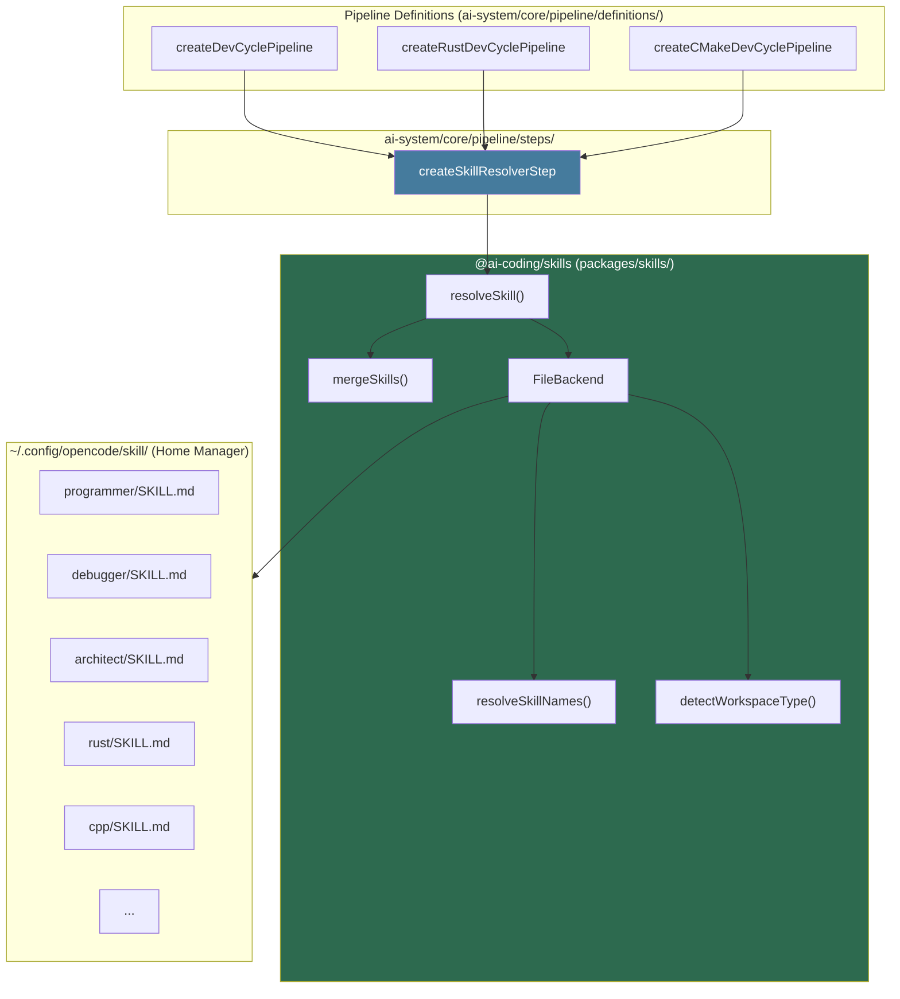
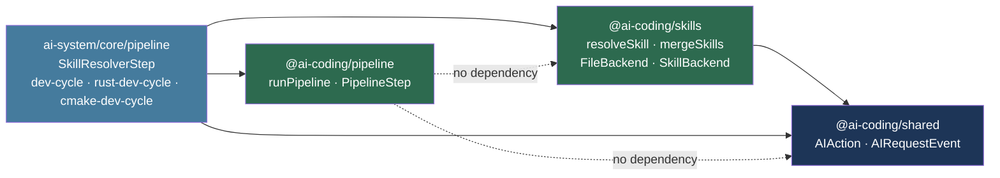
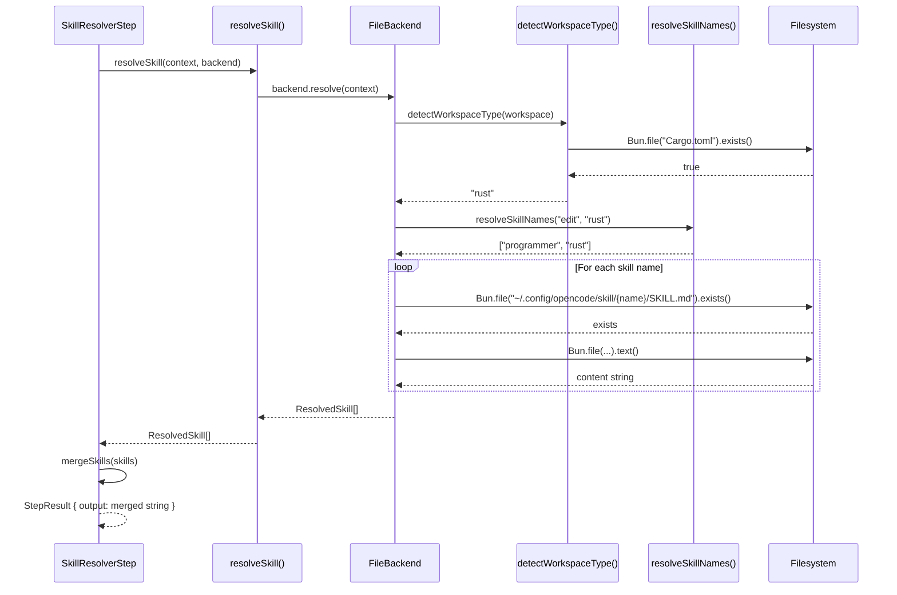
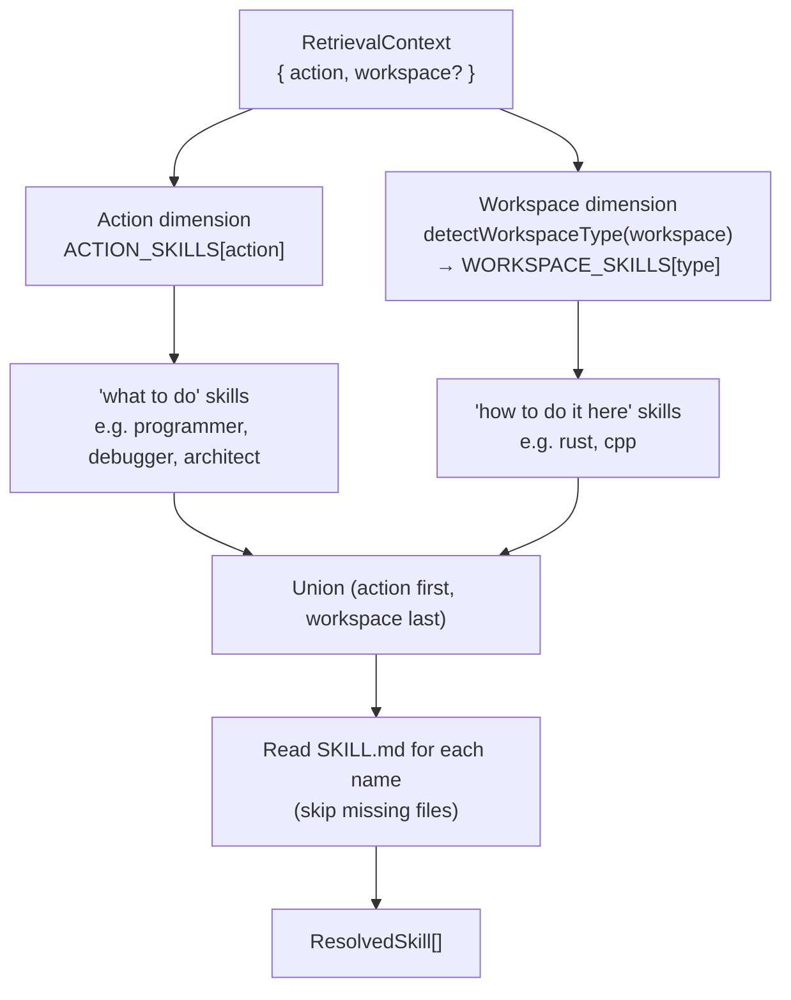
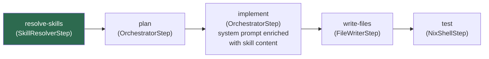
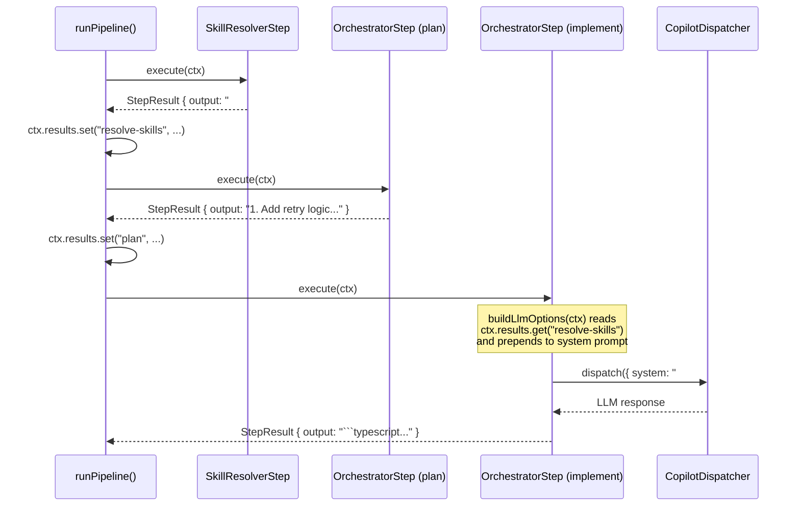
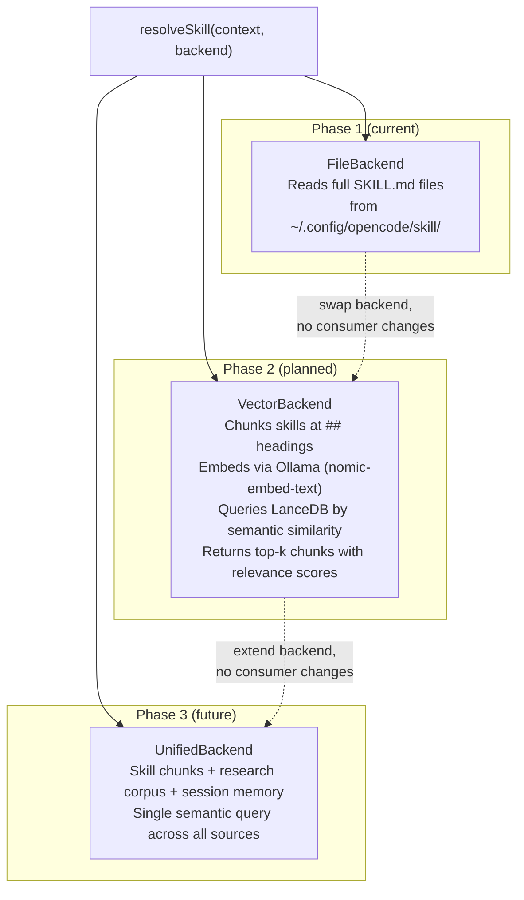
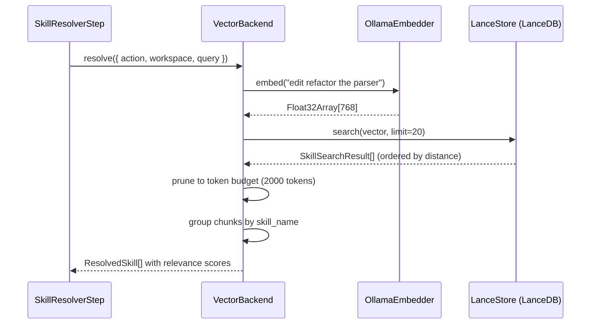
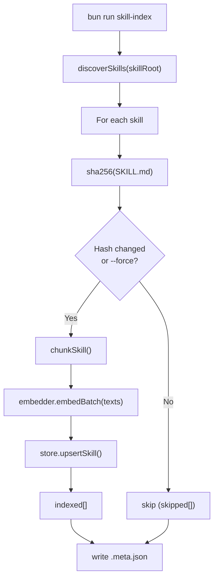
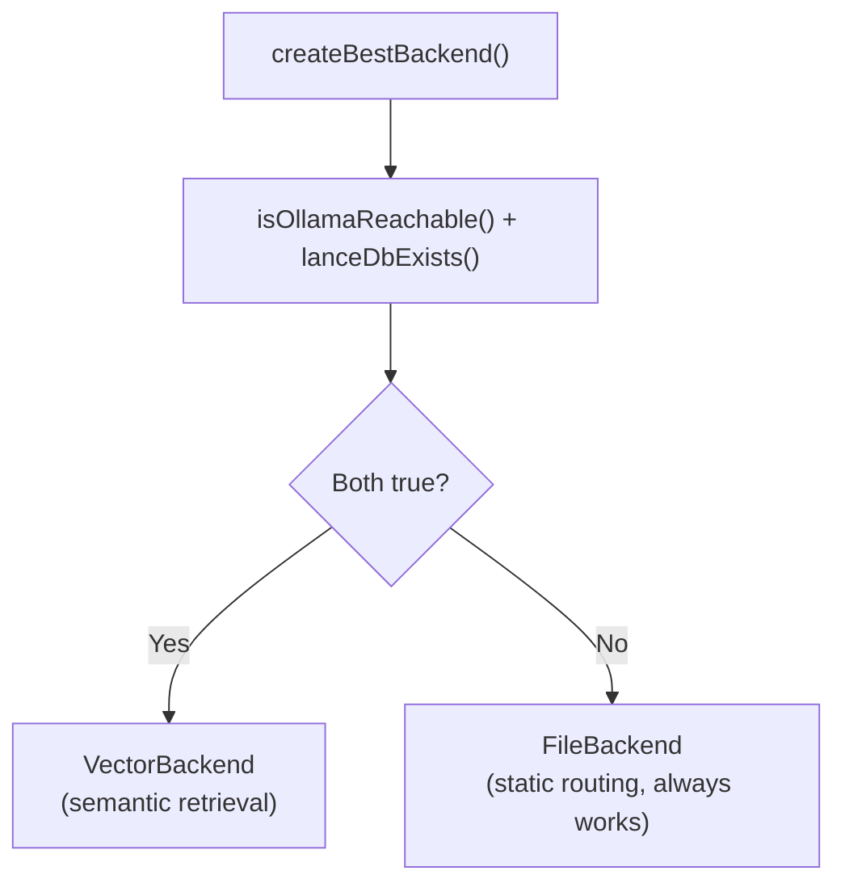

# Skills Package (`@ai-coding/skills`)

## Overview

`@ai-coding/skills` is a shared retrieval abstraction that serves skill knowledge
to both custom pipelines and (in future phases) OpenCode's agent loop. It resolves
the right set of skill files for a given AI action and workspace context, merges
them into a single string, and injects the result into LLM system prompts.

**Problem it solves:** Skills — curated Markdown files with domain-specific
instructions — were previously only available to OpenCode via its built-in `skill`
tool. Custom pipelines used hardcoded, minimal system prompts with no access to
the same knowledge. This package bridges that gap.

**Design philosophy:** Consumers are blind to the backend. The same `resolveSkill`
call works whether the backend reads files from disk (Phase 1) or queries a vector
database (Phase 2). Swapping backends requires no changes to consumers.

---

## Architecture

### System Position



### Package Dependency Graph



---

## Resolution Flow

### Full Sequence



### Two-Dimensional Routing

Skill resolution uses two orthogonal dimensions that compose additively:



**Ordering is intentional:** action skills (general method) appear before workspace
skills (domain specialization). The LLM reads "here is how to debug" before
"and specifically in Rust, do it this way."

---

## Skill Routing Tables

### Action → Skills

| Action | Skills resolved | Rationale |
|--------|----------------|-----------|
| `edit` | `programmer` | Code generation task |
| `refactor` | `programmer` | Code transformation task |
| `debug` | `debugger` | Diagnosis and fix task |
| `plan` | `architect` | High-level design task |
| `explore` | `explorer` | Codebase navigation task |
| `explain` | `analyst` | Analysis and explanation task |
| `task` | `programmer` | General coding task |
| `chat` | _(none)_ | Conversational — no skill needed |

### Workspace Type → Additional Skills

| Detected marker | Workspace type | Additional skills |
|-----------------|---------------|-------------------|
| `Cargo.toml` | `rust` | `rust` |
| `CMakeLists.txt` | `cpp` | `cpp` |
| `package.json` | `typescript` | _(none)_ |
| _(no marker)_ | `unknown` | _(none)_ |

### Examples

| Action | Workspace | Resolved skills (in order) |
|--------|-----------|---------------------------|
| `edit` | Rust project | `programmer`, `rust` |
| `debug` | C++ project | `debugger`, `cpp` |
| `plan` | TypeScript project | `architect` |
| `chat` | Rust project | `rust` |
| `explore` | Unknown | `explorer` |

---

## Pipeline Integration

### Pipeline with Skill Resolution



### How Skill Content Flows Into the System Prompt



---

## API Reference

### `resolveSkill(context, backend)`

The stable public API. Delegates to the backend; consumers are blind to the
implementation.

```typescript
import { resolveSkill, FileBackend } from "@ai-coding/skills";

const backend = new FileBackend();
const skills = await resolveSkill({ action: "edit", workspace: "/my/project" }, backend);
// → ResolvedSkill[]
```

### `mergeSkills(skills)`

Concatenates resolved skills into a single string for system prompt injection.
Each skill is wrapped with a Markdown header. Returns `""` for an empty array.

```typescript
import { mergeSkills } from "@ai-coding/skills";

const systemPrompt = mergeSkills(skills);
// → "## Skill: programmer\n\n...\n\n---\n\n## Skill: rust\n\n..."
```

### `FileBackend`

File-based backend. Reads `SKILL.md` files from a configurable root directory.
Skips missing files silently.

```typescript
import { FileBackend } from "@ai-coding/skills";

// Default: ~/.config/opencode/skill/
const backend = new FileBackend();

// Custom root (e.g. for testing):
const backend = new FileBackend("/path/to/skills");
```

### `createSkillResolverStep(name, backend)`

Pipeline step factory. Resolves skills from the event's action and workspace,
stores merged content as `StepResult.output`.

```typescript
import { createSkillResolverStep, FileBackend } from "...";

const step = createSkillResolverStep("resolve-skills", new FileBackend());
// Downstream steps: ctx.results.get("resolve-skills")?.output
```

---

## Types

```typescript
/** Narrow context for skill retrieval — evolved only when consumers need more. */
interface RetrievalContext {
  readonly action: AIAction;
  readonly workspace?: string;
}

/** A single resolved skill with its content and optional relevance score. */
interface ResolvedSkill {
  readonly name: string;
  readonly content: string;
  readonly relevance?: number; // populated by vector backend (Phase 2)
}

/** Pluggable backend interface — consumers are blind to the implementation. */
interface SkillBackend {
  resolve(context: RetrievalContext): Promise<readonly ResolvedSkill[]>;
}

/** Detected workspace project type from filesystem marker files. */
type WorkspaceType = "rust" | "cpp" | "typescript" | "unknown";
```

---

## Creating a Custom Backend

Implement `SkillBackend` to plug in any retrieval mechanism:

```typescript
import type { ResolvedSkill, RetrievalContext, SkillBackend } from "@ai-coding/skills";

export class MyCustomBackend implements SkillBackend {
  async resolve(context: RetrievalContext): Promise<readonly ResolvedSkill[]> {
    // Your retrieval logic here
    return [{ name: "my-skill", content: "..." }];
  }
}
```

The vector backend (Phase 2) will implement this interface using LanceDB and
Ollama embeddings. Swapping it in requires no changes to pipeline definitions
or the `SkillResolverStep`.

---

## Phase 2 Evolution



**Token efficiency improvement:** Phase 1 sends full skill files (same as current
OpenCode behaviour). Phase 2 sends only the matching chunks per LLM call — for a
500-line skill, this could reduce injected tokens by 80%+ per call.

---

## Phase 2 — Vector Backend (Implemented)

Phase 2 adds semantic retrieval via LanceDB + Ollama embeddings. All components
are in `packages/skills/src/`.

### New Modules

| Module | Purpose |
|--------|---------|
| `embeddings/embedder-types.ts` | `Embedder`, `EmbeddingResult` interfaces |
| `embeddings/ollama-embedder.ts` | `OllamaEmbedder` — calls `POST /api/embed` on local Ollama |
| `chunking/markdown-chunker.ts` | `chunkSkill()` — splits SKILL.md on H2 headings, paragraph-splits oversized sections |
| `store/lance-store.ts` | `LanceStore` — wraps LanceDB table (open, upsertSkill, search, deleteSkill) |
| `indexer/index-skills.ts` | `indexSkills()` — discovers skills, hashes for staleness, chunks + embeds + upserts |
| `indexer/cli.ts` | `bun run skill-index` CLI with `--force`, `--skill-root`, `--db-path`, `--model` |
| `backends/vector-backend.ts` | `VectorBackend` — embeds query, ANN search, token-budget pruning, groups by skill |
| `backends/create-backend.ts` | `createBestBackend()` — auto-selects VectorBackend or FileBackend |
| `cli/skill-retrieval-cli.ts` | `bun run skill-retrieval` CLI used by the OpenCode tool |

### Retrieval Flow (Vector Backend)



### Indexer Flow



### Backend Auto-Selection



### Key Design Decisions

- **Token budget**: default 2000 tokens (~8000 chars). Chunks are accumulated in
  distance order until the budget is exhausted. Oversized individual chunks are
  still emitted (never silently dropped).
- **Staleness detection**: SHA-256 of SKILL.md content, stored in `.meta.json`
  alongside the DB. Only changed skills are re-embedded on each index run.
- **Upsert strategy**: delete-by-filter + bulk add (simpler than `mergeInsert`,
  which requires all-or-nothing match/insert configuration).
- **LanceDB path**: `~/.local/share/ai-coding/skills.lance` (default), overridable
  via `AI_CODING_SKILLS_DB` env var.
- **Embedding model**: `nomic-embed-text` (768 dims) via Ollama. Overridable via
  `--model` CLI flag or `ollamaModel` option in `createBestBackend()`.
- **`query` field**: `RetrievalContext.query` (optional) carries the user's request
  text. The vector backend prepends it to the action label for richer embedding.
  The file backend ignores it.

### Getting Started

```bash
# 1. Start Ollama and pull the embedding model
ollama serve &
ollama pull nomic-embed-text

# 2. Index all skills (first time or after skill updates)
bun run skill-index

# 3. Force re-index everything
bun run skill-index --force

# 4. Pipelines now auto-use the vector backend when Ollama is running
bun run pipeline dev-cycle /path/to/workspace --input "add error handling"
```

---

## Open Questions (Deferred to Phase 3)

- Phase 3: ingest PDF/HTML research corpus alongside SKILL.md files.
- Phase 3: unified retrieval across skills + research corpus + session memory.
- Auto-discovery of new skills vs. manual `ACTION_SKILLS` map updates?
- Should `detectWorkspaceType()` cache results per workspace path?
