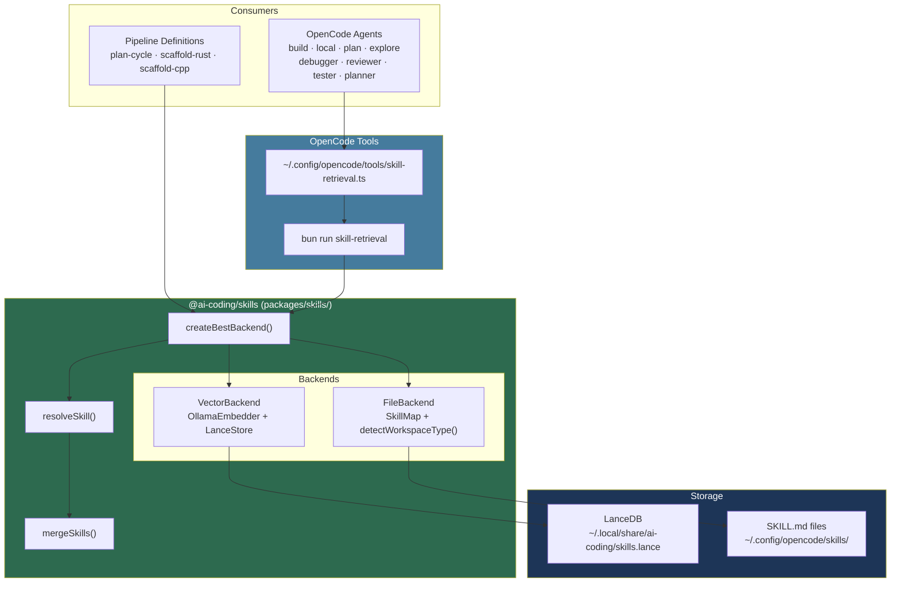
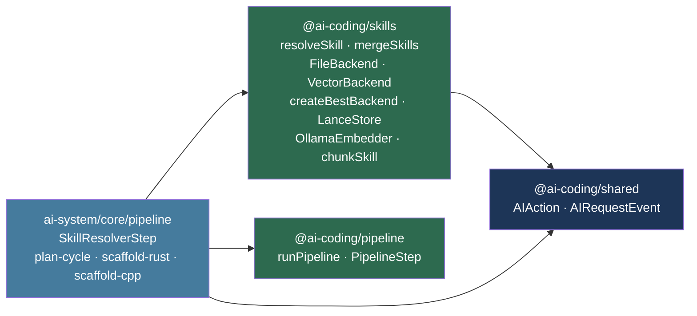
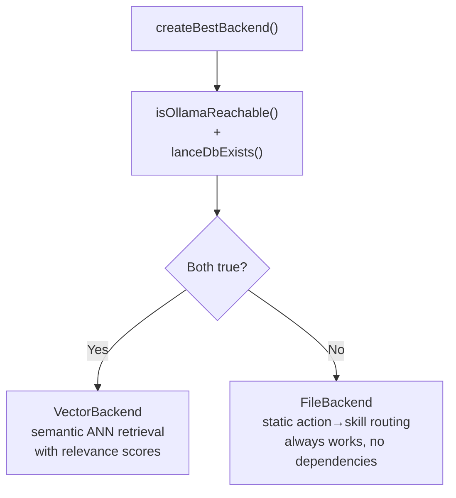
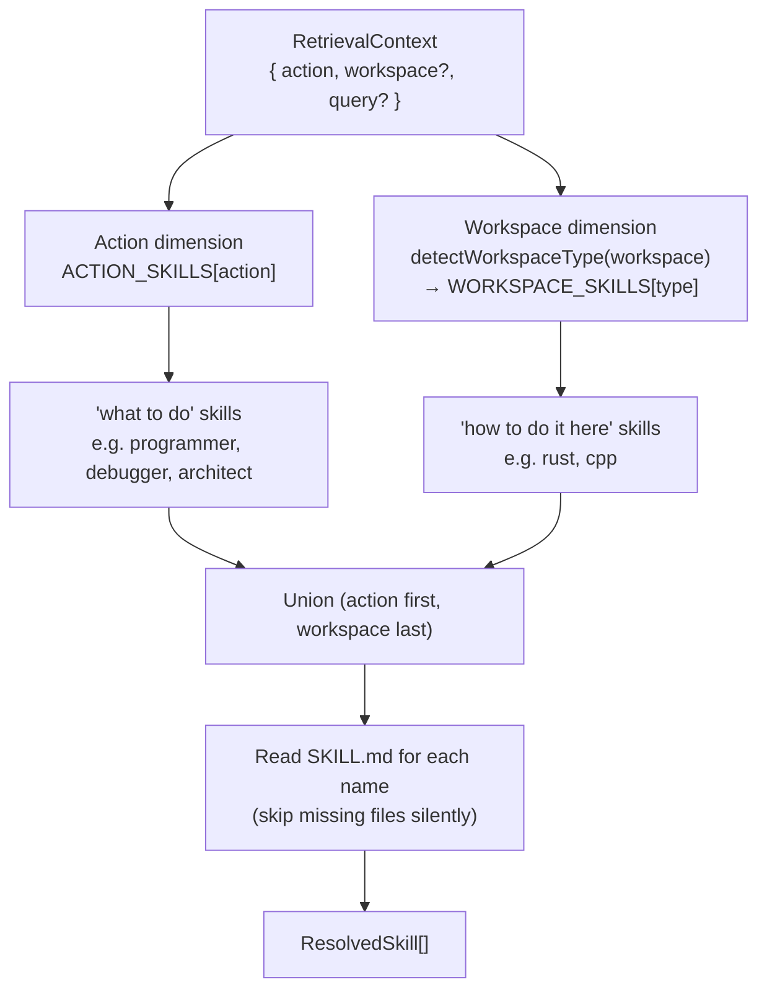
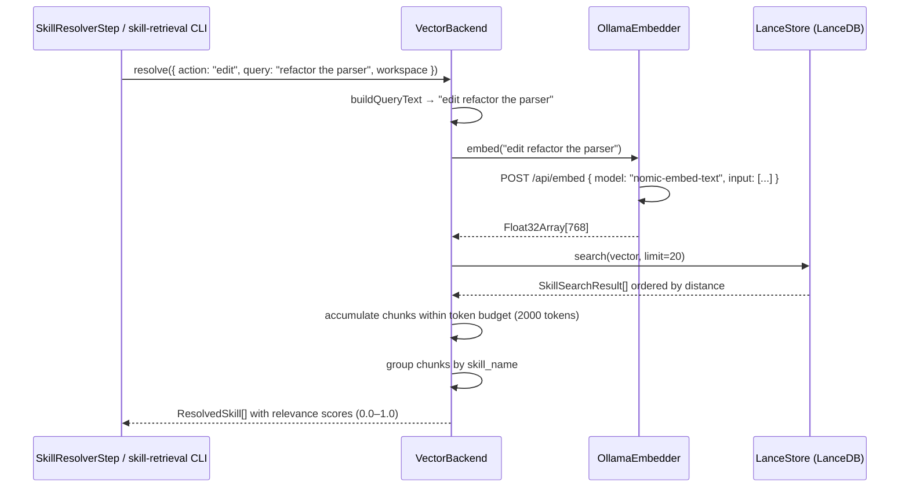
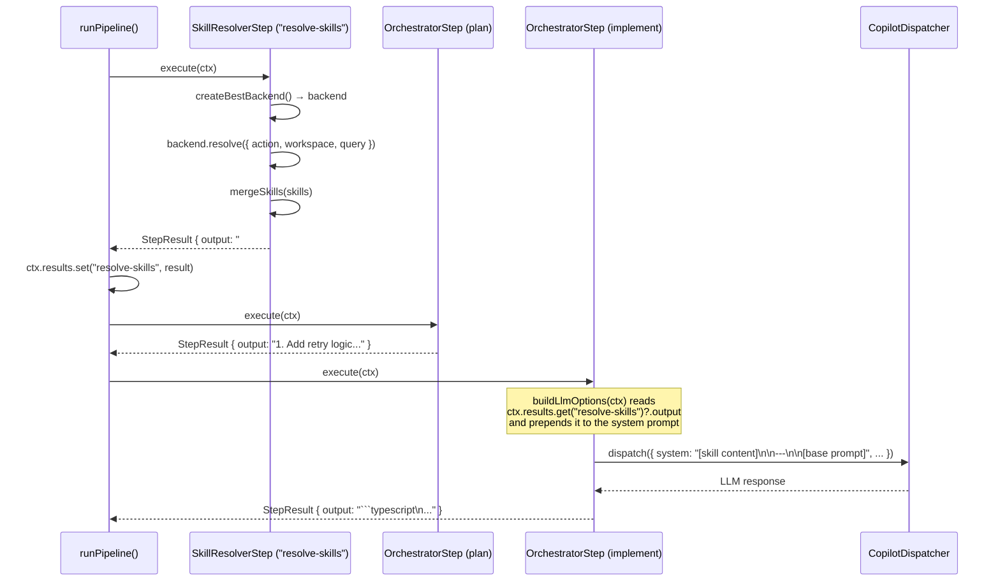
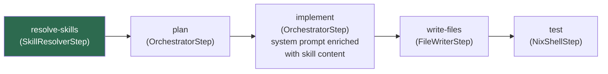
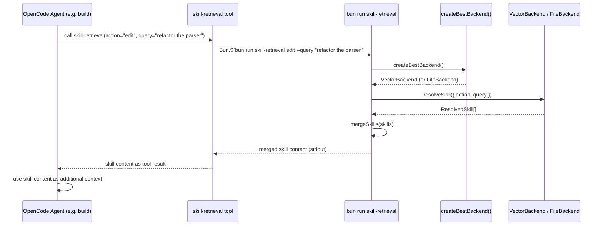

# Skills Package (`@ai-coding/skills`)

## Overview

`@ai-coding/skills` is a shared retrieval abstraction that serves skill
knowledge to both custom pipelines and OpenCode agents. It resolves the right
set of skill content for a given AI action and workspace context, and injects
the result into LLM system prompts.

**Problem it solves:** Skills — curated Markdown files with domain-specific
instructions — were previously only available to OpenCode via its built-in
`skill` tool. Custom pipelines used hardcoded, minimal system prompts with no
access to the same knowledge. OpenCode agents had no way to query skills
semantically. This package bridges both gaps.

**Design philosophy:** Consumers are blind to the backend. The same
`resolveSkill` call works whether the backend reads files from disk
(`FileBackend`) or queries a vector database (`VectorBackend`). Swapping
backends requires no changes to consumers.

**Two backends, one interface:**

| Backend | When used | How it retrieves |
|---------|-----------|-----------------|
| `VectorBackend` | Ollama running + index built | Embeds the query, ANN search in LanceDB, token-budget pruning |
| `FileBackend` | Fallback (always works) | Static action→skill map + workspace type detection |

Backend selection is automatic via `createBestBackend()` — no configuration
needed. See [docs/skill-indexer.md](./skill-indexer.md) for how to build the
index.

---

## Architecture

### System Position



### Package Dependency Graph



---

## Backend Selection

`createBestBackend()` is called at startup by both the pipeline CLI and the
`skill-retrieval` tool. It checks two conditions in parallel:



The check is fast (≤ 2 s timeout on Ollama health check) and never throws.
If Ollama is not running or the index has not been built, the system silently
uses the file backend.

---

## File Backend

The file backend uses two static maps to resolve skills deterministically.

### Two-Dimensional Routing



**Ordering is intentional:** action skills (general method) appear before
workspace skills (domain specialisation). The LLM reads "here is how to debug"
before "and specifically in Rust, do it this way."

### Action → Skills

| Action | Skills resolved | Rationale |
|--------|----------------|-----------|
| `edit` | `programmer` | Code generation task |
| `refactor` | `programmer` | Code transformation task |
| `debug` | `debugger` | Diagnosis and fix task |
| `plan` | `architect` | High-level design task |
| `explore` | `explorer` | Codebase navigation task |
| `explain` | `analyst` | Analysis and explanation task |
| `task` | `programmer` | General coding task |
| `chat` | _(none)_ | Conversational — no skill needed |

### Workspace Type → Additional Skills

| Detected marker | Workspace type | Additional skills |
|-----------------|---------------|-------------------|
| `Cargo.toml` | `rust` | `rust` |
| `CMakeLists.txt` | `cpp` | `cpp` |
| `package.json` | `typescript` | _(none)_ |
| _(no marker)_ | `unknown` | _(none)_ |

### Examples

| Action | Workspace | Resolved skills (in order) |
|--------|-----------|---------------------------|
| `edit` | Rust project | `programmer`, `rust` |
| `debug` | C++ project | `debugger`, `cpp` |
| `plan` | TypeScript project | `architect` |
| `chat` | Rust project | `rust` |
| `explore` | Unknown | `explorer` |

### Utility Skills

Some skills are not mapped to any `AIAction` and are never auto-injected by the
file backend. They are loaded exclusively on demand — either by the agent via
the `skill` tool when it recognises the user's intent, or by the vector backend
when a semantic query surfaces them.

| Skill | Purpose | Trigger |
|-------|---------|---------|
| `context-audit` | Audit OpenCode setup for token waste and context bloat | User asks to audit context, check settings, or optimise tokens |

Utility skills appear in `<available_skills>` in the `skill` tool description
on every turn (one line each), so their descriptions should be concise and
specific. Their content is only injected when explicitly loaded.

See [docs/context-audit.md](./context-audit.md) for the full reference.

---

## Vector Backend

The vector backend retrieves semantically relevant skill chunks using Ollama
embeddings and LanceDB approximate nearest-neighbour search.

### Retrieval Flow



### Key Design Decisions

| Decision | Value | Rationale |
|----------|-------|-----------|
| Token budget | 2000 tokens (~8000 chars) | Balances context richness vs. prompt size |
| Candidate limit | 20 chunks fetched | Wide net before budget pruning |
| Relevance score | `1 - dist / maxDist` | 1.0 = perfect match, 0.0 = maximally distant |
| Chunk grouping | By `skill_name` | One `ResolvedSkill` per skill, chunks concatenated |
| Oversized chunks | Always emitted | Never silently dropped, even if > budget |
| Query string | `action + " " + query` | Richer semantic signal than action label alone |

### `query` Field

`RetrievalContext.query` carries the user's request text (e.g.
`event.payload.input`). The vector backend prepends it to the action label
before embedding, giving the ANN search a much richer signal:

```
action only:        "edit"
action + query:     "edit refactor the Rust parser to use nom combinators"
```

The file backend ignores `query` — it has no effect on static routing.

---

## Pipeline Integration

### How Skill Content Flows Into the System Prompt



### Pipeline Step Order



Skill resolution runs first, before the LLM is called for planning. The
merged skill content is stored in `ctx.results` under the key `"resolve-skills"`
and read by the implement step via `buildLlmOptions`.

---

## OpenCode Integration

### How Agents Use the Skills Database

All action-bearing OpenCode agents (`build`, `local`, `plan`, `planner`,
`explore`, `debugger`, `reviewer`, `tester`) have `skill-retrieval` as step 1
of their workflow. When an agent starts a task:

1. The agent calls the `skill-retrieval` tool with the appropriate `action`
   and a brief `query` describing the task
2. The tool shells out to `bun run skill-retrieval <action> --query <text>`
3. `createBestBackend()` selects `VectorBackend` or `FileBackend`
4. The merged skill content is returned to the agent as additional context
5. The agent uses this content for the rest of the session



### Agent → Action Mapping

| Agent | `action` passed | Skills typically returned |
|-------|----------------|--------------------------|
| `build` | `edit` | `programmer` + workspace skills |
| `local` | `edit` | `programmer` + workspace skills |
| `plan` | `plan` | `architect` |
| `planner` | `plan` | `architect` |
| `explore` | `explore` | `explorer` |
| `debugger` | `debug` | `debugger` + workspace skills |
| `reviewer` | `review` | `reviewer` + workspace skills |
| `tester` | `test` | `tester` + workspace skills |

Conversational agents (`spar`, `brainstorm`, `teach`) do not call
`skill-retrieval` — they do not execute technical tasks.

---

## API Reference

### `createBestBackend(options?)`

Auto-selects the best available backend. Never throws.

```typescript
import { createBestBackend } from "@ai-coding/skills";

const backend = await createBestBackend();
// → VectorBackend if Ollama is running and index exists
// → FileBackend otherwise

// With options:
const backend = await createBestBackend({
  skillRoot: "/custom/skill/root",
  dbPath: "/custom/skills.lance",
  ollamaModel: "mxbai-embed-large",
  tokenBudget: 3000,
});
```

### `resolveSkill(context, backend)`

The stable public API. Delegates to the backend; consumers are blind to the
implementation.

```typescript
import { resolveSkill, createBestBackend } from "@ai-coding/skills";

const backend = await createBestBackend();
const skills = await resolveSkill(
  { action: "edit", workspace: "/my/project", query: "add retry logic" },
  backend,
);
// → ResolvedSkill[]
```

### `mergeSkills(skills)`

Concatenates resolved skills into a single string for system prompt injection.
Each skill is wrapped with a Markdown header and separated by `---`.
Returns `""` for an empty array.

```typescript
import { mergeSkills } from "@ai-coding/skills";

const systemPrompt = mergeSkills(skills);
// → "## Skill: programmer\n\n...\n\n---\n\n## Skill: rust\n\n..."
```

### `FileBackend`

File-based backend. Reads full `SKILL.md` files from a configurable root.
Skips missing files silently. No external dependencies.

```typescript
import { FileBackend } from "@ai-coding/skills";

const backend = new FileBackend();                    // ~/.config/opencode/skills/
const backend = new FileBackend("/custom/skill/root"); // custom root
```

### `VectorBackend`

Vector-based backend. Requires an open `LanceStore` and an `Embedder`.

```typescript
import { VectorBackend, LanceStore, OllamaEmbedder } from "@ai-coding/skills";

const embedder = new OllamaEmbedder("nomic-embed-text");
const store = new LanceStore();
await store.open(); // table must already exist (built by indexer)
const backend = new VectorBackend(embedder, store, 2000); // 2000 token budget
```

### `OllamaEmbedder`

Embeds text via a local Ollama instance. Supports single and batch embedding.

```typescript
import { OllamaEmbedder, isOllamaReachable } from "@ai-coding/skills";

const reachable = await isOllamaReachable(); // → true / false

const embedder = new OllamaEmbedder("nomic-embed-text", "http://localhost:11434");
const { vector } = await embedder.embed("debug a segfault in Rust");
// → { vector: Float32Array[768] }

const results = await embedder.embedBatch(["text 1", "text 2"]);
// → [{ vector: Float32Array[768] }, { vector: Float32Array[768] }]

const dims = await embedder.dimensions; // → 768 (cached after first call)
```

### `chunkSkill(skillName, content, maxChunkChars?)`

Splits a SKILL.md document into indexable chunks. Pure function, no I/O.

```typescript
import { chunkSkill } from "@ai-coding/skills";

const chunks = chunkSkill("programmer", markdownContent);
// → [{ skillName: "programmer", text: "...", chunkIndex: 0 }, ...]
```

### `LanceStore`

LanceDB wrapper for skill chunk storage and retrieval.

```typescript
import { LanceStore } from "@ai-coding/skills";

const store = new LanceStore("/path/to/skills.lance");
await store.open(768);                              // create table with 768 dims
await store.open();                                 // open existing table
await store.upsertSkill("programmer", chunks, embeddings);
const results = await store.search(queryVector, 10);
await store.deleteSkill("programmer");
const count = await store.countRows();
```

### `indexSkills(embedder, store, skillRoot?, metaPath?, force?)`

Index all skills in a skill root. Handles staleness detection, chunking,
embedding, and upsert. See [docs/skill-indexer.md](./skill-indexer.md) for
the full indexer reference.

```typescript
import { indexSkills, OllamaEmbedder, LanceStore } from "@ai-coding/skills";

const embedder = new OllamaEmbedder();
const store = new LanceStore();
const result = await indexSkills(embedder, store);
// → { indexed: ["programmer", "rust"], skipped: ["debugger", ...] }
```

---

## Types

```typescript
/** Narrow context for skill retrieval. */
interface RetrievalContext {
  readonly action: AIAction;
  readonly workspace?: string; // used for workspace type detection
  readonly query?: string;     // user's request text — enriches vector retrieval
}

/** A single resolved skill with its content and optional relevance score. */
interface ResolvedSkill {
  readonly name: string;
  readonly content: string;
  readonly relevance?: number; // 0.0–1.0; populated by VectorBackend only
}

/** Pluggable backend interface — consumers are blind to the implementation. */
interface SkillBackend {
  resolve(context: RetrievalContext): Promise<readonly ResolvedSkill[]>;
}

/** Detected workspace project type from filesystem marker files. */
type WorkspaceType = "rust" | "cpp" | "typescript" | "unknown";

/** Options for createBestBackend(). */
interface CreateBackendOptions {
  readonly skillRoot?: string;    // default: ~/.config/opencode/skill
  readonly dbPath?: string;       // default: ~/.local/share/ai-coding/skills.lance
  readonly ollamaModel?: string;  // default: "nomic-embed-text"
  readonly ollamaUrl?: string;    // default: "http://localhost:11434"
  readonly tokenBudget?: number;  // default: 2000 tokens
}
```

---

## Creating a Custom Backend

Implement `SkillBackend` to plug in any retrieval mechanism:

```typescript
import type { ResolvedSkill, RetrievalContext, SkillBackend } from "@ai-coding/skills";

export class MyCustomBackend implements SkillBackend {
  async resolve(context: RetrievalContext): Promise<readonly ResolvedSkill[]> {
    // Your retrieval logic here
    return [{ name: "my-skill", content: "..." }];
  }
}
```

---

## Module Map

```
packages/skills/src/
  skill-types.ts               RetrievalContext, ResolvedSkill, SkillBackend, WorkspaceType
  resolve-skill.ts             resolveSkill() — stable public API, delegates to backend
  merge-skills.ts              mergeSkills() — concatenate for system prompt injection
  skill-map.ts                 ACTION_SKILLS, WORKSPACE_SKILLS, resolveSkillNames()
  detect-workspace-type.ts     Filesystem probe → WorkspaceType
  backends/
    file-backend.ts            FileBackend — reads SKILL.md files from disk
    vector-backend.ts          VectorBackend — ANN search via LanceDB
    create-backend.ts          createBestBackend() — auto-selects best backend
  embeddings/
    embedder-types.ts          Embedder, EmbeddingResult interfaces
    ollama-embedder.ts         OllamaEmbedder, isOllamaReachable()
  chunking/
    markdown-chunker.ts        chunkSkill() — H2-section splitting
  store/
    lance-store.ts             LanceStore — LanceDB open/upsert/search/delete
  indexer/
    index-skills.ts            indexSkills() — staleness detection + chunk+embed+upsert
    cli.ts                     bun run skill-index CLI
  cli/
    skill-retrieval-cli.ts     bun run skill-retrieval CLI (used by OpenCode tool)
  index.ts                     Barrel export (all public symbols)
```

---

## Phase 3 (Future)

Phase 3 will extend the vector store beyond skill files to include:

- **Research corpus** — PDF/HTML documents (papers, blog posts, language specs)
  ingested alongside SKILL.md files
- **Session memory** — relevant context from prior sessions stored as vectors
  and retrieved automatically
- **Unified retrieval** — a single semantic query across skills, research
  corpus, and session memory

The `SkillBackend` interface will remain unchanged — Phase 3 is a backend
implementation detail invisible to consumers.
