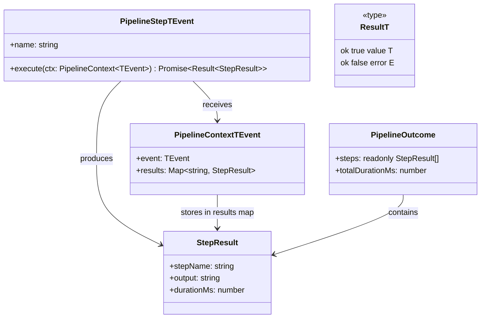

# @ai-coding/pipeline

Generic multi-step pipeline infrastructure for TypeScript/Bun. Sequences
steps, threads shared context, and short-circuits on failure.

Has **zero dependency** on AI-specific types. Works with any event shape.

---

## API Overview



---

## Installation

Within this monorepo the package is linked automatically via workspaces:

```bash
bun install
```

Import via the path alias:

```typescript
import { runPipeline, createShellStep } from "@ai-coding/pipeline";
```

---

## Core API

### `runPipeline<TEvent>(steps, event)`

Runs steps in order, threading context. Stops on first failure.

```typescript
function runPipeline<TEvent>(
  steps: readonly PipelineStep<TEvent>[],
  event: TEvent,
): Promise<Result<PipelineOutcome>>
```

**Errors:**
- `"Pipeline has no steps"` -- empty steps array
- `"Duplicate step name: \"<name>\""` -- two steps share a name

---

### `createShellStep<TEvent>(name, command, options?)`

Runs a fixed shell command via `Bun.spawn`.

```typescript
function createShellStep<TEvent = unknown>(
  name: string,
  command: readonly string[],
  options?: ShellStepOptions,
): PipelineStep<TEvent>

interface ShellStepOptions {
  cwd?: string;            // working directory (default: process.cwd())
  timeoutMs?: number;      // ms before killing the process (default: 60000)
  failOnNonZero?: boolean; // treat non-zero exit as error (default: true)
}
```

- Commands are arrays, never shell strings -- no injection risk.
- On success: `StepResult.output` = stdout.
- On failure: error contains exit code and stderr.

---

### `createNixShellStep<TEvent>(name, command, options?)`

Same as `createShellStep` but auto-detects `flake.nix` in `options.cwd`.
If found, wraps command as `["nix", "develop", "--command", ...command]`.

```typescript
function createNixShellStep<TEvent = unknown>(
  name: string,
  command: readonly string[],
  options?: ShellStepOptions,
): PipelineStep<TEvent>
```

Detection runs at execution time, not at creation time.

---

### `createCoverageGateStep<TEvent>(name, readFrom, threshold, pattern?)`

Parses a coverage percentage from a prior step's output and fails below threshold.

```typescript
function createCoverageGateStep<TEvent = unknown>(
  name: string,
  readFrom: string,        // step name to read output from
  threshold: number,       // minimum % (0-100)
  pattern?: RegExp,        // default: /(\d+\.?\d*)% coverage/i
): PipelineStep<TEvent>
```

Default pattern matches `cargo tarpaulin` text output. Override for other tools:

```typescript
// gcovr: "lines: 95.3%"
createCoverageGateStep("gate", "gcovr", 90, /lines:\s*(\d+\.?\d*)%/i)
```

---

## Types

```typescript
type Result<T, E = Error> = { ok: true; value: T } | { ok: false; error: E };

interface StepResult {
  readonly stepName: string;
  readonly output: string;
  readonly durationMs: number;
}

interface PipelineContext<TEvent = unknown> {
  readonly event: TEvent;
  readonly results: Map<string, StepResult>;
}

interface PipelineStep<TEvent = unknown> {
  readonly name: string;
  execute(ctx: PipelineContext<TEvent>): Promise<Result<StepResult>>;
}

interface PipelineOutcome {
  readonly steps: readonly StepResult[];
  readonly totalDurationMs: number;
}
```

---

## Quick Start

```typescript
import { createShellStep, runPipeline } from "@ai-coding/pipeline";

interface BuildEvent {
  readonly workspace: string;
}

const event: BuildEvent = { workspace: "/path/to/project" };

const steps = [
  createShellStep<BuildEvent>("build", ["make", "all"], { cwd: event.workspace }),
  createShellStep<BuildEvent>("test", ["make", "test"], { cwd: event.workspace }),
];

const result = await runPipeline(steps, event);

if (!result.ok) {
  console.error("Failed:", result.error.message);
  process.exit(1);
}

console.log(`Done in ${result.value.totalDurationMs}ms`);
```

---

## Custom Steps

Implement `PipelineStep<TEvent>` directly:

```typescript
import type { PipelineContext, PipelineStep, Result, StepResult } from "@ai-coding/pipeline";

function createValidatorStep<TEvent>(
  name: string,
  check: (ctx: PipelineContext<TEvent>) => boolean,
  message: string,
): PipelineStep<TEvent> {
  return {
    name,
    execute: async (ctx): Promise<Result<StepResult>> => {
      const startedAt = Date.now();
      if (!check(ctx)) {
        return { ok: false, error: new Error(message) };
      }
      return {
        ok: true,
        value: { stepName: name, output: "ok", durationMs: Date.now() - startedAt },
      };
    },
  };
}
```

Rules:
- Always return `Result<StepResult>` -- never throw.
- `StepResult.stepName` must equal `step.name`.
- Keep steps stateless.

---

## The `TEvent` Type Parameter

`TEvent` is the type of the originating event. It flows unchanged through
`PipelineContext.event` and is available to every step's `execute` callback.

```typescript
// Steps typed for a specific event shape
const steps: PipelineStep<MyEvent>[] = [...];

// Runner infers TEvent from the steps array
const result = await runPipeline(steps, myEvent);
```

When the event type doesn't matter (e.g. shell steps that ignore context),
use the default `TEvent = unknown`.
